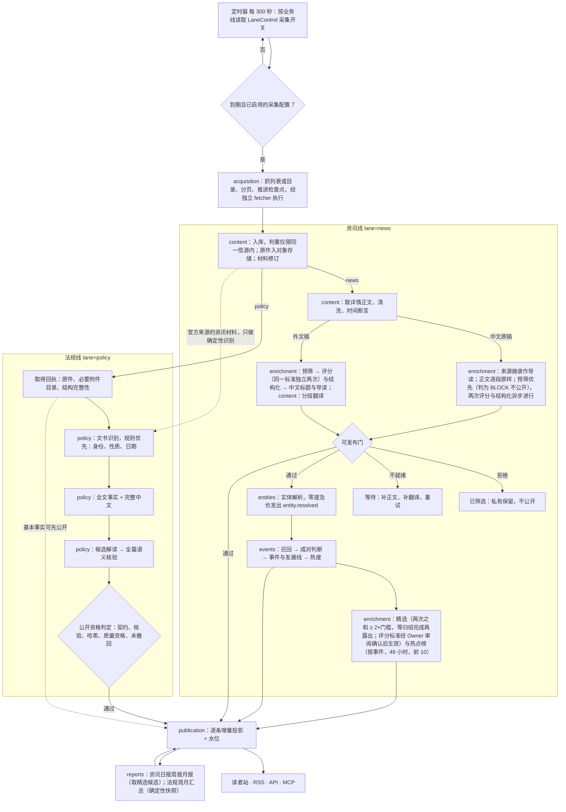
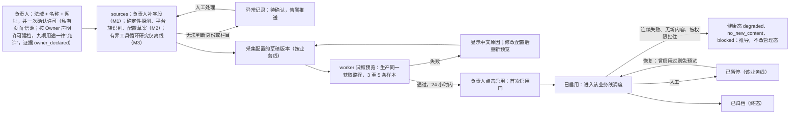
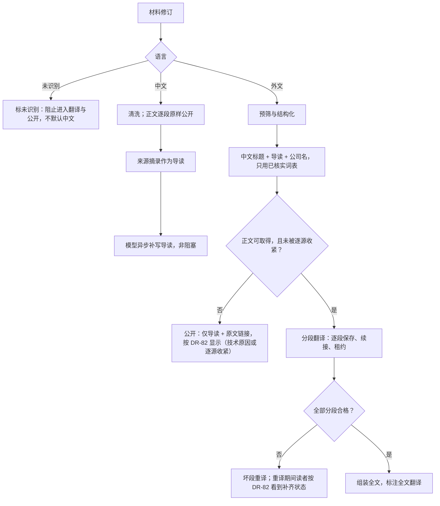
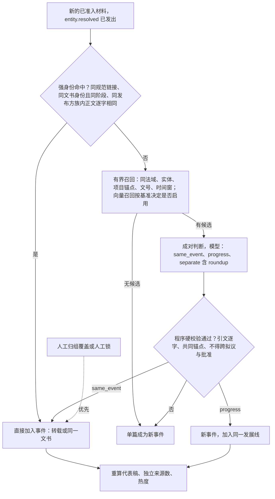
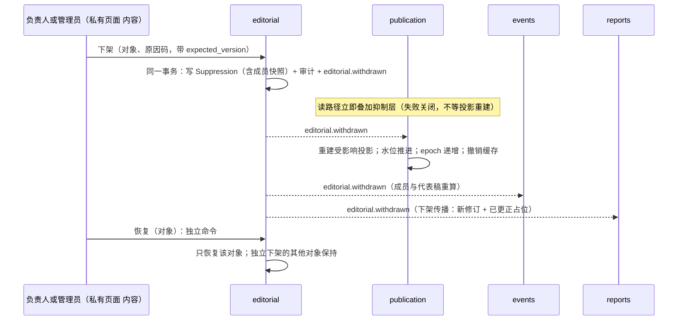
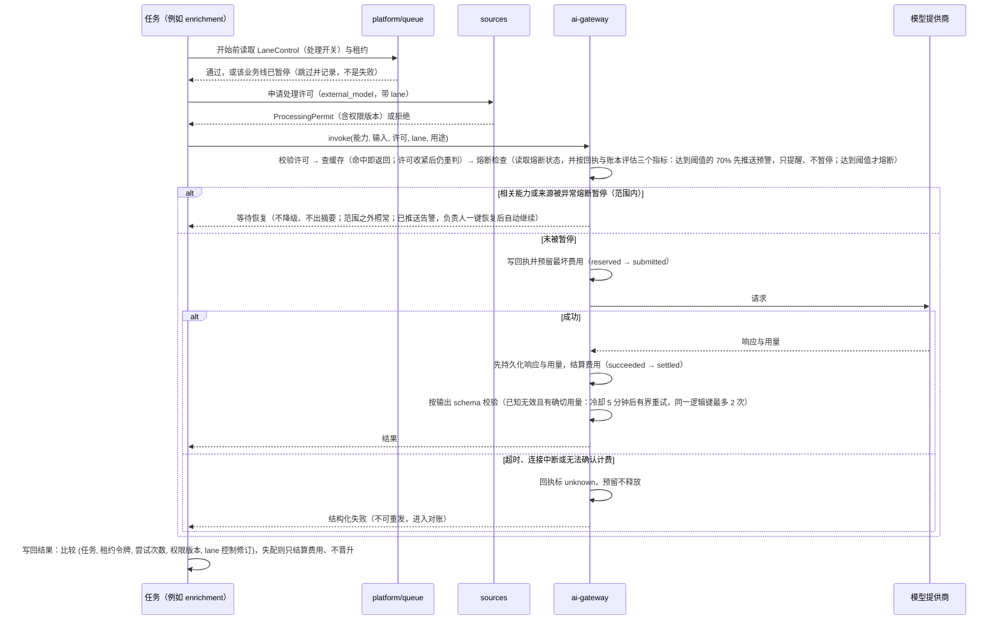
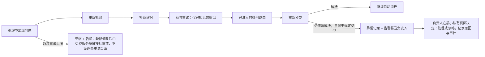
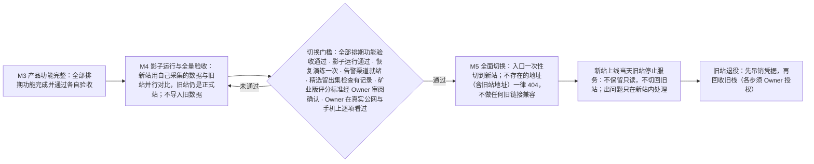

# 核心流程

> 端到端流程图与每一步的输入、输出和负责模块。状态机细节见 `03-data/01-domain-model.md` §6，规则编号见 `02-rules/01-business-rules.md` 与 `01-product/10-policy-service.md`（BR-POL），事件与任务契约见 `03-data/03-internal-contracts.md`。
> v2.0 改动摘要：①**资讯线与法规线并行、隔离运行**（ADR-0016，【Owner 决定】2026-09-26，旧ADR-0037@policy），不再有“法规排到 M3”，法规线不经过资讯预筛与事件归组；②**不设运营台**：所有人工介入点落到“最小私有页面”（ADR-0018，页面编号 OP-xx 见 `01-product/04-private-operations.md`），运行状态改为告警推送；③信源改为“发布方 → 信源 → 按业务线的采集配置”三层；④外文新稿公开条件、不降级、软件发布不依赖 GitHub Actions 等已裁决事项写入各流程。
> v2.1 改动摘要（Owner 2026-10-01 答复，DEC-08～DEC-10、DEC-19、DEC-20、DEC-25、DEC-33）：①付费调用流程（§6）**去掉额度检查分支，加熔断检查**——不设月度金额上限；指标达到熔断阈值的 70% 先预警（只提醒，不暂停）；②**精选与热点沿用 AIHOT 机制并随全面切换上线**（预筛 → 两次独立评分 → 分级门槛 → 等归组再露出；热点榜按事件前 10；矿业版评分标准是草案，生效前须经 Owner 审阅确认），全部矿业动态里同一事件折叠成一张卡；③信源接入（§2）**加入时由负责人一次确认许可**（按 Owner 声明许可建档），逐源可收紧；④新增 §10：**全部功能完成后一次性全面切换，不迁移旧数据，旧链接、旧 RSS、旧接口一概不做兼容**（不存在的地址一律 404；本文没有导入与对账流程）；⑤**报告的选材与出刊时间都沿用 AIHOT**（§7.1：从精选候选取材，同一事实去重，受版面容量限制；日报每天 08:00、周报每周一 10:00、月报每月 1 日 10:30 出刊，按 AIHOT 的时间窗取材，资料跨过刊期边界的归入下一期候选池，不设“补录”）。

---

## 1. 主流程：两条业务线并行，共享底层、互不阻塞

### 1.1 资讯线（lane = `news`）

| 步骤 | 负责模块 | 队列 | 输入 | 输出 | 关键规则 |
|---|---|---|---|---|---|
| 调度 | acquisition | `news.fetch` | 已启用采集配置、频率、上次尝试 | 采集任务 | BR-ACQ；人工暂停优先（INV-05）；读取 LaneControl 采集开关 |
| 抓取 | acquisition（fetcher） | `news.fetch` / `news.parse` | 配置版本、检查点 | 发现的条目、新检查点 | 失败不推进；单源隔离（INV-16）；礼貌抓取（BR-ACQ-14～17） |
| 入库与判重 | content | `news.normalize` | 发现的条目 | 新材料 / 重复（仅同一信源内）/ 新修订 | BR-MAT；旧文标记（BR-TIME-06）；内容哈希不作身份 |
| 正文 | content | `news.normalize` | 材料、权限许可 | 材料修订（正文结构） | 薄材料不算完成（BR-ENR-11）；语言识别，未识别不进翻译与公开 |
| 加工 | enrichment | `news.screen` / `news.enrich` | 材料修订 | 加工结果、中文阅读 | 宽收录（BR-ENR-01/02）；忠实（BR-ENR-12）；规则先行（BR-ENR-04） |
| 翻译 | content | `news.translate` | 材料修订 | 译文分段、`translation.completed` | 新稿优先、存量错峰；逐段保存续接（BR-ENR-08） |
| 可发布门 | publication（判定）+ 各模块状态 | `news.project` | 以上结果 | 公开 / 等待 / 拒绝 | BR-PUB-01；只依赖确定性条件，不被模型与积压阻塞（PIT-038） |
| 实体 | entities | `news.link` | `material.enriched` | 实体提及与解析 | BR-ENT；未核实译名公开页只写原名（DEC-37） |
| 事件 | events | `news.link` | `entity.resolved`、材料 | 事件、成员、发展线、热度 | BR-EVT（宁可分开）；强身份只有三种（§4）；热度沿用 AIHOT（BR-EVT-11） |
| 精选与热点 | enrichment（评分）+ events（热点榜） | `news.enrich` / `news.link` | 预筛与两次评分的结果、事件、人工选择 | 精选决定（分数、规则版本）、热点榜（前 10，带规则版本） | BR-SEL-02～09；**沿用 AIHOT：预筛 → 两次独立评分 → 分级门槛 → 等归组完成（≤3 分钟）再露出**；**矿业版评分标准是草案，生效前须经 Owner 审阅确认（BR-SEL-09）**；有评分的条目显示“AI 评分 · NN”，没有评分什么都不显示（BR-SEL-07）；切换前完成（DEC-10、DEC-64） |
| 发布 | publication | `news.project` | 各模块查询接口、抑制集合 | 投影行、内容版本水位 | ADR-0004；INV-02/03；全部矿业动态同一事件折叠成一张卡（BR-EVT-12） |
| 报告 | reports | `news.report` | 公开读取层里的精选候选（已公开、已入选精选） | 刊期、修订、成员 | BR-RPT（§7）；选材与出刊时间沿用 AIHOT：同一事实去重、版面容量限制（BR-RPT-02），日报 08:00、周报周一 10:00、月报 1 日 10:30（BR-TIME-09，DEC-65） |

### 1.2 法规线（lane = `policy`）【Owner 决定】2026-09-26

| 步骤 | 负责模块 | 队列 | 输入 | 输出 | 关键规则 |
|---|---|---|---|---|---|
| 调度与目录扫描 | acquisition | `policy.fetch` | 法规采集配置（来源角色：核心/补充/参考/重复渠道）、来源契约 | 文书目标集、取得任务 | 按国家/来源轮转，失败不占满轮次（BR-POL-18）；分页目录整轮扫描（BR-POL-16） |
| 取得与解析 | acquisition（fetcher） + content | `policy.fetch` / `policy.parse` / `policy.normalize` | 文书目标、契约 | 取得回执、不可变材料修订、条款/附件节点 | 原件与必要附件目录完整才算结构完整；字符完整性零容忍（BR-POL-19）；缺决定性附件不做确定性发布（BR-POL-12） |
| 文书识别 | policy | `policy.identify` | `material.body_ready`（法规线材料；官方来源的资讯材料也只走此确定性识别） | 文书、文书版本、语言表达、分维法律状态 | 身份 = 法域 + 机关 + 类型 + 文号，标题不进身份（BR-POL-02）；新闻稿只能作“相关报道”链接，不能生成或修改文书（BR-POL-10） |
| 全文事实与完整中文 | policy（译文存 content） | `policy.fulltext` | 完整原文与必要附件 | 逐块事实、完整中文、覆盖清单 | 固定处理链，不用 Agent 循环（DEC-16）；长任务租约与检查点；不降级（DEC-09），积压只调整先后（BR-COST-12） |
| 候选解读与核验 | policy | `policy.interpret` | 通过的事实与中文 | 相关性、要点、结构化经营影响、全篇语义核验结果 | 相关性 relevant / excluded / uncertain（BR-POL-10）；核验输出 `publication_authorized=false` |
| 公开资格 | policy + publication | `policy.project` | 解读、契约、质量资格 | 公开 / 基本事实 / 暂不可用 | 单一判定函数，失配即从所有出口消失（BR-POL-11；`01-domain-model.md` §3.7）；完整解读按“法域 × 文书类型”由 Owner 本人一次性抽检通过后开放（Owner 2026-10-01 已定，DEC-15） |
| 周月汇总 | reports | `policy.report` | 已公开合格版本 | 确定性快照刊期 | 不调用模型（F-051、BR-POL-14） |

### 1.3 隔离与不等待原则

- **隔离**（ADR-0016、可检查）：暂停资讯后法规任务仍被领取、入库并公开；资讯线的异常熔断或积压不阻塞法规线（不设分线保底额，积压按“法规 > 官方一手 > 其他”处理，BR-COST-12）；法规回填不堵住资讯实时流；每个 lane×stage 有独立并发与保留份额，同一 lane 内模型阶段轮转领取，任一阶段积压不能让另一阶段零执行。资讯价值分、资讯暂停、资讯预筛都不拦法规。
- **不等待原则**：中文原稿不等模型（预筛判为 BLOCK 的不公开，公开后才判出的撤出）；外文新稿只等自己的中文标题、导读与（许可允许且可取得时的）完整中文正文，新稿翻译优先执行，不被存量补齐或其他慢步骤阻塞；事件归组与精选不阻塞条目公开（条目先以“单篇事件”公开，归组后更新）——唯一例外是入选精选的资料，它等事件归组完成（最多 3 分钟）再出现，避免同一件事先冒出好几条（BR-SEL-02）；**法规线的基本事实与完整中文不等待解读**，完整解读合格后才以完整形态公开；报告与解读失败只影响自己。
- **人工不在关键路径上**：没有逐条审稿、手工翻译、手工重试与手工发布；机器无法解决的少数异常以告警推送（§8）。

### 1.4 人工介入点与“最小私有页面”

| 场景 | 谁 | 在哪里 | 写入什么 |
|---|---|---|---|
| 新增信源、试抓预览、启用、暂停、恢复、归档（按业务线的采集配置分别操作） | 负责人 | 私有页面“信源”（OP-03/04/05） | 采集配置与配置版本、预览、暂停记录（带原因与到期）；高风险操作一发生就推送 |
| 加入信源时一次确认许可（按 Owner 声明许可建档，不再批量确认与证据续期）；逐源逐项收紧 | 负责人 | “信源”（OP-03） | 来源用途契约新版本（证据 `owner_declared`，记录确认时间；收紧即时生效并联动撤回） |
| 下架、恢复、人工修订（中文标题、导读、正文、分类） | 管理员 / 负责人 | “内容”（OP-09） | Suppression、EditorialRevision，与审计同事务 |
| 暂停/恢复付费处理、恢复异常熔断、调整熔断阈值、预警比例与用量提示步长、结果未知费用逐笔核对 | 负责人 | “用量与模型密钥”组的用量与熔断页（OP-13） | LaneControl、熔断状态（ENT-82）与阈值配置、回执核对（必填依据，写审计） |
| 模型接入、密钥安全录入、环节指派 | 负责人 | “用量与模型密钥”组的模型接入页（OP-12） | 提供商与路由（密钥只替换不回显） |
| 告警渠道地址（飞书群机器人为主、邮件为备） | 负责人 | “用量与模型密钥”组（OP-20，安全弹窗） | AlertChannel（只显示指纹） |
| 读者反馈处理 | 管理员 | “反馈”（OP-14） | 反馈状态与备注 |
| 账号、改密 | 负责人 / 本人 | “账号”（OP-15/16） | 账号、会话（只用密码，DEC-05） |
| 关于、条款、隐私、联系方式、金属价格官方入口 | 负责人 | “网站资料”（OP-17） | SiteSettings |
| 建设期抽样与标注 | 授权人 | 抽样工具（OP-11，**默认关闭**） | ReviewTask；不是发布关卡 |

没有总览页、审稿关卡、审计页、采集运行页、系统健康页；运行状态通过告警推送（F-OPS-03）与只读运维 MCP 获知（ADR-0018）。

---

## 2. 信源接入

- **三层**（DEC-34）：发布方 → 信源（身份）→ 按业务线的采集配置。同一信源可以在资讯线与法规线各有一个采集配置，分别版本化、预览、启停与暂停；**身份或权限撤销作用于整个信源**，必须写明范围；普通暂停不会暗含两条线一起停。
- **两根轴**：管理态 `draft → active ↔ paused → archived` 与健康态 `healthy | no_new_content | degraded | blocked | unknown` 各自独立；健康态由采集结果推导，不能手工设置；“没有新稿”（低频官方源的正常状态）与“连续失败”必须区分。
- **首次启用门**：当前配置版本 24 小时内预览通过且样本 ≥ 1；**曾启用过的配置暂停后恢复不要求重新预览**，只重验权限未被收紧、未归档（DEC-57）。
- **修改配置**：只改名称、说明、许可说明等不影响采集身份的字段，保存即生效，不暂停、不清空检查点；修改入口、采集方式、列表/详情/分页规则、允许主机：生成草稿配置版本 → 预览 → 确认后原子切换，**切换前当前生效版本继续采集**。
- **许可**（Owner 2026-10-01 已定，DEC-33）：Owner 声明“全部都获得许可了”，所以加入信源时**由负责人一次确认并记录时间**，九项用途一律按“允许”建档（证据类型 `owner_declared`，不设自动到期）；原“未知按禁止”“三类自动规则”“批量确认权限”的流程作废，**没有“权限待审定”这一等待状态**。权限矩阵的逐源开关保留作**收紧**：来源方提出异议、Owner 指示或法律要求时，负责人逐源逐项关闭，**即时生效**，已公开的全文或译文随之撤回（与下架联动）；第十项 `syndicate_fulltext`（站外再分发全文）仍默认关闭（Q-47）。建议（不阻塞）：Owner 保留许可依据（合同、邮件、条款截图）备查；不再要求提供逐源书面清单。
- **入口协议**：默认 https，负责人可为单个信源开“仅 http”例外并留审计（DEC-56）；robots 明确禁止的路径默认不抓，负责人可凭许可逐源覆盖并留审计。
- 原始信源表目标与信源分开：一个目标可以对应多个信源入口；目标的“已接通”“持续供稿”必须有运行证据；计数口径按五层写明（原表记录 321 → 目标 320 → 发布方/族 → 信源 → 采集配置）。
- 有界工具循环只用于**离线信源研究**，产物是待准入的候选配置；AI 扩源候选必须经负责人“加入信源”才进入上述流程（DEC-16）。
- 自动化流程只能启用“未被人工动过的初始草稿”；遇到人工编辑、暂停、归档即停止自动操作并保留人工设置（INV-05）。

---

## 3. 中文阅读

- **外文新稿首次公开的条件**（DEC-35，【Owner 决定】2026-09-12，旧站线上即如此执行）：**中文标题 + 导读 + 可取得且获准的完整中文正文**全部就绪；**摘要不计全文**；“仅导读”**只剩两种情况**——技术原因（取不到正文或正文不完整）与逐源收紧（来源方异议、Owner 指示或法律要求，DEC-33）——按来源登记“仅导读例外”后以标题加导读公开（原因枚举见 ENT-13）。新稿翻译优先执行。
- **不存在“预算不足”；积压时只调整先后，不改变公开标准**（DEC-08、DEC-09）：积压如实显示，翻译顺序“法规 > 官方一手 > 其他”；不降级成导读冒充完成。
- **已公开过的旧稿**在补齐期间保留并按 DR-82 显示（读者文案只在 DR-82 定义，本文不另写），不批量隐藏；存量补齐与回填翻译安排在模型非高峰时段（BR-COST-08）。超长材料**不开**“导读 + 翻译进度”先行公开的例外（已裁定，DEC-35、DEC-09；原 AIQ-04）。
- **译名**：公开页上的中文公司名只有已核实词表与原文自带两个来源，其余只写原名；模型给出的暂译只进私有实体核实队列（DEC-37）。
- **法规线**：基本事实与完整中文不等待解读；原文与中文并排阅读须同时具备“公开原文”“公开译文”两项许可，只有其一时按 `01-product/10-policy-service.md` §5 降级，**不降为摘要**；中文原文不翻译，但仍完成全文事实理解；AI 辅助译文显式标注并带机器可读标识（DEC-38）。

---

## 4. 事件归组（资讯线；`events` 读取 `policy` 的公开查询）

- **触发**：由 `entity.resolved` 触发（D10-data-022）：实体未解析就召回会系统性漏召；`material.enriched` 只触发实体解析与投影。
- **强身份只有三种**（D10-data-007）：同一规范链接；同一文书身份（法域 + 发文机关 + 文书类型 + 文号，且同阶段）；同一发布方族内正文逐字相同。**同文号、同正文本身不足以合并**；判重只用于同一信源内的幂等入库。**跨法域或跨机关只能是 `related`，绝不直接合并**。
- **两层关系**：成对判断（`same_event` / `progress` / `separate`，`separate` 带原因含 `roundup`）用于归组；事件间类型化边（`updates` / `corrects` / `repeals` / `implements` / `related`）只由原文明示的文号或引文与程序校验生成，`related` 不得显示为“后续进展”。聚类不确定时保存为两个事件，留待重判。
- **与法规文书的关系**：新闻事件与法规文书只经明确身份（法域 + 机关 + 文号，或官方 URL）互相链接；`events` 读取 `policy` 的公开查询，`policy` 发布 `policy.changed`，`events` 订阅后更新政策进展线；新闻稿**不能生成或修改文书与法律状态**（BR-POL-10）。同一政策的不同阶段是不同事件、同一进展线。
- 事件召回先用确定性候选 + 现有模型判定；向量召回属新增付费依赖，须基准证明必要并经 Owner 同意后才启用（DEC-29）。
- **展示（沿用 AIHOT 的事件卡与事件页，DEC-25）**：全部矿业动态里，同一事件折叠成一张卡（代表稿 + “另有 N 家来源报道” + 事件综述），点开进入事件页；**搜索与筛选仍按篇显示**（BR-EVT-12）。热点榜按事件取前 10（BR-SEL-05）；入选精选的资料等归组完成（最多 3 分钟）再露出（BR-SEL-02）。事件综述（AI-09）随全面切换启用。

---

## 5. 下架与恢复

- 对象类型：条目、事件、发展线、报告刊期；法规线另有**文书版本、语言表达、解读**（对不可变公开版本的撤回是永久的，已撤销的资格不得复活）。
- **即时生效且失败关闭**：下架提交后 **60 秒内**全部出口（页面、搜索、收藏解析、RSS、API、MCP、分享图、报告）不可见（DEC-48）；公开响应不设长缓存，不依赖 TTL 自然过期；无法确认当前抑制状态时停止返回可能被撤回的内容；历史快照、旧分页不能成为下架旁路。
- **不复活**：重采集、回填、重处理、软件升级都不能复活；恢复一个对象不连带恢复另一条独立下架的对象；成组下架保存当时成员快照。
- **写入规则**：人工写操作与审计同一事务，审计写入失败则回滚且不提示成功；下架与恢复是独立命令，不混入审核决定（DEC-54）。

---

## 6. 付费调用（模型网关）

- **用量与熔断**（【Owner 决定】2026-10-01，DEC-08；取代旧ADR-0031、旧ADR-0037:44@policy 的 100 元硬限、80 元提醒与两线保底）：**不设月度金额上限**，付费调用不因累计金额而停止、排队或降级。网关每次调用前做**熔断检查**（BR-COST-20）：同一输入 1 小时内重复付费 ≥3 次；单篇资讯材料累计 >5 元或单份法规文书累计 >100 元；单日总费用超过过去 7 日日均的 3 倍且 >50 元（无历史数据以单日 200 元为界）——任一指标**达到阈值的 70% 先推送预警**（只提醒，不暂停任何处理；写明哪一项指标、当前数值与涉及的能力或来源），**达到阈值才熔断**，即暂停相关能力或来源的付费调用并告警，负责人在“用量与熔断”页一键恢复；**熔断只停付费**，已有公开内容、原生中文直出与不需付费的环节不受影响。阈值与预警比例在受控配置中，只有负责人可改并留审计。积压时的处理顺序仍是“法规 > 官方一手 > 其他”（BR-COST-12）；用量按业务线、能力、信源记账，每月 1 日推送上月用量报告，月内累计每增加 100 元推送一次用量提示（只提示、不暂停；BR-COST-18、BR-COST-19）。
- **结果未知**：自动按供应商请求编号对账；无法自动的由负责人在“用量与熔断”页逐笔核对（必填依据，写审计，只改该笔回执，不改月度用量）；核对前不重发；同一来源内存在未知调用时后续付费调用等待。
- **备用路由**：备用模型须各自准入与评测，重试不自动切到另一家提供商；新供应商（含 embedding）按新付费订阅处理（DEC-29）。
- 状态机与枚举见 `01-domain-model.md` §6.3；响应分类表见 BR-COST-03/04；复用键见 BR-COST-05（需多次独立采样的能力，如精选的两次评分，复用键带调用序号）。

---

## 7. 报告生成

### 7.1 资讯日报 / 周报 / 月报

1. **出刊时间沿用 AIHOT**（北京时间，DEC-65，BR-TIME-09）：`reports.compile` 每天 08:00 编制日报，日期为 D 的日报覆盖 [D-1 08:00, D 08:00)，以出刊日 D 为键；每周一 10:00 编制上一个 ISO 周的周报；每月 1 日 10:30 编制上一个自然月的月报；另每小时检查一次，补出最近 7 天缺的日报、上一个完整周的周报、上一个完整月的月报。**同一周期键幂等**（以 `(类型, 周期键)` 唯一，重跑不产生新刊期）。
2. **候选与归期**（D09-rules-006；**只在精选候选中判定**，DEC-65）：已公开、已入选精选（含人工精选）、不是旧文的条目，按**精选公开时刻**（`visible_after`）落入窗口 [起, 止) 的进入该期候选池；资料进入站点后，跨过刊期边界才确定精选公开时间的，**归入下一期候选池**，**不设“补录”小节**；取稿时等待在截止时刻之前已确定公开时间、但仍在提交的发布事务，避免漏过前后两期；来源日期只用于显示与排序，不参与归期；旧文（首次导入、回填、发现时晚于来源时间 48 小时以上，BR-TIME-06）不进任何期，仅在时间线、搜索、主题中可见；日期无法可靠确定的新闻材料照常公开（BR-TIME-15，2026-10-05 改），不猜日期。
3. 从公开读取层取窗口内的**精选候选**（已公开、已入选精选，含人工精选；不是旧文），**同一事实只留一条代表稿**（一手稿优先，其次分数高；日报另不重复近 7 天已刊载的同一事实），按栏目分栏并**受版面容量限制**（日报每栏最多 8 条、超出的最多 12 条进“快讯”，周报取前 40 条、月报取前 60 条，AIHOT 现值，可配置，BR-RPT-02），统计，得到确定性“内容汇总”修订（首期即可发行，不等模型）；没有精选候选时如实为空，不拿未入选的内容凑数；全量内容在“全部矿业动态”里看。
4. `reports.synthesize` 在内容汇总之上追加模型部分（沿用 AIHOT 的两份报告提示词并矿业化，AI-13）：日报写导语与今日看点，周报/月报按引用约束写总述与分节（只引用本期选定刊载的条目）；校验通过后生成“AI 综合”修订；失败保留内容汇总（日报退回确定性标题与要点），`synthesis_state` 如实显示；异常熔断暂停期间同样退回内容汇总。
5. **切换当天日报、周报、月报必须有**（Owner 2026-10-01 已定，DEC-19）。
6. 写入报告投影（经 publication 命令），水位推进。
7. 之后若引用材料被更正或下架：**生成新修订**（修订号 +1，写原因 `correction` / `withdrawal_propagation`），含下架内容的旧修订不再可读，刊期页显示“已更正”占位；历史期只因更正与下架产生修订，不因重跑模型静默变化；编制之后才入选精选的条目不改写已发行的历史期，按其精选公开时刻落入之后的期。

### 7.2 法规周月汇总（lane = `policy`）【Owner 决定】2026-09-26（F-051、BR-POL-14）

1. 北京时间自然周/月结束后默认 08:00 生成、每小时复核；**首版是确定性快照，不调用模型、不新写法律结论**，只引用已公开合格版本的“基本事实、主要条款要点、经营影响条目”。
2. 成员分区：`period_changes`、`date_unconfirmed`（日期待确认）、`backfill`（补录）、`reading_updates`（解读更新）；月报从该月固定版本独立归并，不拼接周报。（“补录”分区只属于法规周月汇总；资讯线报告不设“补录”，BR-TIME-09。）
3. 必含“已发现但尚未完成解读的重要文件”清单与按 36 个对象全量列出的覆盖说明；“未取得回执”不得写成“没有新法规”。
4. 相同输入复跑不产生新修订；内容或覆盖变化形成新修订（`late_content_or_coverage`）并保存增减数量；上游更正/下架在公开读取时立即移除失效成员，并生成带原因的新修订。

---

## 8. 异常处理（异常式人工审核；不设运营台）

- 规定类型见 BR-EDT-01（新候选信源待加入、官方身份无法确定、来源重大冲突、法律状态长期无法确定、来源权限无法判断、安全策略冲突、数据完整性异常、多次重试后仍无法得到合法结构、费用结果未知、**人工稿待复核 / 冲突**）；普通低/中影响内容与普通聚类不确定不进入人工。
- 异常记录不设队列页面：以**告警推送**（飞书群自定义机器人为主、邮件为备，Owner 2026-10-01 已定；Owner 录入地址前退为邮件；只发业务语言、不含密钥与正文）通知负责人，推送内容含异常熔断预警（指标达到熔断阈值的 70%，只提醒）与触发、用量提示（每 100 元，只提示）与每月 1 日的用量报告（BR-COST-18～20）；处理动作限于“信源”“内容”“用量与模型密钥”三组私有页面。推送失败下个周期重试并走第二渠道，仍失败在私有页面显示“告警未送达”。
- 失败与“被规则筛掉”分开：`rejected_irrelevant`（业务结果）不是异常；`quarantined_invalid`（损坏）与 `rights_blocked`（权限受阻）是阻塞原因码，见 `01-domain-model.md` §6.2。

---

## 9. 软件发布与产品更新（ADR-0017，旧ADR-0038@policy：不依赖 GitHub Actions）

1. **合并**：PR-only、squash、线性历史；合并前必须有该 PR 最终 SHA 的通过回执（`make verify`，可替换执行器，GitHub Actions 可作执行器之一〔2026-10-03，08-owner-voice DEC-25 ③，TASK-0015〕，不在生产主机上构建）。
2. **制品**：按 SHA 构建 linux/amd64 不可变镜像，附 manifest、SBOM 与离线签名；生产主机只接受受信公钥签名的制品，按 digest 拉取。
3. **部署**（独立、可回退的操作；生产首次部署与切换须 Owner 逐项授权）：预检（内存 ≥ 1GiB、磁盘 ≥ 3GiB + 暂存、无并发部署，**在暂停之前完成**）→ 部署保护：只创建 `holder=deploy` 的暂停（带原因与到期，比较交换）→ 迁移（只增不破）→ 替换服务 → 健康检查与公开读取冒烟 → 外部读回发布标识头作为“已上线”证据 → 释放 `holder=deploy` 的暂停（版本已变则不恢复并推送告警）。
4. **成功**：合并本版本的产品更新片段，登记一条产品更新（幂等；登记前按四种类型校验，失败阻断并告警）；回收旧镜像。
5. **失败**：自动回滚到上一版本（代码、内容指针、数据回退分别演练）；保持 `holder=deploy` 暂停并带到期与告警，提供固定的“恢复被持有的 worker”动作；**不登记产品更新**。
6. **生产不中断**：采集、加工、发布在服务器上持续运行，不依赖开发环境与交付链；worker 滚动替换，任务可续接（租约与检查点）；验证执行器、构建机或代码托管平台不可用只影响软件发布。

---

## 10. 全面切换与旧站下线（Owner 2026-10-01 已定：全部功能完成后一次性全面切换；不迁移旧数据）

- **全部排期功能** = 功能全集中除“候选（不排期）”以外的全部功能：资讯线、法规线、事件、精选与热点、报告、主题、搜索、收藏、对外出口（API、RSS、MCP 等）、最小私有页面、告警。切换前旧站照常服务；不再有“与旧站读者能力对等即切换”。
- **法规线**计入门槛的方式：页面与管线的功能完成并通过验收场景即可；覆盖度（36 个法域的研究、取得、中文、解读、持续运行）在台账里如实展示并持续推进，**不以 36 个法域全部供稿为切换门槛**；完整解读仍按“法域 × 文书类型”抽检通过后分组开放（DEC-15）。
- **切换当天**文章页的“相关报道”“事件进展”必须有，日报、周报、月报必须有（§7）；精选与热点已按 AIHOT 机制上线，门槛已完成留出集检查并留记录（BR-SEL-08），矿业版评分标准已经 Owner 审阅确认（BR-SEL-09）。
- **不迁移旧数据**：新站从空库开始，由新系统按信源表重新采集、处理、公开；旧站的文章与译文、事件、报告、下架与人工修订记录、读者反馈、费用账本、信源配置与检查点、账号、产品更新日志一概不导入（DEC-20、DEC-42）。唯一的“导入”是 Owner 的原始信源表（320 个目标，T-147），它是需求输入，不是旧数据。因此本文没有导入、对账与增量追平流程；旧链接、旧 RSS 与旧接口也一概不做兼容（不存在的地址一律 404），这一点与切换步骤都见 `03-data/04-legacy-migration.md`。
- 新站与旧站互不依赖（各有自己的数据库与运行环境，新站的模型密钥由 Owner 另行录入），切换前旧站不受新站影响；新站上线当天旧站停止服务，不保留只读、不切回旧站（Owner 2026-10-03）；新旧两站之间不回写数据。
