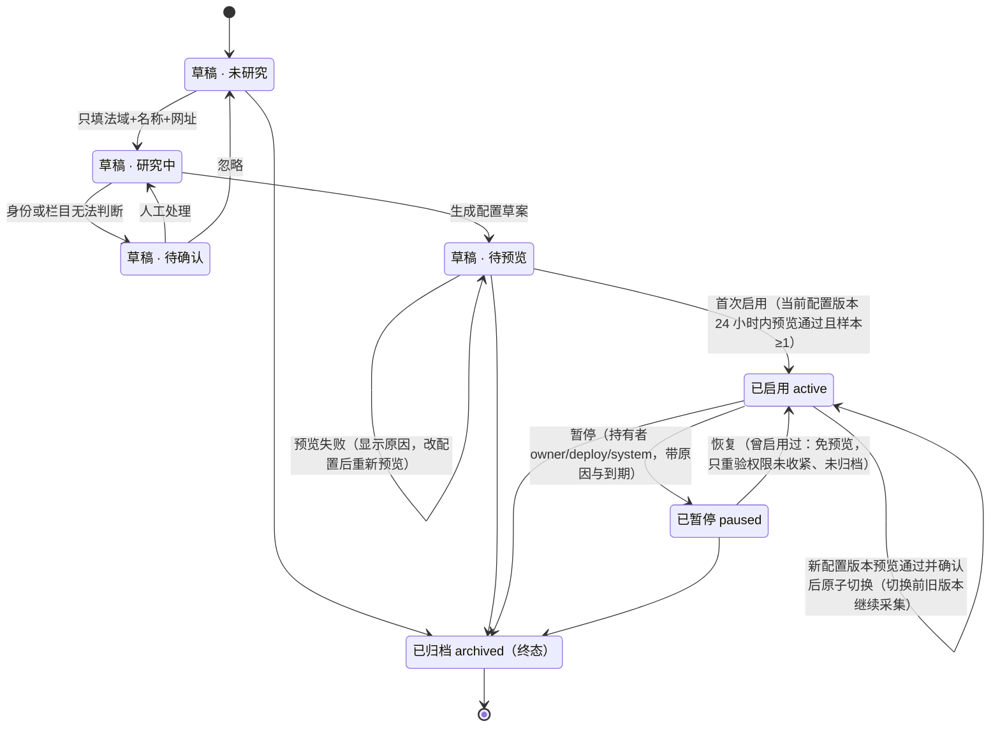
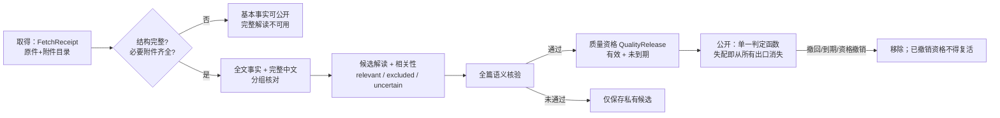
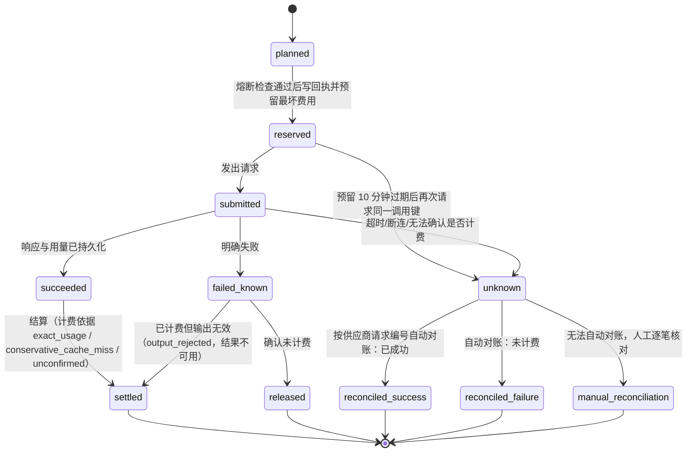
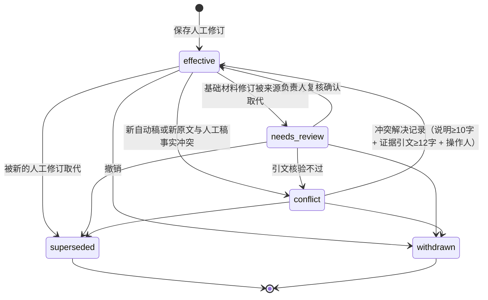
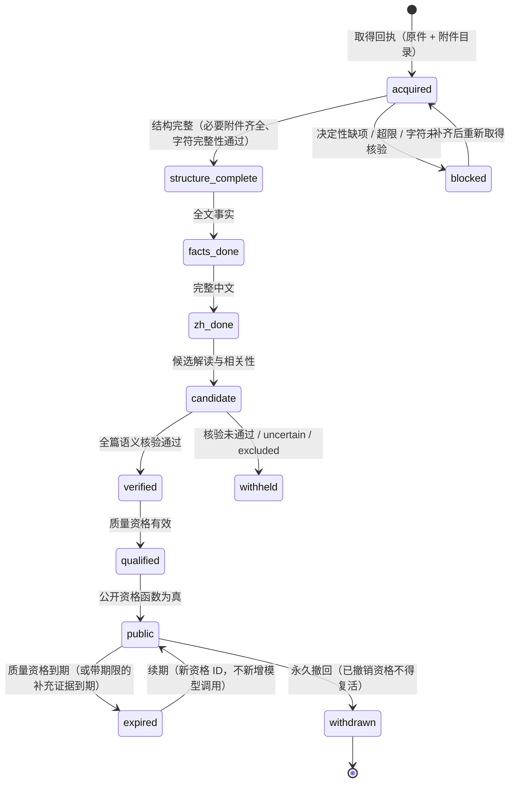

# 领域模型

> 本文定义 AI矿策（aiminingpolicy.com）重建的领域实体（ENT-xx）、归属模块、关键字段、状态机、ID 规则与关系。字段列的是**业务语义上必须存在**的字段，不是完整表结构；具体列名、类型、索引由模块 Agent 在迁移中确定，但不得删减语义。
> 依据：旧项目三代数据模型的蒸馏（只取第三代线上真实语义，第一/二代只取思想）、AIHOT 现有表结构、Owner 已批准的决定（旧ADR-0037/0038@policy、旧ADR-0031@main）、B 包的数据字典（`B:architecture/04-data-model.md`、`B:architecture/05-workflows-and-state-machines.md`）、合并裁决表 `00-decision-ledger.md` 与首轮对照发现 D10-data-001～027。
> 状态标签：【Owner 决定】附日期与依据；【已验证】旧仓库有验收记录或线上回读；【已实现未验证】旧仓库有代码无验收；【设计】【新增】本包提出。引用写法：`路径:行号@main` / `@policy`；包内引用写 `A:文件`、`B:文件`。模块名用 v2.0 规范名（见 `04-architecture/03-module-map.md`）：A 包的 `materials` 现为 `content`，`selection` 并入 `enrichment`，`site` 并入 `publication`，`kernel` 拆入 `platform/*`。

## v2.1 相对 v2.0 的主要变化（Owner 2026-10-01 答复；先看这张表）

| # | 变化 | 依据 | 落点 |
|---|---|---|---|
| 1 | **预算相关实体改为用量账本、熔断状态与阈值配置**（实体编号不变）：ENT-42 月度预算 → **月度用量**（硬上限、提醒线、两线保底额、调剂额字段【已废弃】）；ENT-73 → **用量账本分录**（额度桶与余额【已废弃】）；回执与分录带信源与能力；LaneControl 持有者去掉 `budget`；新增 **ENT-82 熔断状态**（含 70% 预警阶段）、**ENT-83 用量与熔断配置**（含预警比例） | 【Owner 决定】2026-10-01：不设月度金额上限（DEC-08、DEC-09）；BR-COST-17～20 | ENT-41/42/73/82/83、ENT-54、§6.3、§6.9 |
| 2 | **来源用途契约**：证据类型新增 `owner_declared`（不设自动到期）；新建信源九项一律“允许”，“禁止”只由逐源收紧产生；公开资格的到期时间不再含 `owner_declared` | DEC-33（Owner 2026-10-01：全部信源已获许可） | ENT-03、§3.7 公开资格、§5 |
| 3 | **精选评分与热点榜沿用 AIHOT**：ENT-12 评分字段（两次独立评分、门槛、平均分、提示词版本）；ENT-26 精选决定；ENT-27 热点榜（规则版本、名次、热度值，归 events）；新增 **ENT-84 精选校准与评分标准确认记录**（矿业版评分标准生效前须经 Owner 审阅确认）；ENT-32 的分数字段（有评分的条目都带，没有评分为空） | DEC-10、DEC-64；BR-SEL-02～09、BR-EVT-11 | ENT-12/26/27/32/84 |
| 4 | **旧数据不迁移**：仅为迁移服务的实体、字段与取值标【已废弃】（IdAlias 的 `legacy` 类、`first_public_basis` 的 `legacy_snapshot_min`、Receipt 的 `legacy_import` / `legacy_call_key`、ChineseReading 来源 `legacy_import`、AuditLog 的旧审计归档、AcquisitionProfile 的 `legacy_config`）；旧链接、旧 RSS、旧接口一概不做兼容（不存在的地址一律 404），不再有旧 ID 别名 | DEC-20、DEC-21、DEC-42（Owner 2026-10-01：全重做） | §0、§1、§3、§5、§8 |
| 5 | 全部矿业动态按事件折叠展示（展示层，不新增实体）；实体说明里不再出现“暂未启用” | DEC-25 | ENT-16/32/33 |
| 6 | **资讯线报告的出刊时间与时间窗沿用 AIHOT**（北京时间）：日报每天 08:00、周报每周一 10:00、月报每月 1 日 10:30；日报覆盖 [出刊日 D-1 08:00, D 08:00)，以出刊日为键；周报是上一个 ISO 周，月报是上一个自然月；归期看精选公开时刻（`visible_after`），跨过刊期边界的归入下一期候选池，**不设“补录”**（资讯线成员没有 `backfill` 分节与标记）；法规线周月汇总不变 | DEC-65（Owner 2026-10-01：“时间也学 AIHOT”） | ENT-34/36/37/38 |

## v2.0 相对 v1.0 的主要变化（先看这张表）

| # | 变化 | 依据 | 落点 |
|---|---|---|---|
| 1 | **业务线 Lane（`news` / `policy`）成为一等维度**：信源分“发布方 → 信源 → 按业务线的采集配置”三层；运行控制、队列、事件信封、回执与账本都带 lane；新增 LaneControl 取代全局站点暂停 | 【Owner 决定】2026-09-26（旧ADR-0037:23@policy；DEC-01、DEC-34）；`db/migrations/0029_policy_material_runtime.up.sql:41-49@policy` | ENT-02、ENT-54、ENT-56、ENT-41/42/73、§0 原则 9 |
| 2 | **法规线实体链**：PolicyInstrument → PolicyVersion → PolicyExpression → MaterialRevision（站内取得修订）+ ContentBlock + Attachment；政策“阶段”13 值枚举降级，改为分维法律状态；ENT-25 WatchSubject 删除 | DEC-36、DEC-11；`docs/policy-upgrade/requirements.md:36-41@policy`、`material-processing.md:9-15@policy` | ENT-21～25、ENT-63～67、ENT-79 |
| 3 | **法规运行实体**：来源用途契约、取得回执、质量资格、目录扫描、覆盖格（研究台账）、周月汇总成员分区；“公开资格”定义为单一判定函数 | D10-data-003；`0029:58-121@policy`、`0032_policy_publication.up.sql:4-23@policy` | ENT-03、ENT-69～72、ENT-38、§3.7 |
| 4 | **公开读取层**：资讯线逐条增量投影 + 不透明水位 content_version + suppression_epoch；不采用 B 的发布代次（Publication.generation/manifest/CAS）；法规线为不可变公开版本 + 语言头 + 资格视图 | ADR-0004；DEC-47；`0008_live_pipeline.up.sql:112-128@main`（旧站整站快照） | ENT-32～35、§3.10 |
| 5 | **状态机词汇统一**：信源两轴（管理态 × 健康态）；材料三层（领域状态 / 执行状态 / 展示状态）；付费回执取 B 骨架加 A 计费依据与 ≤2 次已知失败重试；人工修订新增需复核 / 冲突 | D10-data-008/009/014/025；§6 | §6 |
| 6 | **Claim / EvidenceLink**（主张与证据）与 E0–E4 证据等级成为共同实体；事件关系分两层（成对判断 + 类型化边）；强身份合并规则改写 | D10-data-006/007/011 | ENT-58/59/68、ENT-16/17/19 |
| 7 | **首次公开时间**是系统自有的写一次事实（带依据）；不并入 TimeAssertion | D10-data-005；`0012_reader_metadata.up.sql:3-12@main` | ENT-32 |
| 8 | **数据生命周期**：受许可约束的正文、附件、译文、向量、缓存随来源用途契约到期或撤销失效；法规公开资格带到期时间 | D10-data-026；`0032:19,22@policy` | §5 |
| 9 | **ID 规则**补齐全部对外对象的前缀；新对象用 ULID 大写字符集，旧 ID 只经别名表解析（**v2.1：旧 ID 不兼容、不建别名，见 §1，DEC-20、DEC-21**） | D10-data-024 | §1 |
| 10 | 新增 A 缺失的实体：Jurisdiction、AlertChannel、SourceObservation、TranslationSegment、JobExecution、InboxReceipt、Topic、ModelProvider、IdAlias、ObjectRef 等（ENT-53～81，顺延编号，不复用、不重排；v2.1 又新增 ENT-82～84） | D10-data-012；entity_map | §2 |

---

## 0. 建模原则（必须遵守）

1. **关系型事实为主，不用巨型 JSON 文档**。条目、事件的核心字段必须是列；JSON 列只用于不参与查询的半结构化数据（例如模型原始响应），并限制大小。旧库的材料、修订、事件、快照都是 `document jsonb` 列（`0008_live_pipeline.up.sql:45-72,112-137@main`），新库不得沿用这种形态（新站不迁移旧站数据，DEC-20）。
2. **ID 不从可变属性派生；“代理 ID + 天然身份键”两层**（PIT-021，D17-pitfalls-018）：① 所有对外、库内主键都是创建时生成的不可变代理 ID，一经公开永不改变、永不复用；② 需要去重的对象另设**天然身份键**作为唯一约束与匹配依据，键的成员变化（文号勘误、机构更名）走“旧身份退出 → 原件核对 → 新身份 → 可拆回”，不改代理 ID：信源 = 发布方 + 入口族；法规文书 = 法域 + 发文机关稳定 ID + 文书类型 + 文号（无文号时退化为来源身份 + 官方 URL 并标“弱身份”，**标题不进身份**）；事件不设天然键，只靠合并/拆分记录与别名重定向。旧项目的信源 ID 由“类型 + URL”哈希得出、事件 ID 由“分类 + 阶段”哈希得出（`services/live_pipeline/processing.py:283-293@main`），URL 改动或模型改判就换身份，这是反例（PIT-021、PIT-051）。
3. **修订只由内容驱动**。许可范围、处理策略、加工结果、人工修订、阅读补齐都不产生材料修订（旧库的 `irv_` 同时承载这四种含义，是反例；新站不迁移旧数据）。材料修订以 `(材料, 修订号)` 唯一；**内容哈希只用于复用内容对象（内容寻址），不作为材料或文书的身份**，恢复旧文本也产生新修订（B 的规则）。
4. **时间带精度与依据**。来源声明的时间统一用值对象 TimeAssertion（ENT-60）；缺失精度时默认最保守的 `date`（PIT-016）。系统自有的事实（首次发现、首次公开）是独立的写一次字段，不放进 TimeAssertion。日期筛选按北京时间（Asia/Shanghai）自然日、右开区间 `[start, end)`；资讯线报告的窗口按 AIHOT：日报 `[前一日 08:00, 当日 08:00)`、周报为上一个 ISO 周、月报为上一个自然月（BR-TIME-09）；只有日期的来源时间不做时区平移（DEC-49）。
5. **人工数据与自动数据分开存放**，自动流程读取并尊重人工数据，永不覆盖（ADR-0011）。分层规则见 §7。
6. **一次性修复不成为领域实体**（旧项目的“阅读补齐批次”“范围升级函数”都是反例）。
7. **配置进受控配置或行业包，不写死在迁移与数据库约束里**（旧项目把 100 元预算上限写成数据库 CHECK，`0008_live_pipeline.up.sql:89-95@main`，PIT-048）。**不设月度金额上限**（Owner 2026-10-01，DEC-08）；异常熔断阈值与用量提示步长是【设计】默认值，放在受控配置里，只能由负责人修改并留审计（ENT-83）。
8. **每类对象一个前缀、一种长度、一个生成规则**（§1）。
9. **业务线是一等维度**【Owner 决定】2026-09-26（旧ADR-0037:23@policy；DEC-01、DEC-34）：`lane ∈ {news, policy}`（中文：资讯线、法规线；代码名与 `03-data/contracts` 一致）。采集配置、运行控制、游标、队列、任务载荷、领域事件信封、处理许可、回执与账本都带 lane；不允许出现任何“站点级单一暂停开关”；不设月度金额上限（DEC-08），异常熔断按能力、信源或对象的范围暂停（ENT-82）。
10. **金额与数量不用浮点**（B §4；D13-stack-009）：数据库里的费用与用量表用 `numeric`（保持字符串或 decimal 读取），领域层一律用“币种 + 最小单位整数”（人民币微元，1 元 = 1,000,000 微元，bigint 以字符串读取）；币种固定人民币；数据库读取层不设全局 Number 解析，numeric 与 int8 默认保持字符串/bigint，仅在分数、计数等明确处局部转换（与 `04-architecture/02-tech-stack.md` §4.3 一致）。数量与单位用 Quantity（ENT-61），百分比与百分点、资源量与储量不得互换。
11. **许可决定能存什么、送什么、公开什么，并可被收紧**（ADR-0009）：来源用途契约（ENT-03）——新建信源的九项用途一律“允许”（证据 `owner_declared`，Owner 2026-10-01，DEC-33，不设自动到期），“禁止”只由逐源收紧产生；第十项 `syndicate_fulltext` 与缺少契约版本记录时按“未知”处理（失败关闭，视同禁止）；受许可约束的正文、附件、译文、向量、缓存随契约被收紧或撤销（以及带期限的补充证据到期）失效，结构化事实与 ID 保留（§5）。
12. **每种状态只有一种词汇**（D10-data-025）：领域状态（材料是什么）、执行状态（任务跑到哪）、展示状态（读者看到什么）分三层各自定义，展示状态由前两层派生、不落库；不得把“被规则筛掉”与“数据损坏”用同一个值表示（§6）。

---

## 1. ID 规则

格式：`<前缀>_<ULID>`，其中 ULID 为 26 位 Crockford Base32 **大写**字符（字符集 `0-9A-HJKMNP-TV-Z`，按时间可排序）。一经公开，永不改变、永不复用。法域不用 ULID，使用稳定代码键（例如 `CN`、`US`、`EU`、`UN`、`OECD`、`CN-GD`），见 ENT-55。

**不兼容旧 ID**（v2.1）：旧站公开 ID 是 `<前缀>_<sha256(内容) 前 26 位小写十六进制>`（`itm_`/`irv_`/`evt_`/`sty_`/`top_`/`rpt_`/`rrv_`/`cv_`，`services/live_pipeline/processing.py:56-60@main`），这里只作背景说明。**新站不迁移旧站数据，也不建旧 ID 别名**（Owner 2026-10-01 全重做，DEC-20、DEC-21）；新站从空库生成自己的 ID（大写 Crockford 字符集的随机串）。新站也不为旧站的任何地址做兼容：形如旧格式（`^[a-z]{3}_[0-9a-f]{26}$`）的路径与任何其他不存在的路径一样，走通用的“页面不存在”（404，见 `04-legacy-migration.md` §2），不查别名表、不当作新 ID 查询，不为它另设状态码或说明页；其余按新 ID 解析：路由层先按本节的前缀与字符集校验形态，形态不合法的（含旧站形态）走通用“页面不存在”（404）；形态合法但对象不存在、已撤回或已下架的，页面显示“当前不可查看”（HTTP 404，已下架可用 410），两类页面都带首页与搜索入口（契约 §2.7）。`top_`、`cv_`、`hot_` 等旧前缀不保留（新主题用 `tpc_`）；公开 ID 一经发出永不复用（新站自身的规则，与旧站无关）。

| 前缀 | 实体 | 归属模块 | 对外可见 |
|---|---|---|---|
| `pub_` | 发布方 | sources | 否 |
| `src_` | 信源（身份） | sources | 是（署名） |
| `apf_` | 采集配置（按业务线） | sources | 否 |
| `scv_` | 采集配置版本 | sources | 否 |
| `pvw_` | 试抓预览 | sources | 否 |
| `ctr_` | 来源用途契约版本 | sources | 否 |
| `obs_` | 原表记录（321 行） | sources | 否 |
| `tgt_` | 原表目标（320 个） | sources | 否 |
| `cand_` | AI 发现的候选信源 | sources | 否 |
| `run_` | 采集运行 | acquisition | 否 |
| `frc_` | 取得回执 | acquisition | 否 |
| `csn_` | 目录整轮扫描 | acquisition | 否 |
| `mat_` | 材料（公开 URL 中的“条目”即材料） | content | 是 |
| `mrv_` | 材料修订 | content | 否 |
| `att_` | 附件 | content | 否 |
| `obj_` | 对象存储引用 | content | 否 |
| `zhr_` | 中文阅读 | enrichment | 否 |
| `ana_` | 加工结果 | enrichment | 否 |
| `clm_` | 主张 | enrichment / policy（各自的表） | 否 |
| `ent_` | 实体 | entities | 是（实体页） |
| `evt_` | 事件 | events | 是 |
| `sty_` | 发展线 | events | 是 |
| `thr_` | 政策进展线 | events | 是 |
| `rel_` | 事件间关系 | events | 否 |
| `pol_` | 政策文书 | policy | 是 |
| `pvr_` | 文书版本 | policy | 是 |
| `pex_` | 文书语言表达 | policy | 是 |
| `pin_` | 政策解读 | policy | 是 |
| `pim_` | 经营影响条目 | policy | 是（随解读） |
| `plr_` | 文书法定关系 | policy | 否 |
| `qrl_` | 质量资格 | policy | 否 |
| `fdc_` | 精选决定 | enrichment | 否 |
| `hsn_` | 热点快照（热点榜；不用旧站的 `hot_`，避免前缀复用） | events | 否 |
| `cal_` | 精选校准与评分标准确认记录（v2.1 新增，ENT-84） | enrichment | 否 |
| `rev_` | 人工修订 | editorial | 否 |
| `wdr_` | 下架 / 抑制记录（代码名 suppression） | editorial | 否 |
| `rvw_` | 审稿任务 | editorial | 否 |
| `exc_` | 异常记录 | editorial | 否 |
| `tpc_` | 主题 | publication | 是 |
| `rpt_` | 报告刊期 | reports | 是 |
| `rrv_` | 报告修订 | reports | 是 |
| `rcp_` | 付费调用回执 | ai-gateway | 否 |
| `led_` | 用量账本分录（原预算账本分录） | ai-gateway | 否 |
| `mpv_` | 模型提供商 | ai-gateway | 否 |
| `ptb_` | 价格表条目 | ai-gateway | 否 |
| `brk_` | 熔断状态（v2.1 新增，ENT-82） | ai-gateway | 否 |
| `acc_` | 账号 | platform/identity | 否 |
| `fbk_` | 读者反馈 | feedback | 否 |
| `upd_` | 产品更新 | publication | 是 |
| `alr_` | 告警 | platform/ops | 否 |
| `chn_` | 告警渠道 | platform/ops | 否 |
| `job_` | 长任务执行记录 | platform/queue | 否 |
| `evn_` | 领域事件（outbox） | platform/queue | 否 |
| `ali_` | 合并与拆分别名（`legacy` 类已废弃，旧 ID 不兼容） | 各拥有模块 | 否 |
| `imp_` | **【已废弃】**ImpactAssessment，由 `pim_` 取代（DEC-11） | — | — |

**旧 ID 不兼容**（v2.1，取代 v2.0 的“旧 ID 兼容”与导入别名）：旧站已公开的 `itm_`（条目）、`evt_`（事件）、`sty_`（故事）、`rpt_`/`rrv_`（报告）ID，以及旧公开接口与 RSS 里出现的 `src_`（信源）、修订 `irv_`，**不迁移、不建别名**（旧数据一概不导入，DEC-20）；旧链接、旧 RSS、旧接口一概不做兼容，不存在的地址一律 404（DEC-21，见 `04-legacy-migration.md` §2）。别名表只记录新站自己的**合并与拆分**产生的别名（事件合并后旧 ID 指向目标），`kind ∈ merge | split`（`legacy` 类【已废弃】）。

---

## 2. 实体总览（按模块）

“v2.0 处理”列：**沿用**＝A 定义不变；**改**＝字段或规则有实质改写；**新**＝本版新增（ENT-53 起顺延）；**废**＝作废（仅标注，不复用编号）。“线”列：N＝资讯线，P＝法规线，两线＝共用。

| 编号 | 实体 | 模块 | 线 | 一句话 | v2.0 处理 |
|---|---|---|---|---|---|
| ENT-01 | 发布方 Publisher | sources | 两线 | 发布内容的机构/媒体/公司；“独立来源”按发布方族计数 | 改（命名对齐 B 的 editorial_family_id） |
| ENT-02 | 信源 Source | sources | 两线 | 发布方的一个持续发布渠道的**身份**（如“自然资源部·政策法规栏”）；启停、预览、游标挂在采集配置上 | 改（三层，状态移到 ENT-56） |
| ENT-03 | 来源用途契约 SourceContract（原信源权限 SourcePermission） | sources | 两线 | 九项用途的 允许/禁止/未知 + 证据 + 到期 + 内容哈希，不可变版本 | 改（合并 B 的 SourcePolicy 与旧分支来源契约） |
| ENT-04 | 采集配置版本 SourceConfigVersion | sources | 两线 | 采集参数的不可变快照，挂在采集配置下 | 改 |
| ENT-05 | 试抓预览 SourcePreview | sources | 两线 | 某配置版本的试抓结果；首次启用门的依据 | 改（24 小时、恢复免预览） |
| ENT-06 | 原始信源表目标 SourceTarget | sources | 两线 | Owner 原表 320 个目标的对账台账 | 改（与 ENT-57 合并口径） |
| ENT-07 | 候选信源 SourceCandidate | sources | 两线 | 离线研究提出、等待负责人“加入信源”的候选 | 沿用 |
| ENT-08 | 采集运行 FetchRun | acquisition | 两线 | 一次对某采集配置的采集尝试及计数 | 改（带 lane、五类结果） |
| ENT-09 | 采集检查点 SourceCursor | acquisition | 两线 | 分页位置、回填窗口进度，按采集配置 | 改 |
| ENT-10 | 材料 Material | content | 两线 | 一篇真实世界材料（公告、报道、法规文书原件、企业披露）；带准入的业务线 | 改 |
| ENT-11 | 材料修订 MaterialRevision | content | 两线 | 材料内容的不可变版本（仅内容变化产生） | 改 |
| ENT-12 | 加工结果 Analysis | enrichment | N | 预筛、结构化、评分等机器判断（只追加） | 改（引用 Claim） |
| ENT-13 | 中文阅读 ChineseReading | enrichment | N | 中文标题、导读、全文译文及完成度；按 (修订, 语言, recipe) 并存，有 current 标记 | 改 |
| ENT-14 | 实体 Entity（含别名） | entities | 两线 | 公司、项目/矿山、机构、法域、矿种的稳定身份与多语言别名 | 改 |
| ENT-15 | 实体提及 EntityMention | entities | 两线 | 材料中对实体的提及及解析结果 | 沿用（加块定位） |
| ENT-16 | 事件 Event | events | N | 同一次真实发生（多篇报道归为一个）；identity_key 非唯一 | 改 |
| ENT-17 | 事件成员 EventMember | events | N | 材料在事件中的角色（八值，同 AI-08 的 `member_role` 加系统指定的 `original`）；含人工锁 | 改 |
| ENT-18 | 发展线 Story | events | N | 同一具体事项的连续进展；`type` 取 `story`／`policy_thread` | 改 |
| ENT-19 | 关系判断 RelationJudgement | events | N | 两篇材料的成对关系判断（模型/规则/人工）；三值 + 原因 | 改 |
| ENT-20 | 人工归组 GroupingOverride | events | N | 人工指定或禁止的归属，自动归组必须尊重 | 沿用 |
| ENT-21 | 政策文书 PolicyInstrument | policy | P | 法律、法规、规章、通知、标准、法案、裁决等的**稳定身份** | 改（身份公式；不含当前阶段） |
| ENT-22 | 政策进展线 PolicyThread | events | P/N | 串联同一政策议题下的新闻事件与相关文书的阅读导航；是 ENT-18 的 `type=policy_thread` 视图 | 改（不存当前阶段） |
| ENT-23 | 政策解读 PolicyInterpretation | policy | P | 绑定文书版本与语言表达的候选解读、核验与相关性 | 改 |
| ENT-24 | ~~影响评估 ImpactAssessment~~ | — | — | 【已废弃】0–100 五维分，由 ENT-67 PolicyImpact 取代（DEC-11） | 废 |
| ENT-25 | ~~观察对象 WatchSubject~~ | — | — | 【已废弃】特定主体影响跟踪，与“不使用特定企业事实”的批准要求相反（DEC-11、DEC-45） | 废 |
| ENT-26 | 精选决定 FeaturedDecision | enrichment | N | 是否入选（两次评分之和 ≥ 2 × 门槛，或人工）、规则版本、推荐理由、露出时刻；沿用 AIHOT，随全面切换上线（DEC-10、DEC-64） | 改 |
| ENT-27 | 热点快照 HotSnapshot（热点榜） | events | N | 某一计算时刻的热点榜：规则版本、前 10 名次、热度值与趋势；沿用 AIHOT，随全面切换上线（DEC-10；原归 enrichment，v2.1 改由 events 计算与写入，因热度按事件计） | 改 |
| ENT-28 | 人工修订 EditorialRevision | editorial | 两线 | 对中文标题、导读、正文、分类的人工修改；状态 有效/需复核/冲突/终态 | 改 |
| ENT-29 | 下架 / 抑制 Suppression（原 Withdrawal） | editorial | 两线 | 对材料/事件/发展线/报告/文书版本/语言表达/解读的下架与恢复；带成员快照与 epoch | 改 |
| ENT-30 | 审稿任务 ReviewTask | editorial | 两线 | 建设期抽样与标注的维度化审稿记录；**默认关闭**，不是发布关卡（DEC-14） | 改 |
| ENT-31 | 异常记录 ExceptionItem | editorial | 两线 | 机器无法自行解决、需负责人决定的少数异常；以告警推送，不设队列页面 | 改 |
| ENT-32 | 公开条目 PublicItem | publication | N | 每篇可公开材料一行的读模型；含写一次的首次公开时间 | 改 |
| ENT-33 | 公开事件/发展线/政策线/文书版本 | publication | 两线 | 事件级读模型；法规线为不可变公开版本 + 语言头 + 资格视图 | 改 |
| ENT-34 | 公开报告 PublicReport | publication | 两线 | 报告刊期的读模型（出刊日期与覆盖期间分开） | 沿用 |
| ENT-35 | 内容版本 PublicationVersion | publication | 两线 | 发布账本的单调水位（不透明字符串）与 suppression_epoch | 改 |
| ENT-36 | 报告刊期 Report | reports | 两线 | 日报/周报/月报的一期；以 (类型, 周期键) 唯一；资讯线出刊时间沿用 AIHOT | 改 |
| ENT-37 | 报告修订 ReportRevision | reports | 两线 | 一期报告的具体版本（初版、更正、下架传播；法规线另有迟到内容或覆盖变化） | 改 |
| ENT-38 | 报告成员 ReportMember（法规周月汇总成员即其 policy 形态 PolicyReportMember） | reports | 两线 | 报告引用的事件/材料/文书版本，所在分节与成员标记 | 改 |
| ENT-39 | AI 能力 Capability | ai-gateway | 两线 | 能力注册：提示词版本、输入输出契约、路由、记账类别（原称预算类别）、单次输入上限与重试上限、所属 lane | 改 |
| ENT-40 | 模型路由 ModelRoute | ai-gateway | 两线 | 环节（stage）+ 阶段契约哈希 → 主/备模型；备用路由须各自准入 | 改 |
| ENT-41 | 回执 Receipt（含 B 的 ModelInvocation） | ai-gateway | 两线 | 每次付费调用的预留、状态、用量、费用、计费依据、是否被拒收 | 改 |
| ENT-42 | 月度用量 MonthlyUsage（原月度预算 MonthlyBudget，编号不变） | ai-gateway | 两线 | 北京时间自然月的用量汇总（已确认/预留/未知/复用，按业务线、能力、信源）、已推送的用量提示档位与月度用量报告；**硬限、提醒线、保底额、调剂额字段已废弃** | 改 |
| ENT-43 | 评测运行 EvalRun | ai-gateway | 两线 | 某能力在某黄金集上的一次评测结果 | 沿用 |
| ENT-44 | 账号 Account | platform/identity | — | 唯一负责人与具名管理员；只用密码（DEC-05） | 改 |
| ENT-45 | 会话 Session | platform/identity | — | 服务端会话（只存摘要，可撤销） | 沿用 |
| ENT-46 | 审计日志 AuditLog | platform/identity | — | 所有私有写操作的追加记录（含前后值）；旧系统审计归档【已废弃】（不导入） | 改 |
| ENT-47 | 读者反馈 Feedback | feedback | — | 文字、可选截图与联系方式；处理完成 180 天后删联系方式与截图（DEC-46） | 改 |
| ENT-48 | 站点设置 SiteSettings | publication | — | 关于、联系方式、条款隐私、金属价格官方入口；**不再含暂停状态** | 改 |
| ENT-49 | 产品更新 ProductUpdate | publication | — | 每次成功发布登记的面向用户的更新说明 | 沿用 |
| ENT-50 | 运行记录与日聚合 RunRecord / DailyAggregate | platform/ops | 两线 | 采集、加工、发布、费用的明细与按日汇总，指标带 lane | 改 |
| ENT-51 | 告警 Alert | platform/ops | 两线 | 告警事件与通知状态（送达/未送达/恢复） | 改 |
| ENT-52 | 领域事件 DomainEvent（outbox） | platform/queue | 两线 | 模块间异步协作的事件记录；信封带 lane | 改 |
| ENT-53 | 告警渠道 AlertChannel | platform/ops | — | 告警推送渠道：2026-10-06 起照上游用飞书自建应用，只发飞书，不做邮件备用，应用凭据与群号写在服务器设置（08-owner-voice DEC-33）；本实体在私有页面的去留由后续任务定（编号已确认，`01-product/04-private-operations.md` 引用此号） | 新 |
| ENT-54 | 业务线运行控制 LaneControl | platform/queue | 两线 | 每条业务线的采集/处理/公开三个暂停开关，带持有者、原因、到期、版本；另有“紧急全停” | 新 |
| ENT-55 | 法域 Jurisdiction | entities | 两线 | 36 个对象（33 国 + 欧盟/联合国/OECD）+ 下级法域；带 `news_scope` / `policy_scope` | 新 |
| ENT-56 | 采集配置 AcquisitionProfile | sources | 两线 | 信源在某业务线下的带版本入口、解析与节奏；管理态、健康态、预览、游标都挂在这一层 | 新 |
| ENT-57 | 原表记录 SourceObservation | sources | 两线 | Owner 原始工作簿的 321 条记录，不因目标合并丢行 | 新 |
| ENT-58 | 主张 Claim | enrichment / policy | 两线 | 带模态与证据等级的单条事实陈述 | 新 |
| ENT-59 | 证据链接 EvidenceLink | enrichment / policy | 两线 | 主张到原文块与引文的绑定；带 E0–E4 证据等级 | 新 |
| ENT-60 | 时间断言 TimeAssertion（值对象） | contracts | 两线 | 来源声明的时间：原文、本地日期、精度、含义、依据 | 新 |
| ENT-61 | 数量 Quantity（值对象） | contracts | 两线 | 带单位、范围、基准的数量，不丢来源原值 | 新 |
| ENT-62 | 译文分段 TranslationSegment | content | 两线 | 全文译文按块逐段保存、续接、复用 | 新 |
| ENT-63 | 内容块 ContentBlock | content | 两线 | 正文节点：层级、父节点、跨版本稳定节点 ID、结构化定位 | 新 |
| ENT-64 | 附件 Attachment | content | 两线 | 材料修订的附件及其“必要”标记、权利与取得状态 | 新 |
| ENT-65 | 文书版本 PolicyVersion | policy | P | 法定版本/汇编版，带分维法律状态与各类日期 | 新 |
| ENT-66 | 文书语言表达 PolicyExpression | policy | P | 版本 × 语言 × kind（原文/官方译本/AI 辅助译文） | 新 |
| ENT-67 | 经营影响条目 PolicyImpact | policy | P | 结构化、条件化的定性影响（七主题） | 新 |
| ENT-68 | 事件间关系 EventRelation | events | N | updates / corrects / repeals / implements / related，只由原文明示生成 | 新 |
| ENT-69 | 取得回执 FetchReceipt | acquisition | P（N 可用） | 每次真实成功检查一份回执：检查时刻、哈希、结构完整、未决项 | 新 |
| ENT-70 | 质量资格 QualityRelease | policy | P | 来源 × 语言 × 规则版本的公开资格，带评测哈希、审阅记录、期限；撤销后不可复活 | 新 |
| ENT-71 | 目录整轮扫描 CatalogueScan | acquisition | P | 分页官方目录的整轮扫描、页校验与原子应用 | 新 |
| ENT-72 | 覆盖格 CoverageCell（研究台账） | policy | P | 法域或组织 × 七主题 × R01–R08 四态台账 | 新 |
| ENT-73 | 用量账本分录 UsageLedgerEntry（原预算账本分录 BudgetLedgerEntry，编号不变） | ai-gateway | 两线 | 预留/结算/释放/调整分录，带 lane、能力、信源与用途，金额不用浮点；无额度桶与余额 | 新 |
| ENT-74 | 长任务执行记录 JobExecution | platform/queue | 两线 | 仅用于带租约的长任务（全文翻译、法规全文处理与解读）：租约令牌、检查点 | 新 |
| ENT-75 | 消费回执 InboxReceipt | platform/queue | 两线 | `unique(consumer, event_id)`，阻止重复效果 | 新 |
| ENT-76 | 模型提供商与模型登记 ModelProvider | ai-gateway | 两线 | 提供商、模型、响应模型白名单、价格版本；路由准入的依据 | 新 |
| ENT-77 | 主题 Topic | publication | 两线 | 国家/矿种/公司/项目/法律监管的浏览入口定义（不是事件层级） | 新 |
| ENT-78 | 合并与拆分别名 IdAlias（原“旧标识与合并别名”，编号不变） | 各拥有模块 | 两线 | `合并前 ID → 新 ID`，路由先查别名；**`legacy` 类（旧站 ID）已废弃**，旧 ID 不兼容、不建别名 | 新 |
| ENT-79 | 文书法定关系 PolicyRelation | policy | P | 修订/废止/勘误/实施/引用/语言版本/草案→正式文本，只由原文证据建立 | 新 |
| ENT-80 | 对象存储引用 ObjectRef | content | 两线 | 获准保存的原始网页、PDF、附件、截图、报告产物的键、哈希、大小、权限版本与到期时间；数据库只存引用 | 新 |
| ENT-81 | 价格表条目 PriceTable | ai-gateway | 两线 | 模型的分时段人民币单价，带观察日与有效期（≤45 天）；过期只拒新付费调用 | 新（第二轮补，BR-COST-13） |
| ENT-82 | 熔断状态 BreakerState | ai-gateway | 两线 | 异常熔断的范围、触发条件与数值、预警（达阈值的 70%，只提醒）、开启与恢复记录；只有开启（`open`）才停付费调用（BR-COST-20） | 新（v2.1；追加预警阶段） |
| ENT-83 | 用量与熔断配置 UsageControlConfig | ai-gateway | 两线 | 受控配置：熔断阈值与预警比例、用量提示步长、速率限制（2026-10-06 起照上游放在 `budgets` 表，BR-COST-07 第二层；同名契约字段由契约卡一并处理）、未知占用告警；只有负责人可改，写审计与版本 | 新（v2.1） |
| ENT-84 | 精选校准与评分标准确认记录 SelectionCalibration | enrichment | N | 一次门槛校准或留出集检查的结果，及所用评分标准与门槛版本（BR-SEL-08）；Owner 对矿业版评分标准的审阅确认（BR-SEL-09） | 新（v2.1；追加评分标准确认） |

---

## 3. 实体详述

### 3.1 sources（信源）：发布方 → 信源 → 按业务线的采集配置【Owner 决定】2026-09-26（DEC-34）

三层的意义：身份与权限撤销作用于**整个信源**（两条线同时受影响，必须写明范围）；暂停、优先级、预览、游标、健康都作用于**采集配置**（不设预算配额，用量按业务线记账），所以“暂停资讯不影响法规”在数据上成立。依据：`docs/policy-upgrade/operations-exit.md:30-31@policy`（共用 `site_settings.processing_paused` 做不到“暂停新闻、法规继续”）。计数口径同样按层写明（原表记录 321 → 原表目标 320 → 发布方/发布方族 → 信源 → 采集配置），见 DEC-59、D19-decisions-010。

**ENT-01 发布方 Publisher**
- 字段：原文名称、中文名称、机构类型（中央部委 / 省级厅局 / 监管机构 / 官方公报与法规库 / 议会 / 法院 / 证券交易所 / 矿业企业 / 行业协会 / 新闻媒体 / 国际组织 / 第三方法律数据库）、所在国家与省州、官网、身份核验状态（已核验 / 未核验 / 冲突）与证据链接与核验时间、**发布方族 editorial_family_id**（同一编辑控制下的机构归为一族，用于独立来源计数；不同 feed 不等于独立发布方）。
- 规则：文章涉及的国家与发布方总部国家**不能混用**（BR-SRC、INV-31）；重复渠道保留映射但不计为独立发布方。

**ENT-02 信源 Source**（只保存身份；状态与运行挂在 ENT-56）
- 字段：发布方、名称、入口身份（规范化入口地址；与发布方 + 入口族构成天然键）、语言（BCP47 列表）、来源时区（可验证才填，否则为空）、覆盖法域（ENT-55 的代码键）、发布方所在省州、**分级**（`T1` 官方一手：政府、监管、公报、交易所披露；`T1_5` 官方账号与准官方；`T2` 媒体与个人；`EXCLUDE` 不参与精选评分；分级决定精选门槛 T1 60 / T1_5 65 / T2 76，起点值，BR-SEL-02）、是否一手（当事方自己发布）、**身份状态** `identity_state ∈ active | revoked`（`revoked` 由负责人的高风险操作写入，带范围、原因、操作人；使该信源所有采集配置同时停止相应阶段，并推送告警）、关联的原表目标。
- 规则：身份或权限撤销是**显式的 identity/contract 命令**，普通暂停不能暗含两条线一起停（`B:contracts/openapi.json` SourceAction 与 `03-data/contracts/interface-behavior.md` §2.6）。

**ENT-56 采集配置 AcquisitionProfile**【新增】（B 的 AcquisitionProfile；A 原 ENT-02 的状态与运行字段移至此）
- 字段：信源、**lane**、**管理态** `admin_state ∈ draft | active | paused | archived`（`archived` 为终态；与旧库 `source_configurations.state` 四态一致，`db/migrations/0010_source_operations.up.sql:8@main`）、**健康态** `health ∈ healthy | no_new_content | degraded | blocked | unknown`（由采集结果推导，**不能手工设置，也不阻止任何管理转移**）、草稿子阶段（`research ∈ none | running | needs_confirmation`；`preview ∈ none | passed | failed`）、当前配置版本、采集方式（`rss`/`atom`/`web_list`/`json_list`/`sitemap`/`pdf_list`/`gov_cms`（中国政府网站集约化平台）/`legislation_api`/`wechat_mp`（付费）/`external_push`）、采集间隔（有上下限，按产出自动调整）、**参与方式**（资讯线：`editorial` 进入全部动态与精选 / `hot_signal` 只作热度证据 / `isolated` 不进任何公开页面）、**来源角色** `source_role`（法规线必填：核心 / 补充 / 参考 / 重复渠道，`F-046`；重复渠道另带 `duplicate_of`——指向被覆盖的核心或补充来源——与覆盖范围证据，保留映射、不重复调度、不计独立发布方，BR-SRC-34）、凭据引用（只存引用，绑定主机与跳转策略）、仅 http 例外标记（DEC-56：默认 https，负责人可为单源开例外并留审计；此类信源的内容不得作为“官方原文”的唯一完整性依据）、`was_active` 与 `activated_at`（曾启用过）、下次运行时间、连续失败次数、`last_check_at`（终止性尝试完成时刻，含 blocked/failed）与 `last_success_at`（实际网络完成时刻）分开（BR-POL-24）、最近错误（中文业务语言 + 错误码）、`legacy_config`【已废弃：仅为旧站迁移服务，新站不导入旧配置，DEC-20】。
- 健康态含义：`healthy` 最近检查成功且有新内容；`no_new_content` **完成检查且无更新**（低频官方源的正常状态，不得与失败混淆）；`degraded` 连续失败达到阈值（默认连续 5 次或 24 小时，见重试与退避参数表）；`blocked` 来源被逐源收紧或带期限的证据到期、域名或身份不符，**只停止相应来源阶段**，其余信源照常；`unknown` 尚无运行证据。

- 规则要点（DEC-57、DEC-56、INV-05）：①**首次启用门** = 当前配置版本 24 小时内预览通过且样本 ≥ 1；②**曾启用过的配置暂停后恢复不要求重新预览**（旧站 2026-09-21 修复“暂停后无法恢复”，旧迁移 `0010_source_operations.up.sql:100-105@main` 已按 `activated_at` 判定），恢复只重验权限未被收紧、未归档；③只修改名称、说明、许可说明等**不影响采集身份**的字段：保存即生效，不暂停、不清检查点、不要求重新预览（PIT-002）；④修改入口、采集方式、列表/详情/分页规则、允许主机：生成新的草稿配置版本并预览，**预览通过并确认切换之前旧版本继续采集**（旧迁移 0010 初版的保存函数会打回 draft、暂停并清游标，`0023_source_draft_configuration_repair.up.sql:45-46@main` 还得手工把游标写回，这是反例）；⑤人工暂停永远优先于任何自动启用；自动化只能启用“未被人工动过的初始草稿”；⑥运行中任务提交前重验配置版本与状态，暂停与取回并发不得写入过期结果。

**ENT-03 来源用途契约 SourceContract**（原 A 的 SourcePermission、B 的 SourcePolicy、旧分支 `policy_source_contracts`；ADR-0009，DEC-58）
- **九项用途**，每项取值 `允许 / 禁止 / 未知`（**新建信源的九项一律“允许”**，证据 `owner_declared`；“禁止”只由逐源收紧产生，v2.1，DEC-33）：`fetch`（抓取）、`store_metadata`（保存元数据）、`process_locally`（本机处理）、`store_fulltext`（保存全文与原件）、`external_model`（送第三方模型）、`public_excerpt`（公开短摘录）、`public_summary`（公开自写导读）、`public_original_fulltext`（站内展示原文全文）、`public_translation`（站内展示全文译文）。另预留**第十项 `syndicate_fulltext`**（站外再分发：全文 RSS、公开 API 正文、公开 MCP 正文）：**默认 `未知`（失败关闭；是否启用见 Q-47）**，由 `01-product/07-sources-and-coverage.md` 定稿前这些出口只给导读与原文链接（D05-api-017；不属于 DEC-58 的九项，故单列）。
- 每个版本带（字段名与 `01-product/07-sources-and-coverage.md` §3.1 一致）：`evidence[]`（链接、`kind`、`checked_at`、`valid_until`、中文依据、所支持的用途、适用主机与路径前缀；**`kind` 枚举**：基线 `owner_declared`（证据文本“Owner 2026-10-01 书面答复：全部信源均已获得许可”，确认人为负责人，加入信源时记录确认时间，**不设自动到期**）；补充证据 `open_license`、`statute`、`public_domain`、`official_policy`、`official_notice`、`robots_terms`、`written_authorization`（只作补充或覆盖 robots 的依据，不再是取得许可的前提）；逐源收紧的依据 `source_objection`（来源方异议）、`owner_instruction`（Owner 指示）、`legal_requirement`（法律要求）；与 `01-product/07-sources-and-coverage.md` §3.1 一致）、`reviewed_by` / `reviewed_at`（确认人与时间；原“自动授予的规则编号”【已废弃】）、`expires_at`（`owner_declared` 为空；只有带明确期限的补充证据才填）、`conditions[]`（署名、排除第三方内容、不得暗示官方背书、以访问时许可为准等条件码，A BR-SRC-15）、**`attachments_in_scope`**（附件是否在范围内，单独布尔）、`licence_label_zh`（给读者看的中文许可说明）、**内容哈希（版本不可变）**。证据复核窗口是可配置起步值（旧分支三份运行契约为 30 天，`config/policy/runtime-contracts.json:108,148,427@policy`），是工程窗口不是法定期限。
- 规则：`未知`（第十项 `syndicate_fulltext` 的默认值，以及缺少任何契约版本记录时）按禁止处理（失败关闭），**只关这一层**，不阻塞该信源在允许范围内的其他处理（INV-32）；权限变化产生新版本，历史处理记录引用当时版本；处理许可 `ProcessingPermit`（带 lane 与权限版本）由本模块签发；原“三类自动规则、批量确认”与“是否‘未见 AI/TDM 禁止即可送模型’须 Owner 定”（Q-02）作废——Owner 2026-10-01 已声明全部信源获得许可（DEC-33），加入信源时由负责人一次确认即建档。
- **收紧与到期**（BR-POL-17；D10-data-026）：逐源收紧（来源方异议、Owner 指示或法律要求）关闭的用途、带期限的补充证据到期、以及范围外用途**立即不可执行**（`owner_declared` 不设自动到期），依赖它的公开内容在数据库读取层同步隐藏，不等下一轮任务；已公开的全文或译文随之撤回（与下架联动）。**资讯线**：权限收窄即退为导读或删除正文展示（A BR-SRC-14）。**法规线**：公开用途（原文公开/译文公开）失效 → 整篇正文与解读从所有公开入口移除，**不退为摘要**；保存/内部处理用途失效 → 停止处理，已存原件与回执按 `store_fulltext` 单独裁定，历史证据不改写。撤销许可必须更新契约，不能只用采集开关表达（BR-POL-21）。

**ENT-04 采集配置版本 SourceConfigVersion**
- 不可变：采集方式参数（选择器、字段路径、分页规则、允许/排除主机与路径前缀、详情页补齐规则、条数上限、抓取礼貌参数）、内容哈希、创建人、创建时间、变更说明。挂在 ENT-56 下。任何历史采集运行都能查到“当时使用的是哪一个配置版本”。旧库的 `source_configurations` 是“单行覆盖、`config_revision` 递增、无历史”，是反例；新站不导入旧配置（DEC-20），每个新信源从 v1 开始版本化。

**ENT-05 试抓预览 SourcePreview**
- 字段：配置版本、权限版本、结果（通过/失败）、样本（最多 3–5 条：标题、链接、时间及精度、正文可得性）、失败原因、预览时间。
- 规则：预览只在 worker 中经**生产同一获取路径**联网执行（私有页面请求只排队，PIT-001；fixture 不计真实预览）；同一配置版本 1 分钟内的重复请求复用同一任务；预览期间配置被修改则结果作废；**暂停与恢复不使已有预览资格失效**（仅用于首次启用门）。

**ENT-06 原始信源表目标 SourceTarget / ENT-57 原表记录 SourceObservation**
- ENT-57：Owner 原始工作簿的 **321 条记录**（工作簿页、行号、序号、原始网址逐字照录、国家、省区、机构原名、原分类、主题、建议批次），保留原始行，不因目标合并丢行。
- ENT-06：按规范化网址归并出的 **320 个目标**（只有 `S16-R054` 与 `S16-R062` 指向同一网址，合成一个目标并标身份冲突）、关联的信源（可多个）、国家与所在省州（取自原表并核对）、接入状态（`待处理`/`研究中`/`已接通`/`持续供稿`/`无法访问`/`需要适配`/`权限待定`（v2.1 起仅指来源被逐源收紧或站点拒绝访问后等待授权或替代官方入口，见 `01-product/07-sources-and-coverage.md` 目标状态说明）/`重复`/`无效或错配`/`暂缓`）、未完成原因、下一步动作、最近证据时间。
- 规则：“已接通”“持续供稿”必须有运行证据（采集运行与公开记录），不能由配置存在推断；数据见 `data/source-targets-320.*`、`data/source-records-321.csv`；导入校验保留 320/321、编号唯一、不做部分导入。

**ENT-07 候选信源 SourceCandidate**
- 字段：法域、机构名称、网址、发现方式（离线信源研究 / 负责人提交 / 覆盖缺口分析）、官方身份置信度、矿业相关度、与已有信源的重复关系、推荐理由、状态（`建议中`/`已加入`/`已忽略`）。
- 规则：有界工具循环只用于**离线信源研究**，产物是待准入的候选配置（DEC-16）；AI 可以发现、研究、评分、解释、去重、推荐，但**不能自动加入正式信源**，必须由负责人在私有页面“信源”中点击“加入信源”。

### 3.2 acquisition（采集）

**ENT-08 采集运行 FetchRun**
- 字段：采集配置（lane）、配置版本、权限版本、触发方式（定时/手动立即运行/回填/预览）、计划时间片、开始与结束时间、**结果五类** `success | no_change | partial | failed | restricted`（成功 / 无变化 / 部分成功 / 失败 / 受限分开）、抓取页数、发现条数、新增条数、更新条数、错误码与中文原因、下一检查点。
- 规则：**尝试、成功取得、新发现、中文完成、公开**是分开的五个事实，任何一个都不能替代另一个（旧ADR-0033、PIT-010）；worker 心跳不能代替“有新内容公开”。

**ENT-09 采集检查点 SourceCursor**
- 字段：采集配置、列表位置（页码/下一页地址/最后看到的条目）、回填窗口状态（资讯线：72 小时优先，7 天、30 天低优先级有界回填；法规线不受 30 天上限约束，另设窗口）、更新时间。
- 规则：失败不推进位置，下次从同一处继续；单轮达到条数或时长上限时保存剩余位置；旧库游标是 `sources.cursor jsonb`，是反例，**不导入**（新站从空库开始，新信源首次启用时按回填规则 72 小时 → 7 天 → 30 天从零采集，DEC-20）。

**ENT-69 取得回执 FetchReceipt**【新增】（旧分支 `policy_acquisitions`，`0029_policy_material_runtime.up.sql:94-121@policy`）
- 字段：采集配置、契约哈希、`checked_at`（**网络完成时刻**，不同于来源发布时间和调度完成时间）、状态、原始字节哈希（sha256）、`structural_complete`（结构完整：目录/附件清单/节点数核对通过）、`unresolved[]`（未决项：缺附件、缺页、字符完整性未核验等）、失败类别、来源版本标识。
- 规则：每次**真实成功检查**生成一份回执；同字节复用材料与修订但**保留新回执**；“取得成功”“结构完整”“可公开”是三个事实，不得混成一个状态（旧项目“目录完整当成全部完成”“抓取 200 当成可公开”的错误）；“未取得回执”不得写成“没有新法规”（BR-RPT-06、F-051）。

**ENT-71 目录整轮扫描 CatalogueScan**【新增】（旧分支 `policy_catalogue_scans/_scan_pages/_scan_heads`，`0037_policy_paged_catalogues.up.sql@policy`；BR-POL-16）
- 字段：采集配置与契约版本、每页记录（页码、声明总数/总页数、实际条数、文书标识列表）、目录指纹、状态 `running → verified | failed | superseded`、失败页与重试时间、四个计数（目录记录数、不同文书数、成功取得数、公开数）。
- 规则：到末页后再取首页复核指纹；页序、总数、跨页唯一 ID、首页复核全部一致才原子更新整轮文书目标集；任一失败不应用部分结果，约 1 分钟后重试首页；契约变化使旧扫描 `superseded`；“目录不再列出”只让条目退出当前视图，保留原件与回执，**不写成废止**。

### 3.3 content（材料与正文）

**ENT-10 材料 Material**
- 身份：信源、来源侧标识（guid / 文号 / 规范链接，按采集方式确定优先级）、规范化原文链接（去跟踪参数）与其哈希、原文标题、**语言**（BCP47：来源配置声明优先，其次按文字与语言检测写入；无法判定标“未识别”并阻止进入翻译与公开，**不默认中文**，D14a-aihot-backend-001）、**准入业务线 lane**（材料由哪个采集配置取得、属于哪条线；官方来源的资讯材料可由法规线文书识别另记法规线准入，不改变其资讯线材料身份）。
- 文书信息：文号（如有）、发文机关署名（如有）——仅记录来源自述，文书身份由 policy 模块确定（ENT-21）。
- 时间组（详见 `02-rules/04-time-semantics.md`）：来源声明的各类时间用 TimeAssertion（ENT-60）列表；系统发现时间 `discovered_at` 是系统自有事实。
- **领域状态**：`已发现` → `正文待取` → `正文就绪` / `仅元数据`（许可或来源限制）/ `正文不可得`（附原因）；另有 `重复`（**只用于同一信源内重复发现**：同一规范链接或同一来源侧标识，指向被重复的材料，停止处理）。“被规则筛掉”“数据损坏”“权限受阻”不是材料状态（见 §6.2）。
- 标记：`旧文`（资讯线，照 AIHOT：新信源首次导入的存量、标记为回填的、发现时已晚于来源时间 48 小时以上的——BR-TIME-06、AIHOT `decideTimeline`；原“来源日期的北京日历日早于发现日的前一天”的判据作废，2026-10-05，TASK-0043）——不推送、不进入当期报告正文；有来源时间的按来源时间进时间线，来源日期不在今天的不进入“今天”与“新”标记；没有来源时间的照 AIHOT 按发现时间进时间线（目前的限制，INV-07）。
- **判重与合并分开**（D10-data-007）：判重只用于同一信源内的同一规范链接/来源侧标识（幂等入库）；内容哈希只做内容对象复用，**不作为材料或文书身份**；跨信源、跨发布方的相似内容交给 events 的召回与关系裁决（ENT-16）。

**ENT-11 材料修订 MaterialRevision**（B 的 DocumentRevision）
- 字段：材料、修订号（单调递增，`(材料, 修订号)` 唯一）、来源版本标识（来源自称的版本/汇编日期）、语言、抓取时间、TimeAssertion 列表、提取方式（列表摘要/详情页抽取/PDF 文本/接口字段/OCR）与提取版本、完整性标记 `complete | truncated | summary_only | incomplete`（**必要附件缺失即 `incomplete`，不得晋升为全文**）、字符完整性 `ok | unverified`（法规线出现 NUL 或 U+FFFD 即 `unverified`，BR-POL-19）、正文哈希、原件对象引用（`obj_`）、使用的权限版本。正文结构见 ENT-63，附件见 ENT-64。
- 规则：**只有来源内容变化才产生新修订**；只在 `store_fulltext = 允许` 时保存全文，否则只保存获准范围（摘要/元数据）；来源原始 HTML 永不在站内执行。两档（D14a-aihot-backend-002）：
  - **资讯线**沿用 AIHOT 的降噪：见过的旧版本哈希不再出修订、替换字符差异容忍，并计数“抖动”；
  - **法规线**版本身份 = 法域 + 发文机关 + 类型 + 文号 + 语言 + 正式版本标识；**哈希相同但发布时间、状态或来源版本号不同也生成新修订；恢复旧文本也产生新修订；禁止在法规线使用 seen-hash 与丢字符通配**，避免吞掉撤回、恢复与关键字差异。
- 加工结果、中文阅读、人工修订、阅读补齐都**不是**材料修订（旧库 `item_revisions` 把它们都记成修订，是反例；新站不迁移旧数据）。

**ENT-63 内容块 ContentBlock**【新增】
- 字段：修订、`block_id`（**跨版本稳定的节点 ID**）、顺序、类型（标题/段落/列表/表格/引用/脚注/定义/附件引用）、层级（部/章/节/条/款/项/附表）、父节点、**结构化定位 locator**（例如 `art:12/para:3`、`附表 2`；PDF 另记页码与区域）、文本或表格单元、块哈希。保留脚注、否定词、链接文本与顺序。
- 用途：证据定位（EvidenceLink 指向块）、分段缓存复用（某条款更正只失效对应分段；依赖全文的分析随之失效，`docs/policy-upgrade/material-processing.md:28-31@policy`）、新旧条款比较（**没有另行取得并关联的旧版原文，该功能不可用，不得凭模型记忆补旧法**，DR-52）。分段以结构节点为界，节点内才按字节上限再分，不在表格行或条款内部切断。

**ENT-64 附件 Attachment**【新增】
- 字段：修订、地址、媒体类型、`required`（决定性/必要）、状态 `listed | unfetched | fetched | failed | blocked_capacity | out_of_scope`、取得方式与权利依据、对象引用、sha256。
- 规则：`unfetched`/`failed` 的必要附件使修订 `incomplete`，**不计入正文完整率**；附件不得自动递归抓取，文书里引用其他材料不授予自动访问权限；**资讯线**附件只登记、PDF 超 200 页只留元数据（BR-ACQ-22、BR-MAT-13），**法规线**先枚举完整附件目录、主动取得，超限记 `blocked_capacity`（BR-POL-12）。

**ENT-80 对象存储引用 ObjectRef**【新增】（ADR-0005：PostgreSQL 是唯一的结构化事实库，原件进对象存储）
- 字段：`obj_` ID、对象键、sha256、大小、媒体类型、归属对象（材料修订 / 附件 / 反馈截图 / 报告产物）、生成该对象所依据的权限版本、`expires_at`、状态 `staged → referenced → expired → reaped`。生产用 S3 兼容接口（首选已有腾讯云 COS），开发与测试用本地目录实现同一端口（`platform/storage`）。
- 规则：**数据库不存临时签名 URL**（只在内存生成）；事务顺序：先写对象到暂存区，再在一个数据库事务内提交修订、解析结果、阶段成功标记与对象引用；**对象上传成功不等于业务提交成功**，超过期限仍未被引用的暂存对象由回收器清理；是否保存由来源用途契约的 `store_fulltext` 决定，未获准的只存元数据与链接；契约到期或撤销时按逐源到期策略删除原件与派生物；备份与原件分桶、分权限；权利到期后不得通过备份复活。

**ENT-62 译文分段 TranslationSegment**【新增】
- 头：`(修订, 目标语言, recipe_version)` 唯一，含术语表版本、输入哈希、状态、块总数与已完成数；行：块 ID、输入哈希、输出、回执、状态 `pending | running | done | failed`。
- 规则：已成功分段在任务重启后**复用，不重新付费**；全部块覆盖才算译文完整，不得静默截断后冒充全文；译文不覆盖原材料修订。

### 3.4 enrichment（资讯加工，仅资讯线）与主张/证据

> 法规线材料**不经过** ENT-12 的预筛、结构化、评分，其准入取决于来源职责与文书身份（ADR-0016；D07-ai-004），见 §3.7。

**ENT-12 加工结果 Analysis**（只追加）
- 字段：材料修订、能力 ID 与提示词版本、来源（规则/模型/人工）、模型路由、回执 ID；
  - 预筛（沿用 AIHOT 的 BLOCK / PASS / UNKNOWN）：矿业影响路径是否成立、处置（`拒绝` = BLOCK：无可信矿业影响路径；`收录` = PASS；`材料不足` = UNKNOWN：正文或元数据不足以判断，等待补正文或重试，拿不准的继续往下走、不阻断；没有材料支撑的 BLOCK 按 UNKNOWN 处理）、理由码；
  - 结构化：一级分类（9 类，见 `01-product/09-glossary.md`）、法域、省州、矿种、公司/项目/机构提及、政策工具/动作/阶段用词、关键日期、影响路径说明、**主张 Claim 列表引用**（ENT-58）；
  - 评分（AI-03；**沿用 AIHOT，随精选上线**；所属信源分级没有门槛的不评分，该组字段为空）：`scores[]`——**同一份评分标准独立两次调用**，各得一个 0–100 的整数 `attentionScore`，带尝试序号（1、2）与各自回执；`score`——两次平均值**向下取整**（无评分为空，**绝不为 0**）；`threshold`——所用的信源分级门槛（T1 60 / T1_5 65 / T2 76，起点值，BR-SEL-08 校准）与门槛配置版本；`score_model`；`score_refused`（模型内容过滤拒答或任一次失败 → 无分数）；评分提示词版本（内容哈希）计入本记录的提示词版本，该版本在对外服务的正式站须已经 Owner 审阅确认（ENT-84，BR-SEL-09）。**旧 55/75 公式与“阅读价值 / 重要性”两维作废**（DEC-10），旧分数既不沿用也不导入；
  - 写作：入选的与平均分高于 50 的按精选写法生成中文标题、答案先行的摘要、推荐理由（每句带 claim_id）与标签；其余写简短标题摘要。
- 规则：同一输入、同一提示词版本、同一模型不重复计算（缓存）；改提示词只影响之后的新任务。
- **内容来源类别**（派生，对应 BR-PUB-10）：本条加工产出的中文标题、导读、推荐理由一律属 `ai_generated`；经人工修订（ENT-28 `effective`）后公开形态为 `ai_assisted_human_edited`；官方中文原文与官方译本不属 AI 内容。该类别不落在本表，由公开投影的 `ai_label` 体现（ENT-32；契约 §2.9）。

**ENT-13 中文阅读 ChineseReading**
- 字段：材料修订、**语言**、`recipe_version`、中文标题、中文导读（答案先行的摘要）、中文正文（按段落保存在 ENT-62）、**`state`** ∈ `not_needed`（原生中文）/ `pending` / `in_progress`（k/n）/ `complete` / `guide_only` / `failed_terminal`；`guide_only` 另带原因 `summary_only_permission | body_unobtainable | over_limit | in_attachment`；公司说明列表（**只含已核实的中文名** + 原文名或简称 + 一句说明 + 出处）、来源 `native_clean | model | human`（`legacy_import` 【已废弃】：新站不迁移旧数据）、回执 ID、`current` 标记。
- 规则：**按 `(材料修订, 语言, recipe_version)` 并存，每个 (修订, 语言) 最多一个 `current`**；重做只新增版本，通过质量检查后切换 `current`，不覆盖旧版；人工编辑走 EditorialRevision 叠加（ENT-28），不改写译文；全部分段完成才标 `complete`；原生中文清洗后直接可读，不等模型；**外文新稿首次公开须中文标题 + 导读 + 可取得且获准的完整中文正文，摘要不计全文**（DEC-35）；未核实的公司译名公开页只写原名，模型给出的暂译只进私有实体核实队列（DEC-37）。读者文案只在内容标准 DR-82 定义，本表的 `state` 是数据侧取值，不是文案。

**ENT-58 主张 Claim / ENT-59 证据链接 EvidenceLink**【新增】（B 的 Claim、EvidenceLink；A 的 AI-02 输出与推荐理由合同以此为前提）
- Claim：所属修订、主张类型、主体/动作/对象、法域、事件时间（TimeAssertion）、**模态** `asserted | denied | conditional | disputed`、状态、数量（Quantity，可空）、中文陈述（≤120 字）、`evidence_grade ∈ E0 | E1 | E2 | E3 | E4`（分级定义见 `01-product/09-glossary.md`；**旧库没有 E 分级；新站不迁移旧数据，E 分级只由新系统按证据生成，不得伪造**）、`superseded_claim_id`（人工纠错必须引用被替代的主张并保留修订链）。
- EvidenceLink：主张、材料修订、块 ID、起止偏移与 locator、关系 `supports | contradicts | context`、来源角色、独立性所属发布方族、引文（逐字存在于原文；AI-02 要求 12–600 字符）。
- 规则：事件的 `evidence_grade` = **决定性主张的最低等级**（派生值，不手填）；推荐理由的每个事实句绑定 `claim_id`；“引文不成立”的已结算结果被拒收（旧拒收码 `analysis_evidence_unsupported`、`analysis_claim_invalid`，`0024_model_response_receipts.up.sql:131-135@main`）。没有存储许可不意味着能把原文私藏到日志、embedding 与缓存；公开证据展示再次经过来源用途契约投影。

### 3.5 entities（实体与法域）

**ENT-14 实体 Entity**（含别名 EntityAlias）
- 类型：公司、项目/矿山、政府机构、法域、矿种/商品、地点。
- 字段：原文规范名、核实过的中文名、简称、多语言别名（每个别名附语言、适用范围、出处、有效期）、国家、上级实体（子公司→母公司、厅局→省政府）、标识（股票代码、注册号等）、一句中文说明与出处、核验状态。
- 规则：实体识别结果带置信度与来源；展示时保留原文名；**同名不同国不自动合并**；同名误配（例如制裁名单同名主体）属于高风险错误；**公开页上的中文公司名只有两个来源：已核实词表（带出处）或该材料原文自带的中文名**，其余只写原文名，模型给出的建议译名只进私有实体核实队列（DEC-37）。

**ENT-15 实体提及 EntityMention**
- 字段：材料修订、块 ID 与偏移、实体（或未解析文本）、提及原文、角色（主体/对象/提及）、置信度、解析方式；`unresolved` 保留原文，不能猜测公司背景。

**ENT-55 法域 Jurisdiction**【新增】（`data/jurisdiction-scope.json`；DEC-03）
- 法域字典**一次建全 36 个对象**：33 国 + 欧盟（`EU`）、联合国（`UN`）、OECD；键为稳定代码（ISO 国家码、`EU`/`UN`/`OECD`、下级法域如 `CN-GD`）。
- 字段：键、类型 `country | subdivision | organization`（**EU/UN/OECD 不计入国家数**）、上级法域（中国 14 个省区先建为下级法域）、中英文名称、**`news_scope`**（资讯线范围，18 国起步）、**`policy_scope`**（法规线范围，33 国 + 3 组织）、`tier`（既有 18 国 / 扩展）、`background_only`（背景层，不进必达分母；默认值：英国、伊朗、瑞士、玻利维亚、马里，DEC-03）、范围依据。“跨国 / 未限定”是独立取值，**不计入任何国家的分子**（BR-SRC-05）。
- 规则：33 国是研究底表不是上限（`country_count_is_cap=false`）；资讯线 18 国起步、按实测逐步扩，不随法规线自动扩到 33 国（Owner 2026-10-01 已定，DEC-03，Q-09）；法规线覆盖格按“法域 × 七主题”统计（ENT-72），资讯线扩源按“法域 × 机构类别”矩阵，两张矩阵并存（DEC-60）。

### 3.6 events（事件，资讯线；读取 policy 公开查询）

**ENT-16 事件 Event**（含 EventRevision）
- 字段：稳定 ID、中文标题、事件综述、发生时间（+精度 +来源当地时区）、法域、一级分类、关键实体、代表材料（优先一手、优先完整度高）、最新进展材料、**状态** `活跃` / `已合并`（指向目标）/ `已拆分`（“已下架”不是事件状态，由 Suppression 叠加层派生）、原始来源数、**独立来源数**（按发布方族去重，转载不计）、`evidence_grade`（派生）、热度、首次出现与最近更新时间、所属发展线与政策进展线；修订 EventRevision：修订号、主张列表、实体引用、阶段、确定性、证据状态（修订不覆盖旧公开事实）。
- **`identity_key` 非唯一、不参与身份**：只是可重算、可多个的候选召回键（含主体/动作/对象/法域/时间窗）；变化不改变 `Event.id`；合并/拆分走别名重定向（新站自己合并或拆分事件产生的别名，与旧站地址无关，ENT-78）与 EventRelation（D10-data-027，PIT-021）。
- **直接并入同一事件的强身份只有三种**（D10-data-007，取代 A 的 BR-EVT-01 旧写法）：①同一规范链接；②**同一文书身份**（法域 + 发文机关 + 文书类型 + 文号，且同阶段）；③**同一发布方族内**的正文逐字相同（≥160 字完全一致）。其余一律进入有界召回 + 关系裁决；**跨法域或跨机关只能是 `related`，绝不直接合并**。“同文号同阶段”“正文完全相同”本身不足以合并（文号只在发文机关内唯一，省级转发与模板化公告可能正文一致但是不同文书）。旧站事件 ID 的输入含 jurisdiction，且只有明确的来源标识才算合并依据（`services/live_pipeline/processing.py:283-292@main`）。
- 规则：**宁可暂时分开，不要错误合并**；聚类不确定时保存为两个事件（内部状态 `uncertain` 待重判，不是模型输出值），获得更多证据后自动重判；误合并视为高风险错误；合并后被并入事件的原 ID（新站自己的 ID）以别名重定向到目标事件，与旧站地址无关（ENT-78）；人工归组不被自动覆盖；同一政策的不同阶段是不同事件（INV-23）。

**ENT-17 事件成员 EventMember**
- 字段：事件、材料、角色 `member_role`（与 AI-08 输出同值：`independent_confirmation` 独立确认 / `reprint` 转载同稿 / `substantive_update` 实质更新 / `correction` 正式更正 / `cross_language` 跨语言分发 / `commentary` 评论解释 / `conflicting` 相互冲突；另有由代表稿与来源一手性规则指定、不是模型输出的 `original` 原始发布。A 原稿的“关系未明”不再是成员角色——模型拿不准时按 `separate` 保持分立，BR-EVT-05）、是否一手、`decision_origin ∈ auto | human | review`、**`locked_by_review`**（人工锁，批处理不得覆盖；批处理建议与人工结果冲突时形成候选差异）、置信度。
- 规则：只有 `original`、`independent_confirmation`、`conflicting` 计入独立证据；`reprint` 转载只增加转载计数；对外 `sources[].relation` 的取值映射见 `03-data/02-public-api-contract.md` §3.5；成对判断为 `separate` + `roundup` 的汇总稿（多话题盘点）**不并入事件成员**，不计入独立证据也不作代表稿（它作为独立材料公开，由报告与时间线引用）。

**ENT-18 发展线 Story**
- 字段：稳定 ID、`type ∈ story | policy_thread`、标题、按时间排列的事件、最新进展、状态（进行中/观察中/已结束）。规则：同一消息重复出现不算进展；只有一条消息时如实显示“暂无后续”；主题相似不等于同一发展线；长期事项可以由版本化关系视图实现，不强迫另造聚类引擎。

**ENT-19 关系判断 RelationJudgement**（两层之一：成对判断）
- 字段：材料 A、材料 B、**`relation ∈ same_event | progress | separate`**、`separate_reason ∈ unrelated | roundup | insufficient_evidence | low_confidence | check_failed`、成员角色（仅 `same_event`）、置信度、判断方式（规则/模型/人工）、模型与回执、双方原文引文（须逐字存在）、时间。用于审计与评测。
- **三套名称的映射**（D10-data-006、D07-ai-011；`B:` 的五值不作为模型输出）：

  | 本包存储值 | AIHOT 提示词与评测脚本 | 旧站模型输出 | B 工作流 |
  |---|---|---|---|
  | `same_event` | `SAME_OCCURRENCE` | `same_event` | `same_event` / `substantive_update`（后者是成员角色，不是关系） |
  | `progress` | `SAME_STORY` | `progress` | `related`（后续进展） |
  | `separate` + `unrelated` | `UNRELATED` | `separate` | `different` |
  | `separate` + `roundup` | `ROUNDUP`（多话题盘点稿） | `separate` | —（B 无此值） |
  | 内部状态 `uncertain` | （模型漏答按 UNRELATED） | `separate` | `uncertain`（B 作为输出值） |

  适配层在提示词输出与存储值之间映射，AIHOT 的提示词、成对评测（混淆矩阵、macro-F1）与金标无需重写（`aihot:packages/backend/src/events/relate.ts:17`、`industry/prompts/group-pair.md`）；旧站模型关联只有三值且要求双方原文引文逐字存在（`services/live_pipeline/event_association.py:204,445@main`）。置信度低于阈值时不输出 `uncertain`，按 BR-EVT-05 保持分开并留待重判。A 的 BR-EVT-04 硬校验全部保留。

**ENT-68 事件间关系 EventRelation**【新增】（两层之二：类型化边）
- 字段：来源事件、目标事件、`type ∈ updates | corrects | repeals | implements | related`、证据 ID 列表、判定版本。
- 规则：只能由原文明示的文号/引文加程序校验生成（A 的 BR-POL-04 口径）；**`related` 不得显示为“后续进展”**；文书之间的**法定关系**另见 ENT-79（法规线，只由原文证据建立）。

**ENT-20 人工归组 GroupingOverride**：字段：材料、指定事件（或“禁止与某事件合并”）、操作人、原因、时间、是否仍有效。自动归组必须读取并尊重。

**ENT-22 政策进展线 PolicyThread**（是 ENT-18 的 `type=policy_thread` 视图，归 events 模块，因为依赖方向是 events → policy）
- 字段：稳定 ID、标题（如“智利矿业特许权使用费改革”）、法域、串联的新闻事件与相关文书（`PolicyInstrument` 引用）、成员依据。
- 规则（D11-policy-010、BR-POL-05）：进展线是**阅读导航**，可由模型提议，但**一份文书能否并入，只能依据 ENT-79 的法定关系或明确的文号引用**；**进展线本身不存“当前阶段”“下一关键日期”**，页面逐份显示所含文书的多维法律状态与各自施行安排；同一政策的不同阶段是不同事件、同一进展线，绝不能因为谈同一部法律就合并事件；查准门槛（≥95%）只约束进展线导航，不约束法定关系（法定关系查准 100%）。

### 3.7 policy（法规政策，仅法规线）【Owner 决定】2026-09-26（DEC-01、DEC-36；旧ADR-0037@policy）

法规线端到端：原文与附件 → 文书识别（确定性规则优先）→ 全文事实 + 完整中文 → 候选解读 → 全篇语义核验 → 质量资格 → 公开。**不经过资讯预筛、评分、事件归组与精选**（ADR-0016）。新闻稿、官方新闻稿、媒体报道与评论只能作为“相关报道”经明确身份链接到文书，**不能生成或修改文书、法律状态**（BR-POL-10）。

**ENT-21 政策文书 PolicyInstrument**（稳定身份，不含标题、不含阶段）
- 身份（天然键）：法域路径 + 发文机关（实体稳定 ID）+ 文书类型 + 文号；无文号时退化为来源身份 + 官方 URL 并标 `weak_identity=true`；**中文标题不进身份，语言不是文书唯一身份**；同号不同地方不合并（`docs/policy-upgrade/material-processing.md:9-15,53-54@policy`）。
- 字段：稳定 ID（`pol_`）、法域、发文机关、文书类型（法律/行政法规/部门规章/地方性法规/规范性文件/通知公告/标准/法案/总统令或政令/征求意见稿/法院裁决/许可或处罚决定/条约/其他）、效力层级、官方链接（网页与 PDF）、涉及矿种与受影响主体类型。
- 规则：文书的“阶段”不再是一个 13 值枚举（DEC-36）；草案不能写成生效，新闻稿不能代替约束性原文，公示日期与法律生效日期分开标注（A BR-POL-02/03 的不变量保留）。A 的 13 值只保留为①新闻卡片的“阶段标签”展示用词；②DR-58 政策监管一行的受控动词顺序。

**ENT-65 文书版本 PolicyVersion**【新增】
- 字段：文书、版本标识（法定版本/汇编版/修订版/更正版，带来源自称的正式版本标识）、**分维法律状态**（每一维可为“未知”并带 `basis` 与 `evidence_ids`；字段与公共契约 `legal_state` 同名，`03-data/02-public-api-contract.md` §3.7）：性质 `law | regulation | amendment | draft | notice | guidance | treaty | judgment | unknown`；立法阶段 `proposed | consultation | adopted | published | unknown`；公布状态 `published | not_published | unknown`；施行 `enforcement ∈ whole | partial | not_in_force | unknown`（整体或分项，各带 `text`、`time`（日期与精度）、`condition` 与证据定位）；适用期；截止事项；废止 `repealed | partly_repealed | unknown`；各类日期（公布、登记、公示、施行、失效）以 TimeAssertion 保存；修订/废止引用见 ENT-79。取值为旧分支实现【已实现未验证】（`services/policy_intelligence/interpretation.py:399-438@policy`）。
- 规则：**站内版本（本站取得的 MaterialRevision 与公开版本）不等于法定版本**，站内版本历史与法定沿革分开呈现（F-POL-10）；不从目录标签或“in force”推断全法已施行；**不按计划日期自动推进状态**；原件或处理记录的变化不直接称为法律修订。

**ENT-66 文书语言表达 PolicyExpression**【新增】
- 字段：文书版本、语言、`kind ∈ original | official_translation | ai_translation`（官方原文 / 官方译本（含官方中文）/ AI 辅助译文；与公共契约 `PolicyExpression.kind` 同值，`10-policy-service.md` §6 早期写作 `ai_assisted`，是同一概念）、引用的材料修订（原文类）或译文（AI 类，ENT-62）、发布机关 `issuing_body`（官方译本必填）、文号表述、`checked_at`（该表达原件的最近核对时间）、阅读状态 `reading_state ∈ complete | partial | restricted | unavailable`、关系证据。
- 规则：同一法定版本的各语言表达各自定位，互相独立；**每个（文书，语言）一个“当前公开头”**（原件头在 policy，公开头在 publication 的资格视图），各语言分别核对资格，一个语言失效不影响另一个；列表与国家数量按文书计数，不按语言（BR-POL-23）；官方配对（如加拿大英法版）不证明同期、等义或现行有效。

**ENT-23 政策解读 PolicyInterpretation**
- 字段：文书版本、所用的语言表达、输入修订、规则/模型执行身份、**块覆盖清单**（覆盖全部原文分组，不信任外部传入的 complete 标记）、`relevance ∈ relevant | excluded | uncertain`（文书级，非 uncertain 必带原文证据；私有，BR-POL-10）、要点 `main_points`、经营影响 `PolicyImpact[]`、多维法律状态快照、法定关系、待核实事项 `gaps`、证据引用（每个事实句绑定块定位）、状态 `pending → facts_done → zh_done → candidate → verified | failed | withheld`、核验输出 `publication_authorized=false`（公开另经资格判定）。
- 规则：**模型仅产候选，程序控制公开资格**（旧ADR-0037:34@policy）；对每个候选结论重新覆盖全部原文分组核对，原稿未引用的文末例外也能否决结论；没有另行取得并关联的旧法原文不做新旧对比（`comparisons=[]`）；面向公众的解读不写“我公司应当……”式个性化建议；`uncertain` 不公开解读、不进入人工待办，只进入质量评测样本；`excluded` 私有保留供覆盖统计。

**ENT-67 经营影响条目 PolicyImpact**【新增】（BR-POL-13；取代 ENT-24）
- 字段：`{id, theme（七主题键之一：`investment_company`、`mineral_rights`、`land_construction`、`safety_environment`、`labour_community`、`tax_finance`、`trade_transport`）, region, legal_actor, affected_actor, activity, condition, effect_mode: direct|indirect, impact, deadline?, exceptions?, evidence_ids[]}`；文书的 `themes[]` 由 impacts 汇总得出。
- 规则：**定性、条件化，不输出数值影响分或影响等级，不输出特定企业定向结论**（DEC-11）；每份文书影响条目上限为工程配置（旧分支 12 条，要点 16 条）；程序可校验“每条都写了法定主体与受影响主体”“主题为枚举值”“direct/indirect 二选一”。

**ENT-79 文书法定关系 PolicyRelation**【新增】
- 字段：来源文书/版本、目标文书、`type ∈ amends | repeals | corrects | implements | cites | language_version | draft_to_final`、证据引文、证据块。
- 规则（BR-POL-04）：**只能由原文证据建立**：目标文号逐字出现在证据引文中且目标能唯一确定；修订、废止、勘误的目标须同一法域；自动链接还要求引文出现目标官方地址、目标是单文书地址且有唯一合格公开版本，否则写“原文未明确指向”；程序不因数据库里暂时只有一个同号候选就认定身份；法规周月报的演变链与“同一部法”的判断只沿这条关系走。

**ENT-70 质量资格 QualityRelease**【新增】（旧分支 `policy_quality_releases`，`0032_policy_publication.up.sql:4-23@policy`）
- 字段：范围 = 来源 × 语言 × 规则/提示词/模型集合版本、真实评测哈希、审阅记录（评判人与时间；评判人为 Owner 本人一次性抽检，2026-10-01 已定，DEC-15）、`expires_at`、`revoked_at`。
- 规则：撤销后**不可复活**（需新资格 ID）；实际响应的模型集合必须是资格模型集合的子集，备用模型或回退路由的产出须有各自资格（BR-POL-11 第 5 条）；续期 = 签发新资格 ID，恢复公开不新增模型调用（F-POL-11）。

**公开资格是一个单一判定函数**（D10-data-003；BR-POL-11，`services/policy_intelligence/publication.py:63-87,109-136,220-235@policy`）：
`公开资格(文书版本, 语言, 形态) = 当前原件指针 ∧ 来源用途契约有效（未被逐源收紧；带期限的补充证据未到期）且用途齐备 ∧ 解读核验通过 ∧ 逐部分内容哈希一致 ∧ 质量资格有效 ∧ 未永久撤回`（“完整解读”形态另需 `relevance=relevant`、至少一条结构化影响、法律状态三维已确认，见 BR-POL-11 第 6–8 条；“基本事实”形态只需契约“公开原文”用途与文书身份核验）。公开读取层（数据库视图）在**读取时**核对上述条件，**任一失配立即从列表、详情、正文、搜索、收藏、报告同步消失**，到期时间 = min(质量资格到期, 所需带期限补充证据到期)（`owner_declared` 不设自动到期）。A 的“可发布门”BR-PUB-01（资讯线）与 B 的 publishability 与此函数统一：资讯线的门是确定性条件，法规线的门是本函数，二者共用抑制层与失败关闭规则。

**ENT-72 覆盖格 CoverageCell（研究台账）**【新增】
- 字段：法域（或组织）、主题（七个经营主题）、POL-R01～R08 各自 `not_started | partial | blocked | complete`、证据版本、缺口、下一步、来源角色映射。
- 规则：36 个对象全部入账，任何阻断不从分母删去；“未完成”不降格成“无需覆盖”；研究、取得、内容、运行四项分别计数、互不替代；研究台账**从空台账开始，新项目重做**（POL-R01～R07）；旧分支研究资产（`config/policy/*.json`）不导入、不导出（Owner 2026-10-01：“都不要了，重做”，DEC-42）。

### 3.8 selection（精选与排序，归 enrichment；热点榜归 events）【Owner 决定】2026-10-01：沿用 AIHOT，随全面切换上线（DEC-10、DEC-64）

**ENT-26 精选决定 FeaturedDecision**
- 字段：对象（材料；事件级精选由其代表材料与事件归组决定）、**是否入选 `selected`**、依据 `basis ∈ rule | manual`、规则版本（评分提示词版本 + 所用门槛的配置版本；门槛放在行业包配置里，与 AIHOT 的 `industry/selection.ts` 同构）、推荐理由、**露出时刻 `visible_after`**（又称“精选公开时刻”，报告归期以它为准，BR-TIME-09；入选资料等事件归组完成，最多 3 分钟）、决定时间、决定人（仅人工精选）。分数与门槛来自 ENT-12：入选 = 两次评分之和 ≥ 2 × 所属信源分级的门槛，由程序合成，**不由模型输出**。
- 规则：精选是**独立决定**，评分不作为“全部动态”的准入门（BR-SEL-01）；没有门槛的信源分级不评分、不入选；规则版本变更按 BR-SEL-03 复核（近期窗口内用已存分值，不重新调用模型）；人工精选仅负责人可用、随精选上线（DEC-14），人工决定优先并记录决定人；公开显示的分数是 ENT-12 的平均分（向下取整），有评分的条目都显示“AI 评分 · NN”，没有评分不显示、绝不显示 0（BR-SEL-07）；**对外服务的正式站只露出基于已确认（`approved`）评分标准版本的精选决定与分数**（ENT-84 `standard_review`，BR-SEL-09），未确认的草案版本只在影子运行与评测环境产生结果、不对外；旧 55/70/65/75 公式作废，旧站分数不沿用也不导入。

**ENT-27 热点快照 HotSnapshot（热点榜）**（归 events；`hsn_`；沿用 AIHOT 的 `hot_rankings`）
- 字段：计算时间、**规则版本**（AIHOT 现值 `heat-v1-48h-halflife24h`）、证据概要（窗口 48 小时、半衰期 24 小时、最少独立参与者 2、候选数）、**榜单条目**（前 10）：**名次 `rank`**、事件、**热度值 `heat`**（热度指数，保留一位小数）、趋势 `trend ∈ up | down | flat | new | unknown` 与变化百分比（与 6 小时前相比，只比较采集进度赶上的参与者；`unknown` = 早先参与者的信源采集落后、无可比）、徽标 `badges ⊆ {new, rising, surge}`、独立参与者数、正式信源数与氛围信号数、报道数、来源名（最多 8 个）、代表稿、最新进展时间、首次报道时间；另保存**事件热度的每小时快照**（供事件页热度走势；采集落后的小时先标 `complete=false`，赶上后重算）。榜单历史保留 30 天（AIHOT 现值）。
- 规则：按事件；独立参与者按发布方与来源族去重，转载同稿不计（BR-EVT-08、BR-EVT-11）；**法规文书不进热点榜**（DEC-62）；数据不足不出榜（诚实空态，BR-SEL-04）；**网页显示热度值，机器出口（API、RSS、MCP）只给名次**（BR-SEL-05）；榜单带规则版本，规则变更产生新版本。

**ENT-84 精选校准与评分标准确认记录 SelectionCalibration**【新增 v2.1；追加：评分标准确认】（`cal_`；BR-SEL-08、BR-SEL-09）
- 字段：`cal_` ID、**记录类型 `kind ∈ calibration | standard_review`**；
  - `calibration`（一次门槛校准或留出集检查）：样本集版本与划分（`development | holdout`）、样本数与分层标签分布、评分标准版本（`selection-score` 提示词内容哈希）与预筛提示词版本、评分模型、所用门槛配置版本（T1 / T1_5 / T2）、结果（准确率、查准率、查全率、门槛扫描摘要、错例数）、运行时间、标注人（Owner）、**Owner 确认时间**、备注（本轮先改了哪条评分标准）；
  - `standard_review`（Owner 对矿业版评分标准的审阅确认，BR-SEL-09）：评分标准版本（提示词内容哈希，及读者定义、内容类型与权重表、两张清单、封顶规则的版本）、提交审阅的时间与提交材料引用（AIHOT 原规则与矿业版改动点的并排对照）、**结论 `status ∈ draft | approved | changes_requested | rejected`**、确认人（Owner）、确认时间、修改意见。
- 规则：只追加；**全面切换前必须有一条 `holdout` 记录**，且其评分标准版本与门槛配置版本等于切换时线上生效的版本；**同一评分标准版本还必须有一条 `approved` 的 `standard_review` 记录**（均为切换门槛）；**对外服务的正式站只加载 `approved` 的评分标准版本**——没有 `approved` 记录时正式站不产生精选、不露出分数（诚实空态，BR-SEL-04），影子运行与评测环境可加载草案；评分标准每出新版本即需新的 `approved` 记录；样本与标注是私有数据，不进仓库、不进公开接口；评测用最小必要样本，同样的输入与提示词重跑不重复付费（BR-COST-05、BR-COST-15）。

### 3.9 editorial（人工决定，两条线共用）

**ENT-28 人工修订 EditorialRevision**
- 字段：对象（材料或事件）、修改的字段与新值、**`base_material_revision`**（基于的材料修订）、基于的自动稿版本、原因（纠错需附原文证据短引）、版本号（`expected_revision`，并发提交冲突返回 409 并保留草稿）、操作人、时间、**状态** `effective | needs_review | conflict | superseded | withdrawn`。
- 状态机（D10-data-014；旧库证据：`editorial_overrides` 绑定 `source_revision_id`，stale 即 requires_review，事实冲突时 `can_publish=false`，`db/migrations/0011_editorial_operations.up.sql:2-19@main`、`services/live_pipeline/operations.py:193-200,818-858,963-975@main`）：`effective →（基础修订被来源新修订取代）→ needs_review`；**`needs_review` 期间仍按人工优先展示**，同时立即生成一条“人工稿待复核”异常记录（告警推送，非队列页面）；新自动稿/新原文与人工稿发生事实冲突（引文核验不过）→ `conflict`，**冲突期间人工稿不得作为公开依据**，须有 `{resolution_note ≥ 10 字, evidence_quote ≥ 12 字, 操作人}` 的冲突解决记录后恢复 `effective`；`superseded`/`withdrawn` 为终态。`needs_review` 期间展示哪一版的证据只到旧代码层面（中等置信），Owner 另有偏好再改。
- 规则：模型原稿与每次修改都保留；自动流程永不覆盖生效的人工修订；未核对的事实不因人工修改文字而变成“已核实”。

**ENT-29 下架 / 抑制 Suppression**（原 Withdrawal；B 的 Suppression）
- 字段：对象类型（材料 / 事件 / 发展线 / 报告 / **文书版本 / 语言表达 / 解读**）、对象 ID、是否生效、原因码与说明、操作人、下架时间、恢复时间、**下架时刻的成员快照**（下架事件/发展线时包含哪些材料）、修订号、**suppression_epoch**（每次下架/恢复递增，驱动缓存与 CDN 失效，仅内部使用）。
- 规则：下架即时覆盖所有公开出口，**查询时叠加（失败关闭）**；重采集、回填、重处理、升级都不能复活；恢复一个对象不连带恢复另一个独立下架的对象（PIT-040）；每条记录独立，成组下架保存成员快照；**法规线对不可变公开版本的撤回是永久的，已撤销的资格 ID 不得复活**（`docs/policy-upgrade/publication-runtime.md:19-21@policy`）。“下架”专指本站人工撤下，原发布方删除原文称“来源撤稿”，“撤回/废止”只作法律状态值。

**ENT-30 审稿任务 ReviewTask**（**默认关闭**，只用于建设期抽样与标注，不是发布关卡；DEC-14）
- 字段：触发原因（抽样/试验）、对象（`item_revision | event_revision | policy_version`）、冻结的草稿包、审稿维度（以旧站已实现的五维为基线：是否收录、事实、中文表达、名称与主体、事件关系；新增日期；法规线加法律状态与条款解读）、每个维度的结论（通过/修改/不适用）、总结论四选 `accept | correct | drop | hold`、审稿人、时间。
- 规则：只记录审稿人明确勾选的维度；语言更正不等于事实认证；`drop` 且勾选“是否收录”时在同一事务产生抑制；**下架/恢复是独立命令，不混入审核决定**（DEC-54）；真实人提交才算 human，不冒充金标。

**ENT-31 异常记录 ExceptionItem**
- 类型：新候选信源待加入、官方身份无法确定、来源重大冲突、法律状态长期无法确定、来源权限无法判断（v2.1：信源默认按 Owner 声明“允许”，此类只在许可记录缺失或异常时出现）、安全策略冲突、数据完整性异常、多次重试后仍无法得到合法结构、**费用结果未知**、**人工稿待复核 / 冲突**。
- 字段：类型、对象、已尝试的自动处理、状态（`自动处理中` / `待人工` / `已解决` / `已忽略`）、处理人、处理说明。
- 规则：**不设异常队列页面**（ADR-0018）：属于规定类型的异常以告警推送给负责人，处理动作限于最小私有页面的信源/内容/用量与熔断页；普通低/中影响内容、普通聚类不确定**不进入**这里（BR-EDT-01）；“被规则筛掉”与“需要修复”是两种不同的事（旧站把 filtered 与 failed 分开）。

### 3.10 publication（公开读取层、站点资料）

**ENT-32 公开条目 PublicItem**（每篇可公开材料一行；ADR-0004）
- 字段：材料 ID、可见性（`公开`/`仅摘要`；“已下架”由抑制层叠加，不落投影）、是否进入全部动态、是否精选、中文标题、中文导读、推荐理由、分类、法域、矿种、发布方名称、信源 ID、原文链接、TimeAssertion 列表的公开形态（含中文 label 与北京日期，DEC-50）、**`first_public_at` 与 `first_public_basis`**、事件 ID、发展线 ID、政策进展线 ID、**AI 评分 `score`（两次评分的平均值，向下取整；有评分的条目都带，没有评分为空，绝不为 0，BR-SEL-07）**、独立来源数、热度值（仅网页公开；机器出口只给热点名次）、正文可得性（全文/节选/无）、**`ai_label ∈ ai_generated | ai_assisted_human_edited`**（必填，生成方式未知按 `ai_generated`；官方中文原文标“官方中文”、不标 AI，BR-PUB-10、契约 §2.9）、搜索文本、修订号、投影水位。
- **首次公开时间**（D10-data-005；PIT-020、INV-08）：系统自有的**写一次**字段，**不放进 TimeAssertion**（后者只描述来源声明）；`first_public_basis ∈ live`（新系统实际首次公开）`| unknown`（`legacy_snapshot_min` 【已废弃】：旧站由最早快照推断的取值，仅为迁移服务；新站不迁移旧数据，DEC-20）；写入后任何重建、更正、翻译、回填都不得修改。资讯线列表排序与 RSS 发布时间照 AIHOT 不依赖它（列表按时间线排序，BR-TIME-14；RSS 用发布时间、没有时用发现时间，OUT-02；2026-10-05 改，TASK-0043）；报告归期看精选公开时刻（`visible_after`，ENT-26、BR-TIME-09），不看来源日期。旧迁移回滚曾直接删除该业务表（PIT-046）。
- **排序键 `sort_key`**【作废（资讯线），2026-10-05，TASK-0043】：资讯线照 AIHOT 按时间线倒序、同一时间线以稳定 ID 倒序决胜（BR-TIME-14，`publication/pool.ts`），不另设排序键。以下原设计作废、留作记录（D09-rules-014；仅日期条目约占三分之二，旧系统把仅日期当成当日 00:00 UTC 参与排序）：先按来源日历日倒序（仅日期取字面日期，分钟精度取其北京日期）；同一日内，分钟精度条目按时间倒序排在前，仅日期条目排在其后并按首次公开时间倒序；再以稳定 ID 作最终决胜。游标只编码该键；**该键不作为任何对外“时间”字段展示**。
- 规则：列表不含正文；详情只返回许可范围内的正文；某条投影构建失败保留该条上一份合法投影。

**ENT-33 公开事件 / 发展线 / 政策进展线 / 文书版本**
- 事件级字段的公开子集外加成员列表（公开材料）与时间线。**法规线以文书版本为单位**：每个合格版本一行**不可变**公开记录 + **语言头**（每 (文书, 语言) 一个当前公开版本）+ 资格视图；新版本追加，不改旧版本；正文分页游标绑定该文书版本；新原文到来不删除合格历史（BR-POL-22），历史阅读必须显式传入历史标识与版本（F-POL-10）。

**ENT-34 公开报告 PublicReport**：周期键、类型、**出刊日期**与**覆盖期间**（分开存放、分开显示；资讯日报显示出刊日和它覆盖的 08:00 至 08:00 窗口）、出刊时间、导语、分节、引用的公开条目、覆盖限制说明、当前修订号。

**ENT-35 内容版本 PublicationVersion**
- `content_version` 是**不透明字符串**（实现为发布账本的单调水位），任何投影变更与下架都使其变化，用于 ETag 与前端版本检查；**不提供按版本钉住读取**，**游标绑定筛选与排序条件而非全站版本**（DEC-47）；单次请求在一个只读事务内自洽。`suppression_epoch` 随每次下架/恢复递增，驱动缓存与 CDN 失效，读路径永远叠加当前抑制层，**不对外公开**。**不设发布代次、manifest 与 current 指针**（旧库 `snapshots + active_pointer` 即此形态，实测冷读 12.0/6.4 秒，见 PIT-037、ADR-0004）。
- 保留 B 的三条：构建失败保留上次可确认版本（按条目实现，并作为全量重建命令的规则）；无法确认抑制状态时失败关闭；合法空站与损坏态区分。

**ENT-48 站点设置 SiteSettings**：关于介绍（≤5000 字）、联系邮箱、联系页面、金属价格官方入口，保存即生效；**不再含任何暂停状态**（暂停归 ENT-54）。站点信息三层归属（D14b-aihot-web-007）：①构建期常量（`industry/site.ts`：名称、主体、主标题、描述、语言区域、MCP 前缀（上线后冻结）、爬虫名称、组织名）；②运行期配置（受保护配置，启动校验：**ICP 备案号与公安联网备案号**由 Owner 经安全方式提供，生产环境任一未配置则公开站不得开放，开发与测试环境不写占位、不回退虚构值；**互联网新闻信息服务许可证信息**（编号、服务类别、有效期）在关于页与页脚展示，未配置时不显示、不写占位，DEC-39、DEC-40、BR-SITE-03；站点网址）；③负责人可编辑（本实体，数据库）。

**ENT-49 产品更新 ProductUpdate**：发布版本标识（唯一，幂等）、包含的变更片段、类型（`公告`/`更新`/`优化`/`下线`）、标题、段落、要点（`highlights[]`）、受众、登记时间（实际登记时刻，不填预计时间）、状态（已登记/待补记）。同一版本重试不重复登记；没有新产品说明的版本登记一条简短的例行维护说明；登记前按四种类型校验，失败阻断并告警。

**ENT-77 主题 Topic**【新增】：主题 ID、类型（国家/矿种/公司/项目/法律监管；维度按 Owner 原话五轴，DEC-26）、标题、查询定义、说明、修订号。**主题是浏览入口，不是事件层级**；法律监管主题链接到法规栏目。旧站的 `topics`（`top_`）不导入（新站从空库开始，DEC-20）。

### 3.11 reports（报告）

**ENT-36 报告刊期 Report**
- 字段：类型（日报/周报/月报/专题；法规线为周报、月报）、**周期键**（资讯线沿用 AIHOT：日报 = **出刊日**，例如 `2026-09-30`；周报 = ISO 周，例如 `2026-W40`；月报 = 自然月，例如 `2026-09`；法规线周月汇总按北京时间自然周、自然月）、覆盖起止（**北京时间，左闭右开 `[start, end)`**；资讯日报 = `[D-1 08:00, D 08:00)`，周报 = 上一个 ISO 周周一 00:00 至本周一 00:00，月报 = 上一个自然月 1 日 00:00 至本月 1 日 00:00）、**出刊时间**（资讯线沿用 AIHOT：日报每天 08:00、周报每周一 10:00、月报每月 1 日 10:30；法规线：自然周/月结束后默认 08:00，BR-POL-14）、状态（`编制中`/`已编制`（确定性组合完成）/`综合中`/`已完成`/`综合失败`（回退到已编制版本））、当前修订。
- 规则：**以 `(类型, 周期键)` 唯一**（BR-RPT-01 要求同一周期键只有一份，而 ID 是随机串，必须靠唯一键保证）；资讯线刊期由 `reports.compile` 在出刊时刻编制，并由每小时的补出检查补齐缺失的刊期（BR-TIME-09）。

**ENT-37 报告修订 ReportRevision**
- 字段：修订号（单调递增）、**修订原因** `initial | late_content_or_coverage | correction | withdrawal_propagation`（初版 / 迟到内容或覆盖变化 / 更正 / 下架传播；`late_content_or_coverage` 只用于法规线周月汇总，资讯线历史期只因更正与下架产生新修订，BR-TIME-09）、**生成方式** `deterministic | ai_synthesis`、**`synthesis_state ∈ pending | running | ready | failed`**（“模型综合未完成”如实显示，旧站为 `compiled + 综合 pending`，`db/migrations/0020_report_synthesis.up.sql:2-20@main`）、`previous_revision_id`、`added_count` / `removed_count`、内容哈希、导语、要点、分节、覆盖限制说明（例如“本期实际采集来源 N 个，某国来源暂未接通”）、回执 ID。
- 规则：**同一输入重跑内容哈希相同则不产生新修订**；历史刊期不因今天重跑模型而静默变化，更正以新修订呈现并写原因；**下架传播**：生成去掉该条的新修订，含该条的旧修订不再可读，刊期页显示“已更正”占位（A+B 合并写法，不沿用旧库“整份修订丢弃”）；资讯线首版与法规线周月汇总的成员与归并规则分别见 BR-RPT 与 BR-POL-14。

**ENT-38 报告成员 ReportMember**：修订、对象引用（事件 / 材料 / 文书版本）、分节（法规线 `period_changes | date_unconfirmed | backfill | reading_updates`，`0036_policy_reports.up.sql:22-33@policy`；资讯线为五个栏目〔DR-89〕与 `flash` 快讯〔超出栏目版面容量的成员，只列标题、来源与时间〕，**资讯线不设 `backfill` 补录**）、位次、一句话摘要、`available_by_cutoff`（期末是否已可取得）、**成员标记** `normal | backfill | date_unconfirmed | reading_update`（补录 / 日期待确认 / 解读更新；后三种只用于法规线周月汇总，资讯线成员只有 `normal`）；**不复制完整对象**（旧项目报告历史进入整站快照导致膨胀）。成员资格（资讯线，BR-TIME-09）：**只在精选候选中判定**——已公开、已入选精选、不是旧文，且**精选公开时刻（`visible_after`）落在该期窗口内**的进入该期候选池；跨过刊期边界才确定精选公开时间的归入下一期候选池，不设“补录”；旧文不进任何期（D09-rules-006）；同一事实一条代表稿；版面容量见 BR-RPT-02（DEC-65）。法规线周月汇总的成员规则见 BR-POL-14。

### 3.12 ai-gateway（模型网关）

**ENT-39 AI 能力 Capability**：能力 ID（AI-xx）与代码名、说明、**所属 lane**、**环节（stage）与不可变阶段契约哈希**、所属模块、**所属 recipe**（一次真实调用覆盖哪几个字段组，`recipe_version` 不含运行时间）、路由修订（ENT-40）、提示词文件与版本（内容哈希）、输入/输出 schema 版本、**记账类别**（原称预算类别）、最大输入/输出 token、**重试次数上限**、超时、缓存键组成、评测集 ID、**对应旧站环节**（AI-01/02/04/06→`zh_edit`；AI-05→`translate`；附件理解→`vision`；AI-07/08/09/16→`event_link`；AI-13→`report`；法规单元链另设 `policy_*` 环节，D07-ai-017）。AI-20、AI-21 的产出另绑定质量资格（ENT-70），能力注册里不放“公开资格”字段。清单见 `02-rules/03-ai-capabilities.md`。

**ENT-40 模型路由 ModelRoute（路由修订 RouteRevision）**：三级结构 **Provider（提供商）→ Model（模型）→ RouteRevision（路由修订）**，前两级见 ENT-76，本实体是第三级。路由按**环节（stage）+ 不可变阶段契约哈希**配置（账本与 Owner 配置与旧站一一对应）；能力是环节内的字段组与评测单位。字段：环节 → 候选顺序（主/备）、每候选最坏情况预留、允许用途、重试 / 降级 / 熔断策略、缓存键版本、**来源允许名单**（哪些来源的材料允许发给哪条路由）、生效时间、修改人、**准入状态** `eval → shadow → canary → promoted`（另有 `rolled_back`：回退后禁止真实执行；迁移带 expected revision 的比较交换）。换供应商或模型只产生新的路由修订，不改变环节职责；**备用/回退路由须各自准入**且相关来源在其允许名单内，重试不自动切到“另一家提供商”；响应模型或 system_fingerprint 不在 Model 的白名单即拒收，该路由退回 `eval`（`02-rules/03-ai-capabilities.md` §1.9）。

**ENT-76 模型提供商与模型登记 ModelProvider**【新增】（D07-ai-006）：提供商记录（HTTPS 源站与路径、凭据引用、只替换不回显的指纹、能力、连接/读取超时、响应字节上限、并发与每分钟请求数）；模型记录（逻辑名/请求名、**响应模型白名单**、供应商提供时的 system_fingerprint 白名单、版本证据、上下文与输出上限、价格指向 ENT-81 价格表条目）。默认沿用 Owner 已开通的 DeepSeek；任何新供应商（含 embedding）按新付费订阅处理（DEC-29）。

**ENT-81 价格表条目 PriceTable**【新增】（BR-COST-13；D07-ai-006、D14-aihot；旧站把价格写在 `config/live/pipeline.json` 的 `model` 块，过期校验见 `services/live_pipeline/config.py:285-294@main`）
- 字段：`ptb_` ID、模型（ENT-76 的 Model 引用，逻辑名与请求名）、币种（固定人民币 CNY）、**分时段单价**（元/百万 token，存整数微元：输入（缓存未命中）高峰 / 空闲、输入（缓存命中）高峰 / 空闲、输出 高峰 / 空闲）、高峰窗口定义（北京时间周一至周五、法定节假日除外的 09:00–12:00 与 14:00–18:00，BR-COST-08）、**`observed_at`**（观察日）、**`valid_until`**（有效期，`valid_until − observed_at ≤ 45 天`）、价格来源证据（官方价格页地址、观察人、内容哈希）。
- 规则：条目只追加、不覆盖，换价产生新条目；回执与账本分录引用结算时的价格条目，**价格条目 ID 不进缓存复用键**（BR-COST-05）；到期前 7 天告警，过期后只阻止需要价格的新付费调用（fail-closed），已付结果复用、免费路径与公开读取照常（BR-COST-13）；预留一律取高峰价、未命中缓存的上限单价；单价与计费依据链接由负责人在“用量与模型密钥”组的模型接入页（OP-12）随模型接入录入并写审计（三项必须同时填写，未填单价的接入不能被任何环节选用，`01-product/04-private-operations.md` OP-12），不由任务或 Agent 自动改写。

**ENT-41 回执 Receipt**（合并 B 的 ModelInvocation；旧库 `model_calls + model_response_receipts + model_known_retries + model_output_rejections + model_call_metrics`）
- 字段：逻辑键（能力 + 输入哈希 + 提示词版本 + 模型路由，业务阶段键 `(subject_revision, stage, recipe_version)` 不含运行时间）、**lane**、**信源**、用途（生产/评测/试验/研究）、关联对象（材料修订等）、**状态**（见 §6.3）、预留金额、实际金额、**计费依据** `exact_usage | conservative_cache_miss | unconfirmed`、用量（输入、输出、缓存命中/未命中 token）、结算所用价格条目（ENT-81，只用于结算与审计，不进逻辑键）、供应商请求编号、响应哈希与私有保存的响应、HTTP 状态、错误码、**`output_rejected` 与拒收码**、重试序号（≤2）与父回执、时间；**【已废弃】**`source = legacy_import` 与 `legacy_call_key`（仅为迁移旧站费用账本服务，新站不导入，DEC-20）。
- 规则：**先写回执再调用、先持久化完整响应与用量再使用**；已知无效输出且有确切用量证明、过冷却期（≥5 分钟）才允许有界重试，同一逻辑键最多 2 次；**结果未知的调用永不重发**；同一来源内存在未知调用时，后续付费调用等待（法规线规则）；预留带 10 分钟过期，过期后再次请求同一调用键时转 `unknown`（`0008_live_pipeline.up.sql:169-172,187@main`）；未知预留不释放（旧系统曾占到月额度约 27%，`PIT-028`）；金额整数微元或 `NUMERIC(18,6)`。

**ENT-42 月度用量 MonthlyUsage**（原“月度预算 MonthlyBudget”；v2.1 起编号不变、内容改写）
- 字段：北京时间自然月；**已确认**（已结算）、**已预留**、**未知占用**（笔数与金额）、**本地复用**笔数、**供应商缓存命中 / 未命中 token**——按 **lane × 能力 × 信源 × 用途**（并带记账类别）汇总，是回执与账本分录汇总得出的**派生值**；**用量提示**已推送的档位（100 元的整数倍）与推送时间；**月度用量报告**（生成时间、内容快照：费用、调用数、缓存命中率、单篇成本、最贵的 10 个任务，推送状态，BR-COST-18）。
- **【已废弃】字段**：月度硬上限、提醒线、各业务线保底额、调剂额，以及状态里的“已提醒 / 额度耗尽 / 总额触顶”（Owner 2026-10-01 不设月度金额上限，DEC-08；BR-COST-01、BR-COST-11 已废弃）。
- 规则（DEC-08、DEC-09）：**不设月度金额上限**，付费调用不因累计金额而停止、排队或降级；月度用量只用于展示、用量提示与月报，**不用于限额**；没有直接修改总额的入口（人工核对只改单笔回执，BR-COST-16）；跨月 pending 归属原预留月，不计入新月；**不降级**（BR-COST-12）。

**ENT-73 用量账本分录 UsageLedgerEntry**（原“预算账本分录 BudgetLedgerEntry”，编号不变）【新增】（B）：分录 ID、用量月（北京时间）、**lane**、**能力**、**信源**、用途、回执、类型 `reserve | settle | release | adjust | manual_reconcile`、金额（不用浮点）、时间。**【已废弃】**额度桶（保底 / 调剂）与“余额 = 上限 − 已结算 − 未结预留”：不设上限，没有余额概念；已确认、已预留、未知占用分列汇总，用量提示按“已确认 + 未知占用”累计（BR-COST-19）。

**ENT-82 熔断状态 BreakerState**【新增 v2.1；追加：70% 预警阶段】（`brk_`；BR-COST-20）
- 字段：`brk_` ID、lane、**范围** `scope ∈ capability_source | object | capability` 及其标识（能力、信源 ID、对象引用）——①同一输入重复付费 → 该能力对该输入所属信源（无信源的输入只停该能力）；②单对象累计费用 → 该材料修订或该文书；③单日总费用异常 → 按当日费用占比从高到低的若干能力（预警阶段只点名占比最高的前三个能力，不暂停）；**触发条件（指标）** `trigger ∈ repeated_input | object_cost | daily_total`、触发时的数值与所用阈值及配置版本（ENT-83）、触发时间、最近相关回执 ID 列表、**状态** `warning | open | recovered`（`warning` = 指标达到其熔断阈值的 70%，只提醒、不暂停任何处理；`open` = 熔断中，暂停该范围内新的付费调用；`recovered` = 已恢复）、**预警信息**（`warn_line` 预警线、`warned_value` 预警时的数值、`warned_at` 预警时间；预警后转为 `open` 时保留）、恢复人（负责人）、恢复时间、恢复备注。
- 规则：①**只有负责人可恢复**（`open → recovered`），且只恢复被点选的范围；自动流程只能产生 `warning` 与 `open`、不能恢复；预警、开启与恢复都经告警渠道推送，开启与恢复写审计；②同一范围已 `open` 时不重复开启（幂等），同一指标 × 同一范围 × 同一统计窗口只产生一条 `warning`，同一能力 1 小时内触发多个范围时合并为一条告警；指标一次越过预警线与阈值时直接 `open`、不补发预警；③网关每次付费调用前读取并评估（缓存之后、预留之前），**只有 `open` 阶段阻止付费调用，`warning` 不阻止任何调用**，范围之外不受影响；开启后范围内待处理的付费任务进入“等待恢复”（不耗尽业务重试次数），恢复后自动继续；④熔断只停付费调用，**不删除也不下线任何已公开内容**，原生中文直出与不需付费的环节照常；⑤与 ENT-54 LaneControl 的暂停互相独立、互不覆盖；⑥熔断配置缺失或不可读时 fail-closed（拒绝发出付费请求并告警，ENT-83）；⑦历史永久保留。

**ENT-83 用量与熔断配置 UsageControlConfig**【新增 v2.1】（受控配置，版本化；不是业务数据）
- 字段：配置版本号、生效时间、修改人、原因；`breaker`——①同一输入重复付费的次数（默认 3）与窗口（默认 1 小时）、②单篇资讯材料累计费用（默认 5 元）与单份法规文书累计费用（默认 100 元）、③当日总费用相对过去 7 个完整自然日日均的倍数（默认 3）、绝对额下限（默认 50 元）、无历史数据时的单日界（默认 200 元）、回看天数（默认 7）、**预警比例**（默认 70%，须在 0 与 100% 之间且不含两端；各指标的预警线 = 阈值 × 预警比例，计数类取整数且小于阈值，复合指标③的两个分量各按比例计；BR-COST-20 第 7 点）；`usage_notice`——提示步长（默认 100 元）；`usage_report`——推送时刻（默认每月 1 日 09:00，北京时间）；`rate_limits[]`——提供商 × 能力的每分钟 / 每小时 / 每天请求次数上限（BR-COST-07；2026-10-06 起照上游放在 `budgets` 表，即 BR-COST-07 第二层；本字段与契约 UsageControlConfig 里的同名字段由契约卡一并处理）；`unknown_alert`——未知占用累计金额（默认 10 元）与最老账龄（默认 24 小时）。金额一律整数微元。
- 规则：**只有负责人可改**，修改不部署即生效，带原因并写审计与配置版本；任务、Agent、默认值不得隐性放宽；**不写进数据库约束、迁移或代码常量**；默认值随初始配置版本写入；读取失败即 fail-closed（2026-10-06 注：这几条不管 `budgets` 表里按服务的调用次数上限：它照上游随迁移写入，没有上限行的服务不限次数，见 BR-COST-07 第二层、裁决表 DEC-66）；**没有“月度上限、提醒线、保底额、调剂额”字段**（已废弃；v2.1 的“预警线”是熔断阈值乘以预警比例得出的派生值，不是预算概念）。

**ENT-43 评测运行 EvalRun**：能力、数据集版本与划分（开发 / 留出 / **密封**——密封集只在换默认模型、季度审计与重大版本发布时由质量泳道运行、只报告汇总，`05-quality/05-evaluation-sets.md`）、模型、提示词版本、指标（准确率、查准率、查全率、F1、误合并率等）、错误样本、费用（计入同一用量账本，用途 = 评测；最小必要样本）、时间；另带**准入证据**：绑定的路由修订、环节、提示词版本、规则包与金标哈希，以及样本数、结构合法率、质量、查准、查全、关键错误、人民币成本与 p95 延迟，供 ENT-40 的准入状态迁移引用（`03-ai-capabilities.md` §1.9）。

### 3.13 platform：identity、ops、queue；feedback

**ENT-44 账号 Account**：登录名（规范化、唯一、不可复用）、显示名、角色（`负责人` 唯一 / `管理员`；`observer` 只作机器只读身份，不是人类角色）、能力（内容修订与下架、异常重试、反馈处理默认具备于管理员；信源配置（含加入信源时的一次许可确认与逐源收紧）、用量与熔断、账号、网站资料、审计读取为负责人专属；模型配置可由负责人按人授予，DEC-32）、状态（在用/停用）、密码哈希（Argon2id）、权限版本（变化即令旧会话失效）。**只用密码**（DEC-05，旧ADR-0031:65-71@main）：无动态码字段，不预留界面入口；账号数上限可配置；首个负责人由部署方在服务端一次性开通，初始密码经安全渠道交给 Owner、首次登录强制改密（DEC-43）。

**ENT-45 会话 Session**：令牌摘要（不存明文）、账号、创建/最近活动/过期时间、撤销时间。停用账号即撤销全部会话；只有 401 才视为会话确定失效，数据库暂时不可用返回 503 不清 Cookie。

**ENT-46 审计日志 AuditLog**：操作人、动作、对象、操作前后值摘要、原因、时间；只追加，不兼做并发令牌（PIT-003）；业务变更与审计同事务，审计写入失败回滚该操作；**不设查看页**，经只读运维 MCP 或导出查询读取；旧系统三套审计（`admin_audit`、`operator_audit`、`actor_audit`）**不导入**（旧审计归档与“旧系统:<actor>”映射【已废弃】，DEC-20）。

**ENT-47 读者反馈 Feedback**：正文（10–5000 字）、页面地址（关联页面）、可选联系方式、可选单张截图（存对象存储，只存键；png/jpeg/webp，≤2MB）、状态（新/已处理/已归档）、处理备注、时间。截图不公开、不送模型；**处理完成 180 天后自动删除联系方式与截图，保留去标识的正文与处理记录**（DEC-46）；幂等键同载荷返回原结果，结果未知不显示“已收到”。

**ENT-50 运行记录与日聚合**：明细（采集尝试、模型调用、发布、任务失败）保留 30–90 天（可配置），之后汇总为日聚合（例如某信源某日：检查 48 次、成功 47 次、新材料 3 条、公开 2 条）；**全部指标带 lane 维度**（每个 lane×stage 的最老积压年龄、重试/死信/结果未知数、正文完整率、中文完成率、发现到公开延迟、发布新鲜度）。

**ENT-51 告警 Alert**：类型（采集连续失败、队列积压、**用量提示（每 100 元，只提示）**、**异常熔断预警（达熔断阈值的 70%，只提醒；OP-13 读取预警记录时称“用量预警”）**、**异常熔断触发**、磁盘阈值、发布失败、备份失败、暂停超时、内容停更（按业务线分别计算）、质量资格或带期限的补充证据即将到期（`owner_declared` 许可不设自动到期）、死信、结果未知费用积累）、级别、**lane**、对象、首次/最近出现、状态、通知记录（送达 / 未送达 / 已恢复通知）。

**ENT-53 告警渠道 AlertChannel**【新增】：类型（飞书自建应用：2026-10-06 起照上游，只发飞书，不做邮件备用，应用凭据与群号写在服务器设置，08-owner-voice DEC-33）、加密地址（只显示指纹，只替换不回显，仅负责人可设）、最近成功时间、状态；推送失败在下个周期重试，仍失败在私有页面显示“告警未送达”（DEC-06）。本实体在私有页面的去留由后续任务定。

**ENT-54 业务线运行控制 LaneControl**【新增】（旧分支 `policy_control`，`0029_policy_material_runtime.up.sql:41-49@policy`：三个独立开关 + revision）
- 字段：`lane ∈ news | policy`（另有一行“紧急全停”）、三个开关 `collection_paused`（采集）/ `processing_paused`（处理，含付费调用）/ `publication_paused`（公开）——每个开关各自一条暂停记录：**持有者 `holder ∈ owner | deploy | system`**（原 `budget` 持有者随预算上限一并取消）、原因、到期时间、操作人、设置时间；行级 `revision`（比较交换）。
- 规则：①**暂停必带原因与到期时间，到期未恢复即告警**（INV-30、PIT-052；旧站遗留全局暂停致停更 5 天）；②三个开关互相独立，只有公开暂停阻止新发布，采集或处理暂停**不删除已合格公开内容**，已公开内容只因许可、资格、撤回或到期而下线（BR-POL-21）；③部署保护只创建和释放 `holder=deploy` 的暂停，不触碰其他持有者，释放时对 `revision` 做比较并交换，版本已变则不恢复并推送告警（D15-secops-018）；④在途结果写回必须核对 lane 控制修订，已暂停的线只结算费用、不晋升结果；⑤**不设月度金额上限，没有预算触发的暂停**；异常熔断是独立状态（ENT-82），不写入本实体，二者互不覆盖；⑥取代 A 的 SiteSettings 全局暂停，**禁止任何站点级单一暂停开关**。旧站的 `site_settings.processing_paused` 是反例，新站不迁移旧数据（DEC-20）。

**ENT-74 长任务执行记录 JobExecution**【新增】（B；仅用于带租约的长任务，不另建通用执行账本，ADR-0005 第 6–7 条）：任务 ID、租约令牌、尝试次数、检查点、来源权限版本、lane 控制修订、状态。结果写回是对 `(task_id, lease_token, attempt, 来源权限版本, lane 控制修订)` 的**比较交换**，任一失配只结算费用、留档，不晋升结果。短任务的阶段成功以各模块结果表上的唯一键 `(subject_revision, stage, recipe_version)` 为准，队列（pg-boss）只作投递器。

**ENT-52 领域事件 DomainEvent（outbox）/ ENT-75 消费回执 InboxReceipt**：事件 ID、类型、信封（含 lane）、主体与版本、产生模块、事务内写入时间、分发状态；消费方 `unique(consumer, event_id)`。见 `03-internal-contracts.md` §2。

**ENT-78 合并与拆分别名 IdAlias**（原“旧标识与合并别名”，编号不变）：`alias_id → 目标 ID`、类型（`merge | split`；`legacy` 【已废弃】：新站不迁移旧数据、旧 ID 不兼容，DEC-20、DEC-21）、来源（合并/拆分操作；导入批次【已废弃】）、是否生效；只随合并/拆分变更并留审计；路由先查别名再查新 ID。

---

## 4. 关系总览

```mermaid
erDiagram
  PUBLISHER ||--o{ SOURCE : "拥有入口"
  SOURCE ||--|{ ACQUISITION_PROFILE : "按业务线的采集配置"
  SOURCE ||--|{ SOURCE_CONTRACT : "用途契约版本"
  ACQUISITION_PROFILE ||--|{ SOURCE_CONFIG_VERSION : "配置版本"
  SOURCE_CONFIG_VERSION ||--o{ SOURCE_PREVIEW : "试抓"
  SOURCE_OBSERVATION }o--|| SOURCE_TARGET : "321 条归并为 320 个"
  SOURCE_TARGET }o--o{ SOURCE : "原表对账"
  SOURCE_CANDIDATE }o--o| SOURCE : "加入后成为"
  ACQUISITION_PROFILE ||--o{ FETCH_RUN : "采集运行"
  ACQUISITION_PROFILE ||--|| SOURCE_CURSOR : "检查点"
  FETCH_RUN ||--o| FETCH_RECEIPT : "成功检查的回执"
  ACQUISITION_PROFILE ||--o{ MATERIAL : "采集得到"
  MATERIAL ||--|{ MATERIAL_REVISION : "内容版本"
  MATERIAL_REVISION ||--o{ CONTENT_BLOCK : "正文节点"
  MATERIAL_REVISION ||--o{ ATTACHMENT : "附件"
  MATERIAL_REVISION ||--o{ ANALYSIS : "机器判断（追加，资讯线）"
  MATERIAL_REVISION ||--o{ CHINESE_READING : "中文阅读（按 recipe 并存）"
  CHINESE_READING ||--o{ TRANSLATION_SEGMENT : "分段"
  MATERIAL_REVISION ||--o{ CLAIM : "主张"
  CLAIM ||--|{ EVIDENCE_LINK : "证据"
  MATERIAL_REVISION ||--o{ ENTITY_MENTION : "提及"
  ENTITY ||--o{ ENTITY_MENTION : "被提及"
  EVENT ||--|{ EVENT_MEMBER : "成员"
  MATERIAL ||--o{ EVENT_MEMBER : "属于"
  EVENT ||--o{ EVENT_RELATION : "类型化关系"
  STORY ||--|{ EVENT : "发展线"
  POLICY_THREAD }o--o{ EVENT : "串联新闻事件"
  POLICY_THREAD }o--o{ POLICY_INSTRUMENT : "串联文书"
  POLICY_INSTRUMENT ||--|{ POLICY_VERSION : "法定版本"
  POLICY_VERSION ||--|{ POLICY_EXPRESSION : "语言表达"
  POLICY_EXPRESSION }o--|| MATERIAL_REVISION : "原文修订"
  POLICY_VERSION ||--o{ POLICY_INTERPRETATION : "解读"
  POLICY_INTERPRETATION ||--o{ POLICY_IMPACT : "经营影响"
  POLICY_INSTRUMENT ||--o{ POLICY_RELATION : "法定关系"
  POLICY_INTERPRETATION }o--o| QUALITY_RELEASE : "公开资格"
  COVERAGE_CELL }o--|| JURISDICTION : "法域 x 七主题"
  EVENT ||--o{ FEATURED_DECISION : "精选决定"
  HOT_SNAPSHOT }o--o{ EVENT : "榜单条目（前 10）"
  SELECTION_CALIBRATION }o--|| CAPABILITY : "评分能力 AI-03 的校准"
  MATERIAL ||--o{ EDITORIAL_REVISION : "人工修订"
  SUPPRESSION }o--|| MATERIAL : "下架（或事件/发展线/报告/文书版本）"
  REPORT ||--|{ REPORT_REVISION : "修订"
  REPORT_REVISION ||--o{ REPORT_MEMBER : "引用"
  RECEIPT }o--|| MONTHLY_USAGE : "北京时间月"
  RECEIPT ||--o{ USAGE_LEDGER_ENTRY : "账本分录"
  BREAKER_STATE }o--|| CAPABILITY : "熔断范围（能力 × 信源 / 对象）"
  USAGE_CONTROL_CONFIG ||--o{ BREAKER_STATE : "阈值版本"
  RECEIPT }o--|| CAPABILITY : "能力"
  LANE_CONTROL ||--o{ ALERT : "暂停超时告警"
  ACCOUNT ||--o{ SESSION : "会话"
  ACCOUNT ||--o{ AUDIT_LOG : "操作"
  PUBLIC_ITEM ||--|| MATERIAL : "公开投影"
```

跨模块的连线在数据库中是**稳定 ID 引用**，不是外键（ADR-0003）；引用完整性由事件处理与定期对账任务保证。每个模块只写自己的 schema（`database/migrations/<module>/`），entities、events、policy 各自独立 schema（D12-architecture-012）。

---

## 5. 数据生命周期

| 类别 | 保存策略 |
|---|---|
| 信源、采集配置历史、来源用途契约版本与证据、发布方、实体、法域字典 | 永久 |
| 材料 ID、材料元数据、事件、发展线、政策进展线、政策文书与版本的**身份与结构化事实**、最终分析与主张 | **永久保留 ID、元数据与已获准内容** |
| 材料修订的**正文、原件、附件、译文、向量、缓存**（受许可约束的内容） | **随来源用途契约被逐源收紧或撤销（以及带期限的补充证据到期）触发失效或重审**（对象存储按逐源到期策略删除；派生译文、embedding、缓存同时失效或重审）；结构化事实与 ID 保留；到期后不得通过备份复活（F-OPS-02）【设计】（D10-data-026） |
| 法规线公开资格 QualityRelease 与公开版本 | 带 `expires_at`（= min(质量资格到期, 所需带期限补充证据到期)；`owner_declared` 不设自动到期），到期自动从所有公开出口移除，历史证据保留；已撤销的资格不复活 |
| 已发布的日报/周报/月报及其修订、产品更新、重要审计（下架、修订、费用相关） | 永久 |
| 公开投影 | 随事实重建；内容版本水位永久递增；`suppression_epoch` 永久递增 |
| 采集运行、任务尝试、调试数据、临时重试、详细运行日志 | 在线 30–90 天（可配置），之后汇总为日聚合 |
| 模型原始响应 | 私有保存，保留期限可配置；回执、用量与账本分录永久（包含结果未知的回执） |
| 读者反馈的联系方式与截图 | 处理完成 180 天后自动删除；去标识正文与处理记录保留（DEC-46） |
| 大对象（获准保存的 HTML/PDF/附件、截图、报告产物、备份） | 对象存储（数据库只存对象键、sha256、大小、媒体类型、权限版本、到期时间，不存临时签名 URL）；暂存区对象超过期限仍未被引用由回收器清理；备份与原件分桶、分权限 |
| 【已废弃】旧系统导入的审计归档与导入批次对账报告 | 新站不迁移旧数据（DEC-20），不存在 |

---

## 6. 状态机与枚举总表

### 6.1 信源采集配置：两根轴

管理态（`draft → active ↔ paused → archived`）与健康态（`healthy | no_new_content | degraded | blocked | unknown`）各自独立，图见 ENT-56。健康态由运行结果推导，**不能手工设置、不阻止任何管理转移**；手动暂停一个正在降级的配置是合法转移；A 原 10 态（研究中/待预览/降级修复中/异常待确认等）的去向：研究中、待预览、异常待确认成为 `draft` 的子阶段，“异常待确认”有“人工处理 / 忽略”两个出口；“降级修复中”成为健康态 `degraded`。目标对账状态沿用 ENT-06 的 10 个。

### 6.2 材料与加工：三层各一种词汇

| 层 | 词汇 | 说明 |
|---|---|---|
| **领域状态**（A，落库） | 材料状态：`已发现 → 正文待取 → 正文就绪／仅元数据／正文不可得`（另有“重复”，仅同一信源内）；预筛处置：`reject`／`collect`／`insufficient`（拒绝 / 收录 / 材料不足，业务结果，不是失败）；阅读完成度：ENT-13 的 `state`；可见性：`公开`／`仅摘要`（下架由 Suppression 叠加） | 各自只有这一种词汇 |
| **执行状态**（B，落在任务/阶段记录） | `queued → leased → succeeded`／`retry_wait`（带失败类别、next_retry_at、attempt 上限）／`dead_letter`；阶段名（进度，不是状态）：`discovered → fetched → parsed → normalized → processing → publishable → projected` | `rights_blocked`（权限受阻）与 `quarantined_invalid`（数据损坏）是**阻塞原因码**，不是材料状态；`rejected_irrelevant`（与矿业无关）是预筛的业务结果；**B 的 `invalid` 拆成这两种**，运营才能区分“被规则筛掉”与“需要修复”；`retry_wait` 到期转 `dead_letter` 并告警，不悄悄丢弃 |
| **展示状态**（派生，不落库） | 私有“内容”页与告警使用：已公开 / 处理中 / 失败 / 待人工 / 已筛选 / 已下架 | 由前两层派生；旧站即如此区分 `published / pending / review / filtered / failed`（`services/live_pipeline/operations.py:139-178@main`） |

阶段成功标记：以各模块结果表的唯一键 `(subject_revision, stage, recipe_version)` 为准，同键只有一个成功结果；recipe 含解析/规则/提示词/输出 schema 版本，不含运行时间；重试从真实失败阶段恢复，已有合法成功结果与原费用不重做。

### 6.3 付费回执（取 B 的骨架，加 A 的计费依据与重试上限，加旧库的拒收）

- **重试**：只对 `failed_known` 且 `cost_basis = exact_usage` 的**无效输出**（旧库 `error_code ∈ model_output_incomplete | model_output_invalid | model_choice_invalid | model_response_invalid`），冷却 ≥ 5 分钟，同一逻辑键最多 2 次，带父回执（旧库 `retry_number 1–2` 与 `retry_at ≥ now + 5 分钟` 的数据库检查，`0024_model_response_receipts.up.sql:12-19,75-80@main`）；**未知调用永不重发**，也不换身份重复请求；确切用量证明的截断最多派生一次替代任务，二者不得叠加（D07-ai-014）。
- **已结算但输出被拒收**：`settled` + `output_rejected=true` + 拒收码，结果不可用，不得作为译文/分析的来源（旧库 `model_output_rejections`：“即使旧的已结算响应也能被拒收”，`0024:108-140@main`）。
- **`manual_reconciliation`**（D04-admin-015、DEC-55）：逐笔进行、不提供批量；选“未计费”必须填依据（供应商账单或控制台记录）并写审计，选“已计费”填金额；核对完成前该调用不重发；**只改该笔回执状态，不直接改月度总额**，不得直接抹账或“释放预留”。B 的三个终态名称保留。
- 响应分类（哪些错误码算“不计费”、哪些算“未知”）是配置化的提供商逐码登记表，见 `02-rules/05-cost-and-budget.md` 的 BR-COST-03/04；未登记即未知。

### 6.4 人工修订

### 6.5 法规文书的公开链（取代 A 的 13 值阶段枚举）

`blocked` 与 `withheld` 时，读者仍可看到已核实的基本事实、缺项与原文入口（形态按 `01-product/10-policy-service.md` §5），**不降为摘要冒充完成**。

### 6.6 报告

`编制中 → 已编制（确定性）→ 综合中 → 已完成 | 综合失败（回退到已编制版本）`；修订原因 `initial | late_content_or_coverage | correction | withdrawal_propagation`；`synthesis_state ∈ pending | running | ready | failed`。法规周月汇总首版为确定性快照，不调用模型（F-051）。

### 6.7 下架与运行控制

- 下架：`生效 → 已恢复`（独立命令、每条记录独立、成员快照、epoch 递增）；法规线对公开版本的撤回不可恢复。
- 运行控制：每条线每个开关 `运行中 ⇄ 暂停（holder、原因、到期、revision）`；到期未恢复告警；`holder=deploy` 的暂停成功路径恢复、失败路径保持并带到期与告警。

### 6.8 事件

`活跃 | 已合并（→目标）| 已拆分`；“已下架”由抑制层叠加；`uncertain` 是归组裁决的内部待重判状态。

### 6.9 异常熔断（ENT-82）

`warning → open → recovered`（`recovered` 为终态，历史保留；未升级的 `warning` 也作为历史保留，不需要负责人处理，也不阻止任何调用）：指标（同一输入重复付费、单对象累计费用、单日总费用异常，默认阈值见 ENT-83 与 BR-COST-20）**达到阈值的 70%** → 产生 `warning`（只提醒：推送预警并写记录，**不暂停任何处理**）；指标**达到阈值（触发条件满足）** → 对应范围 `open`（若已有同一范围的 `warning` 则由它转 `open` 并保留预警时间；只停该范围内新的付费调用，并推送告警）；**负责人一键恢复** → `recovered`；恢复后同一指标再次进入预警或满足触发条件会产生新的熔断记录（新的 `brk_`）。指标一次越过预警线与阈值时直接 `open`。`open` 期间范围内的付费任务处于执行状态 `retry_wait` 的“等待恢复”子类（不耗尽业务重试次数），恢复后自动继续；已公开内容、原生中文直出与免费环节不受影响。

---

## 7. 人工数据与自动数据分离

| 人工数据 | 归属 | 自动流程的权限 | 叠加 / 冲突规则 |
|---|---|---|---|
| 人工修订 EditorialRevision（ENT-28） | editorial | 只读；永不覆盖 | 投影时叠加（人工优先）；基础材料修订前进转 `needs_review`，事实冲突转 `conflict` |
| 下架 Suppression（ENT-29） | editorial | 只读 | 查询时优先叠加、失败关闭；重采集、回填、升级不复活 |
| 人工归组 GroupingOverride、`EventMember.locked_by_review`（ENT-20/17） | events | 必须读取并尊重 | 批处理建议与人工结果冲突时形成候选差异，不覆盖 |
| 人工精选（随精选上线，仅负责人） | enrichment | 只读 | 人工决定优先 |
| 信源启停、许可确认与逐源收紧（ENT-56/03） | sources | 自动化只能启用“未被人工动过的初始草稿” | 人工暂停永远优先（INV-05） |
| 熔断恢复（ENT-82） | ai-gateway | 自动流程只能产生预警与开启熔断，永远不能自动恢复 | 只有负责人一键恢复，写审计 |
| 质量资格审阅记录（ENT-70） | policy | 只读 | 评判人真实提交才算人工，不冒充金标 |
| 暂停记录（ENT-54） | platform/queue | 按持有者隔离 | 部署保护不触碰 `holder≠deploy` 的暂停 |
| 审计（ENT-46） | platform/identity | 只追加 | 与业务变更同事务 |

并发与重放：人工写操作带 `expected_revision`，版本变动返回 409 并保留草稿；幂等键同载荷返回原结果、异载荷返回 409；数据库故障不当成“审核拒绝”。模型原稿与每次人工修改都保留（ADR-0011）。

---

## 8. 命名对照（A / B / 旧库 / AIHOT → v2.0）

| 概念 | A 包 | B 包 | 旧库 | AIHOT | v2.0 |
|---|---|---|---|---|---|
| 业务线 | 无 | `AcquisitionProfile.lane`；`RevisionReady.lane` | 政策分支 `policy_control`（三开关）、`tasks` 行级策略按 `policy_` 前缀隔离 | 无 | `lane` 取 `news`／`policy`；ENT-54 |
| 发布方/族 | ENT-01 | Publisher（`editorial_family_id`） | 配置内 `family_id` | sources | ENT-01 |
| 信源 | ENT-02（10 态） | Source + AcquisitionProfile | `sources` + `source_configurations`（4 态 + 健康 3 态） | sources | ENT-02 + ENT-56（两轴） |
| 来源权限/用途契约 | ENT-03（8 项） | SourcePolicy（7 项 + expires_at） | 配置内三字段；法规 `policy_source_contracts`（6 用途，按哈希不可变） | `site_fulltext` / `syndicate_fulltext` | ENT-03 SourceContract（9 项 + 预留第 10 项） |
| 原表 | ENT-06（320） | SourceObservation（321） | `source_intake_targets` + `source_intake_source_links` | 无 | ENT-06 + ENT-57 |
| 材料 / 修订 | ENT-10/11（`mat_`/`mrv_`） | SourceItem / DocumentRevision | `items`（`itm_`）/ `item_revisions`（`irv_`，语义多义） | `articles` / `article_revisions` | ENT-10/11（内容驱动；新站不迁移旧数据） |
| 正文块 / 附件 | 正文结构 + 附件链接 | ContentBlock + Attachment | `public_body`；法规 nodes ≤8192 + `required_attachment_ids` | `content/` 抽取 | ENT-63 / ENT-64 |
| 中文阅读 | ENT-13（完成度枚举） | Translation + TranslationSegment | `analysis.title_zh/summary_zh` + `public_body` | `translations` | ENT-13 + ENT-62 |
| 主张/证据 | 无 | Claim + EvidenceLink | `analysis.claims[{text_zh, evidence_quote}]` | `analyses.output`（隐式） | ENT-58/59（+E0–E4） |
| 事件 | ENT-16 | Event + EventRevision | `events`（`evt_`=sha(法域,分类,依据,阶段)） | `facts` | ENT-16（稳定 ID；`identity_key` 非唯一） |
| 事件成员 | ENT-17（9 角色） | EventMembership（`locked_by_review`） | `event_items` | `fact_articles` | ENT-17 |
| 成对关系 | ENT-19（4 值） | 五值决策 | 三值 `same_event/progress/separate` | 4 值 `SAME_OCCURRENCE…ROUNDUP` | ENT-19（三值 + 原因；映射表） |
| 事件间关系 | 无 | EventRelation | `event_relations` | `grouping_decisions` | ENT-68 |
| 政策文书 | ENT-21（一行，13 阶段） | PolicyInstrument / PolicyVersion / PolicyExpression | 政策分支 `policy_material_versions` / `_heads` / `_publication_language_heads` | 无 | ENT-21 / 65 / 66 |
| 政策线 | ENT-22 | Story / PolicyThread | `stories`（`sty_`） | `stories` | ENT-22（= ENT-18 的 `policy_thread`） |
| 影响评估 / 观察对象 | ENT-24 / ENT-25 | ImpactAssessment（不给伪精确） | 无 | 无 | 废 / 废 → ENT-67 |
| 精选 / 热点 | ENT-26/27 | EditorialAssessment | `analysis.featured`（未启用自动精选）；`hotness_snapshots` | `selected_ledger`；`hot_rankings` | ENT-26/27（沿用 AIHOT，随全面切换上线）；ENT-84 校准记录 |
| 人工修订 | ENT-28 | ReviewDecision（field_patch） | `editorial_overrides` / `editorial_history` / `editorial_resolutions` | `editorial_overrides` | ENT-28（+状态机） |
| 下架 | ENT-29 Withdrawal | Suppression（epoch） | `withdrawals` + `withdrawal_memberships`；法规 `policy_publication_withdrawals` | `editorial_overrides.visibility` | ENT-29 Suppression |
| 公开投影 | ENT-32–35（增量） | Publication + PublicItemProjection（世代） | `snapshots` + `active_pointer` + `first_publication` | `publications` | ENT-32–35（增量；无世代） |
| 报告 | ENT-36/37/38 | ReportEdition | 快照内 reports + `report_synthesis_tasks`；法规 `policy_report_versions/_members/_heads` | `reports` / `report_revisions` | ENT-36/37/38 |
| 回执 / 预算 | ENT-41/42 | ModelInvocation / BudgetLedgerEntry（无本体） | `model_calls` + `model_response_receipts` + `model_known_retries` + `model_output_rejections` + `monthly_budget`（CHECK 上限） | `receipts` / `budgets` | ENT-41 / 42 月度用量 / 73 用量账本 / 82 熔断状态 / 83 用量与熔断配置 |
| 价格表 | 无（文字里只有“价格版本”） | 无 | `config/live/pipeline.json` 的 `model` 块（单价、观察日、有效期） | 无 | ENT-81 价格表条目 |
| 账号/会话/审计 | ENT-44/45/46 | AuditEntry | `private_admin.*`；`admin_audit` / `operator_audit` / `actor_audit` | `admin_users` / `audit_log` | ENT-44/45/46 |
| 站点设置 / 暂停 | ENT-48（含全局暂停） | 无 | `site_settings`（含 `processing_paused`） | `settings` | ENT-48（无暂停）+ ENT-54 |
| 反馈 / 产品更新 | ENT-47 / 49 | Feedback / ProductUpdate | `reader_feedback`（截图 bytea）/ `product_releases` | `feedback` | ENT-47（截图入对象存储）/ ENT-49 |
| outbox / inbox / 长任务 | ENT-52 | OutboxEvent / InboxReceipt / JobExecution | `tasks`（`lease_token`） | pg-boss | ENT-52 / 75 / 74 |
| 发布资格 | 无 | 无 | 政策分支 `policy_quality_releases`、`policy_publications.expires_at` | 无 | ENT-70 + 公开资格函数 |
| 研究台账 | 无 | 仅产品文档 R01–R08 四态 | 政策分支 `config/policy/*.json` | 无 | ENT-72（从空台账重做，旧研究数据不导入） |
| 首次公开时间 | PublicItem 字段 | 无 | `first_publication` | `publications.selected_ready_at` 近似 | ENT-32 `first_public_at` + 依据 |
| 主题 | 无实体 | Topic | `topics`（`top_`） | `topics` | ENT-77（`tpc_`） |

说明：A 包 ENT-01～52 的编号不变；新增实体自 ENT-53 起顺延（v2.1 新增 ENT-82～84），作废实体标【已废弃】并指向替代（ENT-24、ENT-25、前缀 `imp_`）。本表对应 D10 的 entity_map，逐项依据见 `appendix/C-merge-findings.md`。
