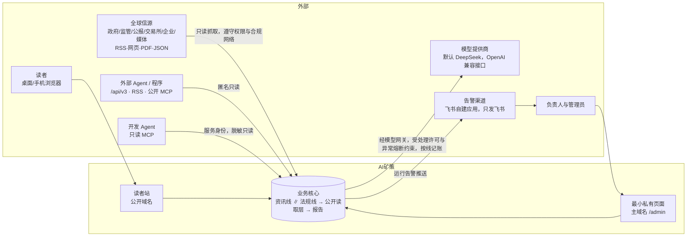
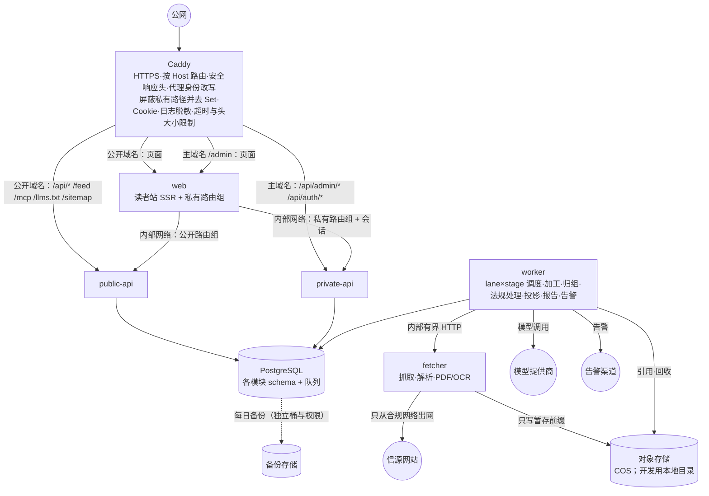
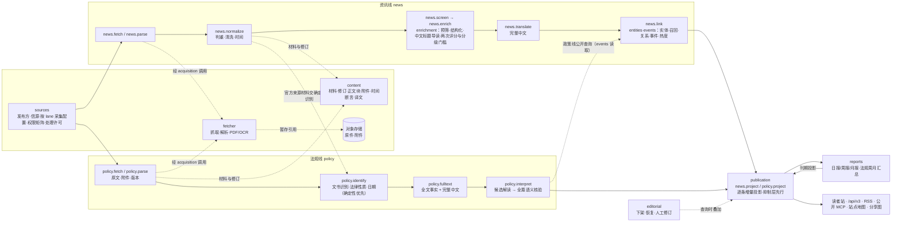
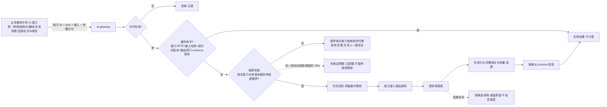

# 目标架构

> 本文给出新 AI矿策 的整体架构：风格、进程、两条业务线的数据流与调度、读写分离、AI 与任务体系、安全分区、验证与交付、演进路径。
> 模块细节见 `03-module-map.md`；技术选型与版本见 `02-tech-stack.md`；对 AIHOT 的逐项处置见 `04-aihot-adoption.md`；决定记录见 `adr/`（状态索引 `adr/README.md`）。
> 标注说明：【Owner 决定】= Owner 已批准的产品层决定（附日期与出处，改动须 Owner 重新决定）；【设计】= 本包提出的工程基线，M0 结束前由架构 Agent 按基准结果定稿，可用新 ADR 调整。

---

## 1. 架构风格：契约优先的模块化单体【设计】（ADR-0002）

**一个仓库、一个数据库、四类应用进程（web、api〔公开/私有两个实例〕、worker、fetcher）、十二个业务模块 + 平台包，边界由统一验证入口机器检查。**

- **为什么不是微服务**：首期部署在中国大陆的单台主机（区域为【Owner 决定】，与 ICP 备案一致；规格【Owner 决定】2026-10-01：先做容量基准，达标沿用已购 4C4G，DEC-18；这是全新重写的项目），一个 PostgreSQL，团队是 1 位 Owner + 按需开的多个 Agent。微服务带来的网络、部署、一致性和观测成本远大于收益。多 Agent 并行需要的是**清晰边界**，不是网络边界。
- **为什么不是“一个大 backend 包”**：AIHOT 把全部业务放在 `packages/backend` 一个包里，边界靠约定；旧项目有 20 个 `services/*` 目录却共享数据库表和隐式约定。两者都会在多 Agent 并行时互相踩。新项目的目标形态是每个模块一个独立 workspace 包、公开入口唯一，依赖方向与数据归属由 `make verify` 检查；到达方式是按业务线分治的渐进拆分（`03-module-map.md` 第 9 节），不做一次性机械重组。
- **进程按资源与安全边界划分，不按模块划分**：抓取解析放进独立的 fetcher（网络与恶意输入隔离），公开与私有 API 分实例（凭据隔离），其余业务都在 worker 内按业务线 × 阶段调度。
- **以后要拆服务怎么办**：模块之间只通过契约（查询函数、领域事件、任务）交流，每个模块拥有独立 schema。某个模块需要独立扩容时（例如 fetcher 或 worker 搬到另一台机器），只需把它的处理器放到单独进程，不需要重写。
- **总原则五条：以 AIHOT 为基础，按本交接包矿业化改造**【Owner 决定】2026-10-01（DEC-64、ADR-0021）：①基础是 AIHOT——新项目以 AIHOT 开源项目的功能和底层框架设计为基础；②改造内容以本交接包为准——怎样改成矿业版（功能、规则、页面、法规政策线、信源、内容标准等），交接包写明的以交接包为准；③交接包没写到的，照 AIHOT 的现有设计并矿业化（把 AI 领域的评分标准、提示词、分类、话题换成矿业的；精选评分机制与显示、热点榜、同一事件折叠成一张卡、日报周报月报的选材与出刊时间是 Owner 点名要学 AIHOT 的）；④模型榜与 Codex 重置监控明确删除、不移植，模型厂商标志、AI 话题与提示词等只对 AI 行业有意义的内容同样删除；⑤新建仓库，沿用 Owner 现有的服务器与域名——以 AIHOT 归档为起点新建私有仓库（默认名 `ai-mining-policy`），旧仓库只读存档，旧代码与旧数据一概不迁移，旧站的链接与接口地址也不做兼容或重定向，新站从空库开始，不存在的地址一律 404。

---

## 2. 系统上下文

不设运营台【Owner 决定】（旧ADR-0037:21-22@policy，2026-09-26；ADR-0018）：Owner 不需要每天打开任何后台，异常由告警推送给人，必要操作在六组最小私有页面完成。

---

## 3. 运行拓扑（首期单机）【设计】

| 进程 | 职责 | 持有 | 资源预算（4C4G 初值，基准后定） |
|---|---|---|---|
| `caddy` | HTTPS、按 Host 路由、安全响应头、代理身份改写（用直接对端地址覆盖 `X-Forwarded-For`）、屏蔽私有路径并去 `Set-Cookie`（公开域名 404 且无 `Set-Cookie`）、日志脱敏、超时与头大小限制；**不做限流**，限流在应用层（9.2、`06-security-and-access.md` 2.2） | 证书 | ~50 MB |
| `web` | 读者站 SSR；私有路由组在主域名的 `/admin` 响应（`PRIVATE_HOST` 生产即主域名，ADR-0026）；只调 api | 两个 api 的内部地址 | ~200 MB |
| `public-api` | 公开只读查询、反馈提交（公开 API 前缀 `/api/v3`；`/api/` 下不存在的路径，含旧站的 `/api/v1`、`/api/v2`，统一返回错误体 `not_found`（404），不做兼容或适配） | 公开只读登录、反馈写入登录、限流与游标 HMAC 密钥、仅 `feedback/` 前缀只写的对象存储凭据 | ~200 MB，1 核上限 |
| `private-api` | 私有页面接口（ADR-0018 六组操作）、只读 MCP（服务身份） | 私有业务登录、认证登录、会话/CSRF 密钥、只能加密的模型密钥与告警渠道地址封装材料、只读反馈截图的对象存储凭据 | ~150 MB |
| `worker` | 全部任务与定时器；两条业务线 lane×stage 调度；调用 fetcher 与模型网关；告警 | worker 登录、模型密钥与告警渠道地址的解封材料、对象存储凭据（原件读写与回收） | ~600 MB |
| `fetcher` | 抓取、HTML 抽取、PDF 文字层与表格、OCR（浏览器默认关闭） | 有时限任务描述、出站策略、对象存储暂存写凭据 | ~300 MB（硬上限 512 MB） |
| `postgres` | 结构化事实、队列、全文检索 | — | ~1.2 GB（shared_buffers 约 512MB） |

合计约 2.7GB，留出系统、页面缓存与发布预检所需的 ≥1GiB 余量。迁移以一次性任务容器执行。

私有主机名配置项 `PRIVATE_HOST` 保留，含义为“可以访问私有路径的主机名”，生产填主域名：后台页面在 `/admin`，私有接口在 `/api/admin/*`，登录接口在 `/api/auth/*`（ADR-0026）；不是独立的运营台应用或运营子站。旧 `admin.aiminingpolicy.com` 保留解析与证书，入口层 301 到主域名的同一路径与查询；取值在 `07-deployment-and-ops.md` 登记。

四个关键隔离：
1. **读者请求永远不会触发写入、采集或模型调用**——`public-api` 只有查询与一个受控写入口（反馈），不同步调用模型。
2. **私有接口只在 `PRIVATE_HOST` 的私有路径可达**——其他主机名对私有路径返回 404 且不带 `Set-Cookie`；`private-api` 不注册公开路由、只接受 `PRIVATE_HOST`（生产即主域名，ADR-0026）；两个 api 实例各自只挂本角色的数据库登录与密钥文件。
3. **抓取与解析关在 fetcher 里**——它没有主库凭据、没有模型密钥，只能写对象存储暂存区（ADR-0019）。
4. **web 不持任何数据库或模型凭据**——启动时按角色校验配置，出现禁止项即拒绝启动（9.1 节）。

---

## 4. 核心数据流：资讯线与法规线两条并行业务线【Owner 决定】（ADR-0016）

法规政策线与资讯线从第一个开发里程碑（M1）起并行、隔离运行（旧ADR-0037:23@policy，Owner 2026-09-26 批准；`docs/policy-upgrade/requirements.md:15@policy` D07）。两条线共享可靠的底层能力，但准入、暂停、优先级、调度份额与用量记账各自独立。

### 4.1 两条业务线对照

| 维度 | 资讯线 `news` | 法规线 `policy` | 共享但不混用 |
|---|---|---|---|
| 法域范围 | 18 国起步，按实测逐步扩（Owner 2026-10-01 已定；法域字典 `news_scope`） | 33 国 + 欧盟/联合国/OECD（`policy_scope`；33 国是底表不是上限） | 一张 36 个对象的法域字典（DEC-03） |
| 业务入口 | 官方动态、企业、媒体、行业机构；社交与未核实转载只作线索，不能单独支撑公开事实 | 官方法规政策发布体系、必要的部门/地方来源、修订与附件 | 发布方 → 信源 → 按 lane 的采集配置三层；每个采集配置独立版本化与启停（DEC-34） |
| 准入 | 矿业关联、可读性与证据；精选另行判断 | 法域/机关职责/法律性质、正文完整性与附件；**不经资讯预筛、评分、事件归组与精选** | 许可、URL 安全、证据完整性是共同底线；资讯价值分不拦法规 |
| 处理 | 清洗 → 预筛 → 结构化与中文标题导读 → 完整中文 → 实体 → 事件与热度 | 原文与附件 → 文书识别（规则优先）→ 全文事实与完整中文 → 候选解读 → 全篇语义核验 | content 与 ai-gateway 共用，业务 recipe 分开 |
| 调度 | 近期流优先，历史回填独立低优先级队列 | 更新检查、版本/效力检查、附件补齐、回填 | 队列按 `<lane>.<stage>`，各有并发上限与保留份额；不共享一个无界 FIFO |
| 暂停 | 只停资讯任务 | 只停法规任务 | 全局只保留“紧急全停”；来源级紧急权限撤销可同时影响两线，但须写明范围 |
| 用量与熔断 | 分线记账，不设保底额 | 分线记账，不设保底额 | 不设月度金额上限【Owner 决定】2026-10-01：付费调用不因累计金额而停止、排队或降级；因并发或速率限制积压时按“法规 > 官方一手 > 其他”的顺序处理；异常熔断（指标达阈值的 70% 先预警）只停触发它的付费调用、不停公开（DEC-08、DEC-09） |
| 产物 | 全部矿业动态（同一事件折叠成一张卡，DEC-25）、事件、精选与热点（沿用 AIHOT，切换前完成）、日报/周报/月报（选材沿用 AIHOT：取自精选候选，DEC-65） | “法规政策动态”栏目、文书版本、完整中文、解读与影响、周月汇总 | 同一公开读取层与抑制规则；产物类型与状态分开 |
| 公开条件 | 原生中文清洗完成即可公开；外文新稿需中文标题 + 导读 + 可取得且获准的完整中文正文（摘要不计全文，DEC-35）；预筛判为 BLOCK 的都不公开 | 基本事实与完整中文不等待解读；完整解读按“法域 × 文书类型”抽检通过后开放（DEC-15；Owner 2026-10-01 已定：由 Owner 本人一次性抽检） | 不编造译名；公开页只写原名，暂译只在私有队列（DEC-37） |

### 4.2 数据流

原则：
- **宽进全部动态，严选精选（资讯线）**：通过“可发布门”（未被预筛判为 BLOCK、来源有效、元数据完整、证据可追溯、权限允许、无未解决冲突、结构校验通过）的内容，不论影响高低都进入“全部矿业动态”，同一事件在该列表里折叠成一张卡（沿用 AIHOT 的事件卡与事件页，DEC-25）。
- **精选与热点沿用 AIHOT 的机制并矿业化，随全面切换上线（切换前完成）**【Owner 决定】2026-10-01（DEC-10、DEC-64，完整机制见 ADR-0021）：预筛 BLOCK / PASS / UNKNOWN（宽进，BLOCK 不出现在任何公开页面）→ 同一份评分标准独立打两次分（0–100），**两次之和 ≥ 2 × 门槛**即入选，门槛按信源分级（T1 官方一手 60、T1_5 官方账号与准官方 65、T2 媒体与个人 76，为 AIHOT 现值，作矿业版起点）→ 未入选但平均分高于 50 的也按精选的写法写中文标题、答案先行的摘要、推荐理由和标签 → 入选资料等事件归组完成（最多 3 分钟）再出现在精选里；热点榜按事件排名：过去 48 小时内被多个独立信源共同讨论的事件取前 10，网页显示热度值，机器出口只给名次，公式与衰减以 AIHOT `packages/backend/src/events/` 为准，法规文书不进热点榜（DEC-62）。评分标准、提示词、分类与话题换成矿业口径——评分标准的结构按 AIHOT 的 `selection-score.md`（内容类型 → 五轴各 0–10 整数 → 按类型权重合成 0–100；“必须正常评价”与“必须压住”两张清单；材料不足规则），**矿业版评分标准（读者定义、内容类型与权重表、两张清单、封顶规则）是草案，生效前必须先交 Owner 审阅确认（BR-SEL-09），提交时并排给出 AIHOT 原规则与矿业版改动点；未经确认不得用于正式站的精选，影子运行期可以用草案跑并把结果给 Owner 看**；门槛是 AIHOT 在 AI 领域的值，须用 100–200 条矿业样本（Owner 标注）按 AIHOT 的校准办法重新校准，影子运行期可先用原门槛，全面切换前必须完成一次留出集检查并留记录。显示按 AIHOT：有评分的条目在卡片右上角（详情页同样）显示“AI 评分 · NN”小标签（手机只显示数字；85 分及以上暖红、70 分及以上强调色、其余灰色；分数是两次评分的平均值，向下取整），入选精选的另有“精选”标记，推荐理由照常显示；没有评分的条目什么都不显示——不显示 0、占位或“暂无评分”。旧 55/70/65/75 公式与“暂未启用、等 Owner 给规则初稿”均已作废；数据不足时只显示诚实空态。
- **法规线不以新闻标准取舍**：新闻不适合法规不等于新闻垃圾；法规文书不合格时不降为摘要继续公开（旧ADR-0037:39,55@policy）。
- **最便宜的步骤在最前面**：确定性规则（Tier 0）→ 廉价模型 → 只有必要时才用强模型；法规线的文书识别、日期与关系先用程序规则，模型只产候选，证据与权限一致性由程序控制公开资格。
- **每一步都可重放、可审计**：阶段键 `(subject_revision, stage, recipe_version)` 决定是否已完成；相同输入不重复付费；任何阶段失败保留已成功阶段，不发布半成品。
- **发布不等待可选步骤**：原生中文材料清洗完成即可公开，不等可选的模型导读（预筛判为 BLOCK 的不公开）；法规线的基本事实与完整中文不等待解读。

### 4.3 lane × stage 调度与并发规则

| 队列（`<lane>.<stage>`） | 执行进程 | 所属模块 | 是否付费 | 说明 |
|---|---|---|---|---|
| `news.fetch` / `policy.fetch` | worker 调用 fetcher | acquisition | 否（付费抓取服务默认关闭） | 列表、分页、检查点、条件请求；等待网络不占模型并发 |
| `news.parse` / `policy.parse` | fetcher | acquisition → content | 否 | HTML 抽取、PDF 文字层与表格、OCR（按源启用）；CPU 预算单列 |
| `news.normalize` / `policy.normalize` | worker | content | 否 | 判重、清洗、时间断言、原件入对象存储 |
| `news.screen` | worker | enrichment | Tier 0 优先 | 资讯预筛与矿业关联（仅资讯线） |
| `news.enrich` | worker | enrichment | 是 | 结构化、中文标题/导读/推荐理由、同一标准独立两次评分（沿用 AIHOT，门槛按信源分级）；入选资料等 `news.link` 归组完成（最多 3 分钟）再进入精选 |
| `news.translate` | worker | content | 是 | 完整中文正文（分段、续译、租约） |
| `news.link` | worker | entities、events | 部分 | 实体解析、有界召回、关系判断、事件与热度 |
| `policy.identify` | worker | policy | 规则优先 | 文书身份、法律性质、立法阶段与各类日期（分维记录，DEC-36） |
| `policy.fulltext` | worker | policy（译文存 content） | 是 | 全文事实 + 完整中文（租约、检查点） |
| `policy.interpret` | worker | policy | 是 | 有界归并、候选解读、全篇语义核验（固定工作图，非 Agent 循环） |
| `news.project` / `policy.project` | worker | publication | 否 | 逐条增量投影、抑制叠加 |
| `news.report` / `policy.report` | worker | reports | 资讯报告可能付费 | 资讯报告从精选候选取材（同一事实去重、受版面容量限制），日报导语与周报、月报综述由模型写；出刊时刻与时间窗沿用 AIHOT（北京时间：日报每天 08:00 出刊、覆盖前一天 08:00 到当天 08:00，周报每周一 10:00 出上一个 ISO 周，月报每月 1 日 10:30 出上一个自然月；DEC-65）；法规周月汇总复用已合格版本，不重新解读，按北京时间自然周、自然月 |
| `news.backfill` / `policy.backfill` | worker 调用 fetcher | acquisition | 否 | **历史回填独立低优先级队列**：资讯线 72 小时 → 7 天 → 30 天有界回填、旧文不进“今天”；法规线另设窗口；与新稿同样计入用量与熔断检查、尽量非高峰加工 |
| `platform.<stage>`（`platform.ai`、`platform.storage`、`platform.ops`） | worker | ai-gateway、content、platform/ops、feedback | 否 | lane=`all` 的平台任务：回执对账与预留过期、用量提示、熔断预警（70%）与异常熔断评估（`ai.evaluate-usage`）、用量报告（`ai.usage-report`，每月 1 日）、暂存对象回收、保留清理、备份、告警评估与通知、健康汇总、反馈过期清理 |
| `offline.research` / `offline.eval` | worker | sources / ai-gateway | 是 | 信源研究与评测，不属任一业务线，单独记账、用最小必要样本，不设额度（Q-54 作废）；研究的有界工具循环须 Owner 批准后启用 |
| `offline.import` | `sources.import-targets`（一次性，手动） | sources | 否 | 一次性导入 Owner 原始信源表（321 条记录、320 个目标；需求输入，不是旧数据），幂等、可 dry-run、不产生模型费用（T-147）。原“旧数据一次性导入与增量追平（M4/M5）”【已废弃】：Owner 2026-10-01 已定“全重做”，不迁移旧站任何生产数据（DEC-20；`03-data/04-legacy-migration.md`），`import.run-batch` 任务类型不复用 |

任务类型名取 `<模块的 schema 名>.<动词>`（`ai-gateway` 的 schema 是 `ai`，`platform/ops` 是 `ops`）；队列名与任务目录以 `03-data/03-internal-contracts.md` 第 3 节为准。

调度规则（可检查的架构约束）：
1. 每个 lane×stage 有独立并发上限与保留份额；借用另一线的空闲容量必须可被所属线收回。**初值（双 lane 公平基准前）**：模型阶段每条线至少保留 1 个执行位；`*.parse` 每条线 1 个；`*.fetch` 每条线 4 个且每主机 1 个。基准后写入版本化配置。
2. 抓取等待不占模型并发；正文/PDF/OCR 的 CPU 预算不挤占公开 API。
3. 新闻突发不能无限推迟法规任务；法规回填不能堵住新闻实时流；历史回填一律走独立低优先级队列。
4. 同一 lane 内的模型阶段轮转领取（例如 `policy.fulltext` 与 `policy.interpret` 交替），任一阶段积压不能让另一阶段零执行；每轮付费调用上限由这些阶段共同使用；某付费调用结果未知时，本轮不再向其他阶段分配付费机会（旧分支 `service-scheduling.md:14-24@policy` 的修复）。
5. 运行控制按 lane：采集暂停、处理暂停、公开暂停各自独立，暂停必须带原因与到期时间并触发告警；在途结果写回时核对 lane 控制修订，已暂停的线只结算费用、不晋升结果（ADR-0005 第 7 条）。
6. 不设月度金额上限，也不设分线额度（DEC-08，Owner 2026-10-01 已定）：付费调用不因累计金额而停止、排队或降级；因并发或供应商速率限制出现积压时，处理顺序是“法规 > 官方一手 > 其他”。异常熔断（7.1）只暂停触发它的能力或来源的付费调用，不拖停另一条线；确定性处理、已公开内容与原生中文直出照常。
7. 验收：双 lane 公平基准（T-137，路线图 T-0614，M1；新闻突发 + 法规回填 + 慢 90 秒抓取 + 大 PDF + 供应商 429 同时存在时，每个 lane×stage 的最大等待有界）；“暂停新闻、法规继续”“法规回填、新闻实时流不受阻”两条集成测试；旧分支调度回归（慢采集 + 长模型调用 + 解读积压同时存在，三个阶段都获得执行机会）。

---

## 5. 读写分离：逐条增量投影取代“整站快照”【设计】（ADR-0004）

旧项目把整个公开站点序列化成一个巨型 JSON 快照，每次读取都要完整校验。旧ADR-0035 实测：595 篇材料 + 290 份报告修订时快照约 7.7MB，隔离冷读 0.5 核 12.0 秒、1 核 6.4 秒，而 Web 超时 10 秒，只能把发布上限从 8MiB 提到 12MiB（`docs/architecture/decisions/0035-measured-reader-capacity.md:10-26@main`）。这是新项目**必须避免**的头号架构坑；B 包的“发布代次 + current 指针 + 按 publication_id 存投影”是它的变体，同样不采用。

新方案（沿用 AIHOT 的“一个公开读取层 + 按条目一行的投影 + 发布账本单调序号”，并加强）：

1. `publication` 模块维护**关系型投影表**：资讯条目、事件/发展线、法规文书版本、主题、报告刊期、分面计数、搜索索引。投影由领域事件**逐条增量**更新，单条更新在一个事务内完成；不做整站重建，不设全站代次。
2. `content_version` 是不透明字符串（实现为发布账本的单调水位），任何投影变更与下架都使其变化，只用于 ETag 与前端版本检查；不提供按版本钉住读取；列表游标绑定筛选与排序条件，长文阅读游标绑定材料修订与语言表达（换版 409，撤回 404/410；DEC-47、ADR-0004 第 2 条）；`suppression_epoch` 只在内部使用。
3. **下架先行、失败关闭**：抑制层在每次公开查询时优先叠加；无法确认当前抑制状态时停止返回可能被撤回的内容；撤回即时移除，公开响应不设长缓存，下架后 60 秒内全部出口不可见（DEC-48）；投影重建是异步的，正确性不依赖它。
4. 法规文书按版本投影：每个合格版本一行不可变公开记录 + 语言头 + 资格视图；公开用途被逐源收紧（来源方异议、Owner 指示或法律要求）或质量资格到期时，整篇从所有公开入口移除，不退为摘要；`owner_declared` 许可证据不设自动到期（DEC-33）。
5. 列表接口不返回正文；详情接口只返回许可范围内的正文；站外出口（RSS、公开 API、公开 MCP）只对明确允许再分发的来源返回正文（ADR-0009）。
6. 公开页面、RSS、公开 API（`/api/v3`）、公开 MCP、站点地图、分享图、报告全部从 `publication` 读取并适用同一抑制规则；AI 生成或翻译的内容在详情、报告、RSS、API 中显式标注“AI 辅助生成/翻译”并带机器可读标识（DEC-38）。
7. 合法空站（尚无公开内容：空集合、详情 404、诚实空态）与损坏态（错误态）严格区分，不用示例内容填充。
8. 历史报告是“刊期 + 成员 + 修订”，引用固定修订，不复制正文；只因更正或下架产生修订。

性能目标：预热后常用公开接口 p95 ≤ 300ms；桌面首屏 ≤ 2s、手机 ≤ 3s；单次公开请求读取的行数与字节有上限，数据量扩大 10 倍时 p95 不劣化。AIHOT 线上实测页面中位数约 10ms、接口约 6ms，说明投影 + 索引的方案在同量级机器上足够。

---

## 6. 任务与工作流体系【设计】（ADR-0005）

- **一个持久化队列基础设施、按 lane×stage 分队列**：基于 PostgreSQL 的 pg-boss（AIHOT 已使用）。不引入 Redis、Kafka 或独立工作流引擎。队列名 `<lane>.<stage>`（另有 `<lane>.backfill`、`platform.<stage>`、`offline.*`，见 4.3），任务类型名 `<模块的 schema 名>.<动词>`，一个任务类型按载荷中的 lane 投入对应队列。
- **写事实与投递下一步在同一事务**（outbox）：模块写入自己的数据时，同一事务内插入领域事件（信封必带 lane）；分发器把事件转成订阅方的任务；消费方用 inbox `unique(consumer, event_id)` 去重。
- **阶段成功以结果表唯一键为准**：`(subject_revision, stage, recipe_version)`，同键只有一个成功结果，不随队列清理而丢失。
- **长任务有租约**：全文翻译、法规全文处理与解读使用业务侧执行记录；结果写回核对租约令牌、尝试次数、来源权限版本与 lane 控制修订，失配只结算费用、不晋升结果。
- **全局串行靠数据库**：归组合并等用数据库锁或唯一约束，不依赖某进程的 `localConcurrency: 1`。
- **失败隔离**：单个信源、单篇材料、单次模型调用的失败只影响它自己；按“重试、退避与租约参数表”（`02-rules`；默认任务最多 3 次尝试）自动重试；超过上限进入死信并**推送告警**；不设人工逐条重试页面，缺陷修复后由受控服务身份按批重放（ADR-0018 第 7 条）。
- **调度**：定时器每 300 秒检查到期信源（尊重每个采集配置自己的频率）；资讯日报每天 08:00、周报每周一 10:00、月报每月 1 日 10:30 出刊（沿用 AIHOT：日报覆盖前一天 08:00 到当天 08:00，周报覆盖上一个 ISO 周，月报覆盖上一个自然月；每小时检查一次并补出缺的刊期；跨过刊期边界才确定精选公开时间的归入下一期，不设“补录”；选材取自精选候选；均为北京时间，DEC-65）；清理、聚合、备份按日执行。
- **生产不依赖开发环境与交付链**：采集、加工、发布在服务器上持续运行；验证执行器、构建机或代码托管平台不可用只影响软件发布。开发 Agent 不进入生产调度依赖（旧ADR-0037:22@policy）。
- **运行控制**：生产中的暂停按 lane 存在数据库（采集/处理/公开三类，带原因与到期），另有一个“紧急全停”；环境级安全阀（`COLLECT_ENABLED`、`MODEL_CALLS_ENABLED`、`PUBLISH_ENABLED`、`NOTIFY_ENABLED`）只决定“发不发出去”，不改变代码路径，开发与测试默认全关。

---

## 7. AI 架构【设计】（ADR-0006、ADR-0007）

### 7.1 模型网关（`ai-gateway`）是唯一出口

- **能力注册表**：每个 AI 能力声明 ID、所属 lane、提示词文件、输入/输出 schema、路由、记账类别、单次输入长度上限（最大 token）、重试次数上限、超时、缓存键组成、评测集 ID。
- **提示词在行业包**：`industry/prompts/<capability>/`，版本即内容哈希；改提示词后只影响新任务，已判过的不重算（除非显式批量重跑）。
- **路由变更是经准入的配置修订**：评测 → 影子 → 小流量 → 启用；模型接入与密钥录入在私有页面“用量与模型密钥”（OP-12/13）完成；不因单次失败自动换到另一家提供商。
- **提供商不写死**：业务代码里不出现任何提供商名称；默认 DeepSeek【Owner 决定】（08-owner-voice DEC-10，2026-09-05）；新增任何供应商（含 embedding）须基准证明必要，并由 Owner 同意、开通账号、录入密钥（DEC-29；不再以预算为由拒绝）。
- **不设月度金额上限，但不浪费、可核算是初始架构要求**【Owner 决定】2026-10-01（DEC-08；取代旧ADR-0031 的“月度 100 元硬限、80 元提醒”及旧ADR-0037:44@policy 的重申，旧站在切换前仍按其自身上限运行，与新项目无关）：付费调用不因累计金额而停止、排队或降级；全部省钱纪律保留——先登记回执再调用、同一输入加同一提示词版本不重复付费（回执与缓存复用）、结果未知不盲目重发并逐笔核对、每个能力有单次输入长度上限与重试次数上限、评测与研究用最小必要样本；已确认、预留、结果未知、本地复用、提供商缓存分开统计，回执与账本带 lane，并按业务线、能力、信源分别记账；每月 1 日推送上月用量报告（费用、调用数、缓存命中率、单篇成本、最贵的 10 个任务），月内累计每增加 100 元推送一次用量提示（只提示，不暂停处理；BR-COST-17～19）。
- **异常熔断（防故障烧钱，不是预算上限），预警先于熔断**【Owner 决定】2026-10-01（“防烧钱熔断”已确认，并要求有预警）：三项指标——同一输入 1 小时内重复付费调用 ≥3 次；单篇资讯材料累计费用超过 5 元，或单份法规文书累计超过 100 元；单日总费用超过过去 7 日日均的 3 倍且超过 50 元（没有历史数据时以单日 200 元为界）。**任一指标达到其熔断阈值的 70% 时先推送预警**（只提醒，不暂停任何处理），达到阈值才熔断：任一触发即暂停相关能力或来源的付费调用并告警，负责人在私有页面一键恢复。预警与熔断都走告警渠道（渠道见 DEC-06），消息写明是哪一项指标、当前数值与阈值、涉及的能力或来源。阈值与预警比例（默认 70%）是【设计】默认值，放在受控配置里（ENT-83，负责人可调）；熔断只停付费调用，不影响已公开内容、原生中文直出与不需付费的环节（细则见 `02-rules/05-cost-and-budget.md` BR-COST-20；熔断状态为 `03-data/01-domain-model.md` ENT-82，独立于人工暂停）。
- **读者请求永远不调用模型**。

### 7.2 能力单元化与评测驱动

每个 AI 能力 = 提示词 + 输入输出契约 + 模型路由 + 黄金集 + 评测脚本 + 记账类别 + 所属 lane。这样：
- 不同 Agent 可以并行改进不同能力，互不影响；
- 换更强的模型只是经准入的路由变化，用评测结果决定是否切换；
- 质量改进有数字依据（准确率、查全率、误合并率、成本、延迟），而不是凭感觉；质量结论只来自真实样本（DEC-15）。

能力清单与规格见 `02-rules/03-ai-capabilities.md`，评测集规范见 `05-quality/05-evaluation-sets.md`。

### 7.3 生产主链路不用 Agent 循环【设计】（DEC-16）

- **生产是程序编排的固定工作图**：资讯加工与法规处理（全文事实与完整中文 → 文书身份与日期 → 有界归并 → 候选解读 → 全篇语义核验 → 周月汇总引用合格版本）都是有类型、有单次输入与重试上限、有最大输入输出的任务链，不是 Agent 循环；不引入常驻智能体（旧ADR-0037:24@policy）。
- **有界工具循环只用于离线信源研究**（识别官方身份、找到新闻/法规栏目、判断分页），产物是待准入的候选配置，仍要走信源预览与启用门。`ai-gateway` 提供循环执行器与计费（步数、请求数、token、时长、单次任务费用上限，每步走同一回执与熔断检查），**不自带工具**：工具由调用方模块注入，抓取类工具必须经 acquisition 的受控抓取端口（由 fetcher 执行）。启用前须经 Owner 批准工具、上限、终止条件与产物 schema。
- 不引入第三方 Agent 框架作为生产依赖（旧仓库时序：旧ADR-0012 禁止 → 旧ADR-0036 批准受控试验、首批 3 个真实任务未产出可审稿 → 旧ADR-0037 取代其依赖）。

模型越强，固定工作图里每一步的质量越高、可合并的步骤越多，但护栏不变——这就是“模型越强，系统越容易演进”的具体含义。

---

## 8. 配置即数据，能力即代码【Owner 决定 + 设计】（ADR-0018）

日常生产**没有任何人工步骤**，也不需要改 JSON、改代码、提交、重新部署或找 Agent。必要的人工操作只有下表六组，全部在最小私有页面完成；运行状态以告警推送给人（DEC-04、DEC-06）：

| 必要操作 | 载体 |
|---|---|
| 登录、改密；负责人增停具名管理员、重置密码 | 私有页面 · 账号 |
| 新增信源（国家 + 名称 + 网址即可发起试探）、试抓预览、启用、暂停、恢复、归档（按业务线分别操作）；加入信源时由负责人一次确认（按 Owner 声明许可建档），逐源逐项收紧权限开关（关闭即时生效并联动撤回） | 私有页面 · 信源 |
| 查找内容，下架、恢复、人工修订标题/导读/正文/分类 | 私有页面 · 内容 |
| 查看本月用量与分线分能力明细、异常熔断状态与阈值（含预警记录，负责人可调）、熔断后一键恢复、按业务线暂停/恢复处理；结果未知费用逐笔核对；模型接入、密钥录入、环节指派（新路由修订须经准入）；录入告警渠道地址并发送测试、查看未送达列表（OP-20，修改渠道为高风险确认） | 私有页面 · 用量与模型密钥（OP-12/13/20） |
| 处理读者反馈 | 私有页面 · 反馈 |
| 维护关于、条款、隐私、联系方式等站点资料，以及 ICP 备案号、公安联网备案号、互联网新闻信息服务许可证信息（受保护配置，Owner 经安全方式提供） | 私有页面 · 网站资料（OP-17） |
| 采集连续失败、积压、发布新鲜度、用量提示（每 100 元）、用量预警（熔断指标达阈值的 70%）、异常熔断触发、死信、磁盘、备份、质量资格与证书到期等运行状态 | 告警推送（飞书自建应用，照上游，只发飞书；2026-10-06，08-owner-voice DEC-33） |
| 开发 Agent 诊断运行状态、队列、用量与熔断状态、发布版本、错误样本 | 只读 MCP（服务身份、脱敏） |
| lane×stage 并发与保留份额、重试参数、行业词表与提示词 | 版本化配置，随代码经 PR 发布 |

**不做**：总览页、审稿关卡、审计查看页、采集运行页、系统页、逐条重试/翻译/发布按钮（旧ADR-0037:21@policy）。

**架构必备的保留组件**（旧ADR-0037:37-38@policy）：只读 MCP、服务身份、费用回执、审计（与业务变更同事务写入）、持久下架。

新增系统原本没有的能力（新的分析阶段、新型信源适配器、订阅、项目库等）才需要写代码；新增私有操作须 Owner 点名。

---

## 9. 安全分区【设计】

| 区域 | 规则 |
|---|---|
| 公开读者站与公开 API | 匿名只读；不设账号；收藏只存在浏览器本地（只存引用 ID；旧站遗留的本地收藏指向旧 ID，新站忽略且不报错）；不暴露模型、提示词、成本、两次评分的明细、置信度、私有证据（公开的分数只有精选的平均分，向下取整，没有评分的条目不显示分数）；新公开 API 前缀 `/api/v3`（只为避免旧客户端打到同名路径拿到形状不同的响应，不承担兼容义务）；**新站不为旧站的任何地址做兼容或重定向**【Owner 决定】2026-10-01（DEC-21）：没有旧链接对照表、301 映射、“已改版”专页与旧接口适配期，不存在的地址（含旧站的条目、事件、报告链接，旧 RSS 与旧接口地址）一律 404——页面类走通用“页面不存在”页（带首页与搜索入口），接口类返回统一错误体 `not_found` |
| 私有页面 | 主域名的 `/admin`（ADR-0026）；只用密码的具名账号（Argon2id）、服务端会话（`__Host-` Cookie、可撤销，空闲 30 分钟、绝对 12 小时）；CSRF 防护；登录两级限流（同账号、同来源，先限流后算哈希；全站总量只告警）；所有写操作与审计同事务；确认分两级，高风险操作仅负责人并即时推送；首个负责人服务端一次性开通（DEC-05、DEC-43）；负责人忘记口令走云控制台固定脚本（`06-security-and-access.md` 3.1） |
| 模型与密钥 | 服务级密钥一律为只读挂载的密钥文件，配置里只放路径；不进仓库、环境变量、命令行、前端包、日志、浏览器；模型密钥在私有页面录入后信封加密存储，只显示指纹，只有 worker 能解密（细则见 `06-security-and-access.md`） |
| 信源权限 | 权限矩阵是处理的硬门，也是逐源收紧的开关：Owner 2026-10-01 声明全部信源均已获得许可，九项用途一律按“允许”建档（证据类型 `owner_declared`，不设自动到期）；来源方提出异议、Owner 指示或法律要求时逐源逐项关闭，即时生效并联动撤回已公开的全文或译文；被关闭的处理（外部模型、保存全文、公开全文、公开译文）不做；站外再分发全文（`syndicate_fulltext`）默认关闭（ADR-0009、Q-47） |
| 采集出网 | 只从部署所在的合规网络发起；不可达如实标记，不用代理、境外节点或第三方抓取绕过；默认 https，单源 http 例外须负责人开启并留审计（ADR-0019） |
| 数据库 | 不开放公网端口；按角色分登录（`dbFor(role)`：`public_read`、`feedback_write`、`private_ops`、`auth`、`worker`、`migrate`〔短时〕；备份作业另有专用只读 `backup` 登录，不经模块注入；web、fetcher 无数据库登录）；公开只读登录只能读当前公开投影与视图；网络分段见 `07-deployment-and-ops.md` 2.3（web、api、postgres 无出网，只有 fetcher 与 worker 加入出网网络） |
| 读者反馈 | 截图与联系方式私有，不公开、不送模型；处理完成后 180 天自动删除联系方式与截图（DEC-46）；按可信代理传递的客户端地址限流 |

### 9.1 部署角色与凭据【设计】

| 角色 | 可以做 | 持有 | 不持有 |
|---|---|---|---|
| web | SSR、路由、表单转发、UI | 两个 api 的内部地址、会话 Cookie 转发 | 数据库连接、模型密钥、抓取与对象存储凭据、云管理权 |
| public-api | 契约校验、公开投影读取、反馈接收 | 公开只读登录、反馈写入登录、限流与游标 HMAC 密钥、**仅 `feedback/` 前缀只写**的对象存储凭据（无读取、列举、删除） | 私有表查询、会话/口令/管理密钥、模型调用、抓取权限、认证库访问 |
| private-api | 认证、六组私有操作、审计、只读 MCP | 私有业务登录（经应用端口的受限写）、认证登录、会话/CSRF 密钥、只能加密的模型密钥与告警渠道地址封装材料、**只读反馈截图**的对象存储凭据 | 任意 SQL、所有者数据库权限、可解密模型密钥或告警地址的材料、抓取权限 |
| worker | 任务消费、领域处理、投影构建、告警 | worker 登录、队列、模型密钥与告警渠道地址的解封材料、对象存储凭据（原件读写与回收） | 云控制权、开发 Agent 会话、Web 资产写权限、认证库 |
| fetcher | 获取允许目标、解析并返回暂存引用 | 有时限任务描述、出站策略、对象存储暂存写凭据 | 主业务数据库、发布/审核写权限、模型与告警渠道凭据 |
| migration | 有版本的 schema 变更 | 临时迁移登录 | 长期运行服务身份 |
| backup | 备份与恢复演练 | 专用只读备份登录、age 公钥、只写的独立备份桶凭据（只写子账号或短期凭据，无 Delete） | 备份私钥（Owner 离线保管）、公开响应权限、通用管理入口；细则见 `06-security-and-access.md` 4.2 |

可执行检查：
1. 启动时按角色校验配置：web 出现 `DATABASE_URL` 或模型密钥、fetcher 出现数据库凭据、生产出现出网代理设置，即拒绝启动；开发与生产用同一配置 schema。
2. 集成测试用真实登录（不是 `SET ROLE`）跑允许/拒绝矩阵：公开登录读不到私有表与模型账本；fetcher 无数据库登录；从 public-api 容器内读不到任何管理密钥文件。
3. Compose 模板按服务分别挂载密钥文件，不使用共享 `env_file`（AIHOT `docker-compose.yml` 的 `x-app` 锚点让所有容器共用一份 `.env` 与数据库连接串，不沿用）。

### 9.2 公开入口限流与可信代理【设计】（PIT-061、INV-25）

- **限流在应用层（令牌桶），Caddy 不限流**（标准 Caddy 没有内置限流，边缘与应用各管什么见 `06-security-and-access.md` 2.2）。限流键 = 按可信跳数取得的客户端地址的**哈希**（只存哈希，哈希密钥缺失则启动失败）；Caddy 用直接 TCP 对端覆盖 `X-Forwarded-For` 并删除其他代理身份头；`trustProxy` 只信 1 跳，绝不设 `true`；未认证请求不能影响他人的桶。
- 服务端渲染的内部请求（Caddy → web → public-api）保留有界的客户端地址链，边缘身份缺失或畸形即失败关闭，避免全站读者共用 web 容器的一个桶。
- 公开读的突发额度不低于首屏 API 请求数的 2 倍，首屏请求数有上限（T-097、T-098）；反馈提交与登录另设更严的桶。
- `/healthz`（进程存活）只在内部网络可达、不碰数据库；`/readyz` 不对公网；公网只暴露一个经限流的“公开新鲜度探针”，供外部拨测使用。
- 旧实现值（每客户端 60 次/分钟、突发 20）不继承，由容量基准定值写入配置。

详见 `06-security-and-access.md`。

---

## 10. 可观测与可被 Agent 运维【设计】（ADR-0020）

- **业务运行记录 + 结构化日志是首期唯一必需的观测通道**：每次采集尝试、模型调用、发布、报告生成都有记录；30–90 天明细后汇总为日聚合。JSON 日志带 `trace_id`、lane、模块、任务 ID、信源 ID、材料 ID；不记录密钥与正文全文。
- **指标全部带 lane 维度**，由 `platform/ops` 定时计算写表：每个 lane×stage 的最老积压年龄与可用并发、重试/死信/结果未知数量、正文完整率与中文完成率、发现到公开延迟、发布新鲜度、模型费用（按业务线、能力、信源）与缓存命中率、重复率与误合并率、数据库增长与对象回收率、磁盘与备份、出口带宽与月流量用量（默认 70%/90% 告警）。
- **告警推送**：超阈值推送到 Owner 指定渠道（飞书自建应用，照上游原样，只发飞书，不做邮件备用；Owner 2026-10-06，08-owner-voice DEC-33），含责任模块、lane、失败类别、最近成功时间与恢复建议；随首次生产部署上线（DEC-06）。分三层：应用内业务告警、独立于应用的外部检查（云监控 + 不在同一主机上的外部拨测）、日程型到期预警（`07-deployment-and-ops.md` 6.3）。低频官方源按“计划检查成功 + 真实无更新”评估。页面正常、容器健康、worker 心跳都不能单独证明内容持续更新。
- **追踪**：代码用 OpenTelemetry API 打点，任务载荷携带 trace 上下文，默认不导出；trace 后端在“跨进程排障连续两次依赖手工拼日志”后再引入。
- **只读 MCP（面向开发 Agent）**：提供脱敏后的运行状态、队列、用量与熔断状态、发布版本、错误样本的只读查询，让 Agent 在不接触密钥和生产写权限的情况下诊断问题。

---

## 11. 验证、交付与部署【Owner 决定 + 设计】（ADR-0017、ADR-0012）

不依赖 GitHub Actions【Owner 决定】（旧ADR-0038，Owner 2026-09-26 批准；PR-only、线性历史、版本绑定、可信制品、授权和回退不取消）：

- **统一验证入口**：`make verify`（合并前）与 `make release-check`（发布前），在指定完整 SHA 的干净检出上运行，首尾校验 HEAD/tree/锁文件；产出机器可读验证回执（SHA、tree、锁文件哈希、各阶段结果、平台与工具版本、时间），随 PR 附上。执行者是独立构建机或开发机上的隔离环境，**不得是生产主机**。
- **合并规则**：PR-only、squash 线性历史、禁止强推与删除、审查意见须解决、管理员同样受约束；合并前必须有该 PR 最终 SHA 的通过回执。
- **制品与信任**：镜像按 SHA 构建（linux/amd64），附 manifest、SBOM 与离线签名；生产只接受 Owner 一次性授权的受信公钥签名的制品，按 digest 拉取；更换信任根须 Owner 明确授权，不能先关验签上线。
- **合并后不自动部署**：部署是独立、可回退的操作。发布顺序：预检（可用内存 ≥1GiB、可用磁盘 ≥4GiB）→ 只增不破的迁移 → 替换服务 → 健康检查 → 公开读取冒烟 → worker 跑通一轮 → 外部读回发布标识头 → 登记产品更新；失败自动回滚，**回滚也要验收**，失败进入维护态并告警。保留当前与上一版本。
- **磁盘**：系统盘已用 < 20,000,000,000 字节；回收只限受管的旧容器、无引用镜像、已验证的旧发布目录；禁止全局 prune 与删卷。
- **备份**：PostgreSQL 每日 custom dump，经 age 客户端加密后写入私有、版本化的备份桶（与原件分桶、分权限），默认保留 7 日 + 4 周（可选月备份）；默认 RPO ≤24 小时、RTO ≤2 小时（需 Owner，Q-59）；公网发布前与切换前各做一次隔离恢复演练，此后每月一次，须证明业务引用与结果未知的费用都能恢复（`07-deployment-and-ops.md` 第 5 节）。
- **切换**【Owner 决定】2026-10-01（DEC-19、DEC-20）：全部排期功能完成并通过各自验收后，一次性全面切换，旧站在此之前照常服务；M4 是影子运行与全量验收（新站用自己采集的数据与旧站并行对比，旧站仍是正式站），M5 是全面切换。切换门槛：全部排期功能验收通过（含精选：矿业版评分标准已经 Owner 审阅确认、门槛已完成一次留出集检查并留记录）、影子运行通过、恢复演练一次、告警渠道就绪、Owner 在真实公网与手机上逐项看过；法规线以页面与管线功能完成并通过验收为门槛，不以 36 个法域全部供稿为门槛。**不迁移旧站任何生产数据**（新站从空库开始，没有导入与对账）；新站上线当天旧站停止服务，不保留只读、不切回旧站，切换后出问题只在新站内处理（Owner 2026-10-03）；新旧两站之间不回写数据；新站不为旧站的任何地址做兼容或重定向，不存在的地址一律 404（见 `03-data/04-legacy-migration.md`）；主机与入口层步骤、同机切换窗口见 `07-deployment-and-ops.md` 第 4 节。

详见 `07-deployment-and-ops.md`。

---

## 12. 演进路径【设计】

| 触发条件（测量得到，而不是预感） | 演进动作 |
|---|---|
| CPU 持续 >70%、内存 >75%、数据库 >12GB、搜索 p95 >300ms、文档 >10 万（旧ADR-0010 触发线，作为可配置默认值） | 先查索引、保留清理与并发配置；仍不足再按基准选规格（须 Owner 批准费用） |
| 浏览器/OCR 池成为测得的容量瓶颈，或发生隔离事故 | 水平扩展 fetcher 或把它迁到第二台机器（接口不变） |
| 队列长期积压、某 lane 最老积压持续超阈值 | 调整 lane×stage 份额；仍不足把 worker 拆到第二台机器（同一数据库），按队列分配 |
| 数据库成为瓶颈 | 迁到托管 PostgreSQL；读者读取可加只读副本 |
| 中文搜索质量或性能不足 | 在 PostgreSQL 内加中文分词扩展；再不够才引入独立搜索服务 |
| 公共流量显著增长 | CDN 缓存公开页面与接口（内容版本号作为缓存键，下架仍即时生效） |
| 私有页面依赖无法与公开包隔离，或安全审计要求物理隔离 | 把私有路由组拆成独立进程（ADR-0018 第 8 条） |
| 跨进程排障连续两次依赖手工拼日志 | 引入 trace 后端（ADR-0020） |
| 需要境外采集节点 | 另立 ADR，写明法律与安全评估、凭据隔离，经 Owner 决定（默认不设） |

---

## 13. 与旧项目、与 AIHOT 的差异一览

| 方面 | 旧项目 | AIHOT | 新 AI矿策 |
|---|---|---|---|
| 形态 | 20 个 Python 服务目录 + Next.js，共享表 | 3 进程 + 1 个大 backend 包 | web + api（公开/私有两实例）+ worker + fetcher；12 个强边界业务模块 + 平台包 |
| 业务线 | 新闻优先，法规线在分支上补做 | 单一资讯线 | 资讯线与法规线从 M1 起并行、隔离（准入、暂停、调度份额、分线记账） |
| 公开读取 | 巨型 JSON 快照，逐次校验 | 公开读取层 + 投影表 | 公开读取层 + 逐条增量投影 + 抑制层先行、失败关闭 |
| 原件存储 | 数据库与本地文件混用 | 本地数据卷 | 对象存储（COS；开发用本地目录），数据库只存键与哈希 |
| 运营 | 大量配置文件、需要 Agent 操作生产；后期运营台 | 单管理员后台 | 不设运营台；六组最小私有页面 + 告警推送；负责人 + 具名管理员 |
| AI | 多套网关/规则包并存，部分离线空转 | 回执 + 预算 + 每步换模型 | 统一网关 + 能力单元 + 评测驱动 + 固定工作图；有界工具循环只用于离线信源研究；不设月度金额上限，用量报告 + 异常熔断（70% 预警在先） |
| 信源 | 321 条原表，接通 ~21 个 | 18 个示范源 | 原表全部入库为待办（Owner 声明许可，按 `owner_declared` 建档）；36 个法域对象；按业务线的采集配置，逐源接通 |
| 精选与热点 | 暂未启用；旧 55/75 公式只作离线基线 | 预筛 + 同一标准独立两次评分 + 信源分级门槛；按事件的 48 小时热点榜 | 沿用 AIHOT 机制并矿业化（评分标准、提示词、分类、话题换成矿业；矿业版评分标准是草案，须先经 Owner 审阅确认才生效；门槛用矿业样本重新校准），随全面切换上线（ADR-0021） |
| 报告选材与出刊时间 | 日报含全部合格内容；按自然日/周/月归期 | 从精选候选取材，同一事实去重、受版面容量限制；导语与综述由模型写；日报 08:00 出刊、取前一天 08:00 到当天 08:00，周报周一 10:00、月报 1 日 10:30 | 选材与出刊时间都沿用 AIHOT（DEC-65）：日报 08:00、周报周一 10:00、月报 1 日 10:30，日报覆盖前一天 08:00 到当天 08:00，跨界归下一期、不设“补录”，历史期不改写；法规周月汇总另是一套确定性快照（北京时间自然周、自然月） |
| 仓库与功能基础 | 旧仓库（20 个服务目录） | AIHOT 仓库（开源） | 新建私有仓库（以 AIHOT 归档为起点，默认名 `ai-mining-policy`）；以 AIHOT 的功能和底层框架设计为基础，改造内容以本交接包为准，交接包没写到的照 AIHOT 并矿业化，模型榜与 Codex 重置监控不带入，沿用 Owner 现有的服务器与域名（Owner 2026-10-01，DEC-64） |
| 切换与旧数据 | 旧站运行至切换 | — | 全部排期功能完成后一次性全面切换；不迁移旧数据，新站从空库开始；不为旧站的任何地址做兼容或重定向，不存在的地址一律 404（Owner 2026-10-01，DEC-19、DEC-20、DEC-21） |
| 治理与交付 | 总控人工审查、多阶段收口门；Actions 为唯一执行器 | 轻量 | 统一验证入口 + SHA 绑定回执 + 签名制品；不依赖 Actions；人只做产品决策与验收 |

---

## 14. 故障分类与处置矩阵【设计】

| 触发 | 可自动做 | 必须保持 | 对读者影响 |
|---|---|---|---|
| 429/503/短暂网络错误 | 按参数表退避、遵守 Retry-After、单源降速 | 游标与已获成功结果 | 已发布内容可读，信源健康注明 |
| 源站从大陆不可达 | 标“不可达（网络）”并告警 | 不用代理或境外节点绕过，不伪造新鲜度 | 覆盖说明如实标注 |
| TLS/身份/跳转不符 | 隔离该信源并报具体原因 | 不关闭 TLS 校验，不绕过身份 | 不伪装为已接入 |
| 解析布局变化 | 保留合法元数据，解析隔离 | 原权限、旧稳定 ID | 正文未取得如实说明 |
| PDF/OCR 置信不足 | 保留页码，标待处理 | 不声称完整中文或完整解读 | 导读/原文入口或“处理中” |
| 熔断指标达到其阈值的 70%（预警） | 推送预警（只提醒，不暂停任何处理），写明指标、当前数值与涉及的能力或来源；预警与熔断同走告警渠道 | 公开标准、全部处理照常 | 无 |
| 异常熔断触发（重复付费、单篇/单份累计费用、单日费用异常） | 只暂停相关能力或来源的付费调用并告警；规则处理、缓存复用、原生中文直出与已公开内容照常；负责人在私有页面一键恢复 | 已预留与结果未知的费用、公开标准 | 受影响能力的更新延迟如实可见，另一条线与其他能力照常 |
| 供应商限流或并发积压 | 按“法规 > 官方一手 > 其他”的顺序处理，退避并遵守 Retry-After；不设金额上限，不降低公开标准 | 已预留与结果未知的费用、公开标准 | 更新延迟如实可见 |
| 模型输出 schema 或证据不符 | 在重试上限与已知失败语义内有界重试；否则隔离 | 不发布臆造字段 | 不发布不完整分析 |
| worker 崩溃 | 租约超时后同阶段键恢复 | 检查点与费用回执 | 已公开内容继续 |
| fetcher 崩溃或超时 | worker 侧按参数表重试，暂存对象由回收器清理 | 游标不前移 | 无 |
| 数据库不可用 | 停写、就绪检查失败 | 不把未知提交当失败重发 | 503；不清合法会话 Cookie |
| 抑制状态读取失败 | 停止返回可能被撤回的内容 | 下架集合 | 503 或占位，不回退旧数据 |
| 搜索投影失败 | 重建受影响投影 | 不返回未过抑制的结果 | 详情可读；搜索明确降级 |
| 审计写入失败 | 回滚该人工操作 | 原权限、下架与修订状态 | 私有页面提示未完成，不给成功通知 |
| 发布或回滚冒烟失败 | 回滚；回滚也失败则进入维护态并告警 | 上一版本镜像与数据库兼容 | 只读静态页或短暂不可用，不暴露半版本 |
