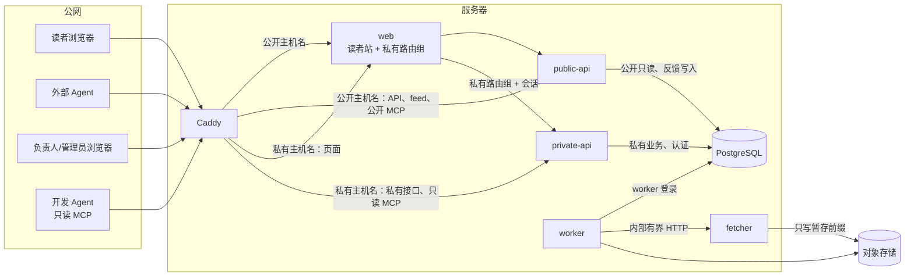

# 安全与权限

> **结论**：公开站匿名只读；不设运营台，必要私有操作只在私有主机名上的“最小私有页面”完成；密钥只放只读文件，每个进程、每个数据库登录只拿自己需要的；第三方内容按权限矩阵处理；主机、网络与抓取出网各有基线；以上每条都有可判定的验收（第 7 节）。
> 标注：【Owner 决定】= Owner 已批准（附日期与出处）；【已验证】= 旧仓库有验收记录或线上回读证据；【已实现未验证】= 旧仓库只有代码；【设计】【新增】= 本包提出。引用格式：`路径:行号@main`（旧仓库 main 65d3624）、`@policy`（法规分支 6d37df8）、`A:` / `B:`（两包原件）、`AIHOT:`（AIHOT 快照）。
> 依据：ADR-0018（最小私有页面取代运营台）、ADR-0019（独立抓取进程）、ADR-0017（不依赖 Actions 的验证与交付）；旧ADR-0028（公网 Web 最低安全）、旧ADR-0031（只用密码的具名账号，Owner 2026-09-06）、旧ADR-0037（不设运营台，Owner 2026-09-26）、旧ADR-0006（中国大陆部署）；旧仓库多人后台威胁模型与线上部署手册；AIHOT 的“公开内容匿名、后台只允许管理员”规则；裁决 DEC-04/05/06/32/33/39/40/43/46/56。
> **v2.1 修订（2026-10-01 按 Owner 答复）**：信源权限改为按 Owner 声明许可建档、逐源收紧（DEC-33）；合规展示新增公安联网备案号与互联网新闻信息服务许可证（DEC-39、DEC-40）；不为旧站任何地址做兼容或重定向、不存在的地址一律 404（DEC-21）；预算上限相关的高风险操作改为异常熔断阈值（DEC-08）；页面组名改为“用量与模型密钥”；告警渠道已定（DEC-06）。
> 本文不含密钥、公网 IP、个人资料；涉及 Owner 自持的账号与凭据，只写类别与处置方式（清单见 `07-deployment-and-ops.md` 第 8 节）。

---

## 0. 硬规则速查

| # | 主题 | 规则 | 状态 |
|---|---|---|---|
| 1 | 私有面载体 | 不设运营台；六组最小私有页面，只在私有主机名 `PRIVATE_HOST` 响应（ADR-0018） | 【Owner 决定】2026-09-26（旧ADR-0037:21-22,37-38@policy） |
| 2 | 登录 | 只用密码的具名账号；不做动态码、不预留入口；首个负责人由部署方在服务端一次性开通，首次登录强制改密 | 【Owner 决定】2026-09-06（旧ADR-0031:65-71@main）；DEC-05、DEC-43 |
| 3 | 会话与限流 | 空闲 30 分钟、绝对 12 小时；同账号 5 次/15 分钟、同来源 20 次/15 分钟，先限流后算哈希；全站总量只告警与逐步延迟，不拒绝已通过两级限流的请求 | 【已验证】（前两项）/【新增】（全站总量） |
| 4 | 进程隔离 | public-api 与 private-api 是同镜像的两个实例，各自只挂本角色的数据库登录与密钥；web 不持任何数据库或模型凭据；fetcher 无数据库、无模型密钥 | 【设计】D15-secops-019；ADR-0012、ADR-0018、ADR-0019 |
| 5 | 密钥 | 服务级密钥只放只读挂载的文件，配置里只放路径；禁止环境变量与命令行；启动自检属主、模式、类型 | 【已实现未验证】旧站做法；D15-secops-005 |
| 6 | 公开入口 | 限流在应用层令牌桶，Caddy 不限流；`trustProxy` 只信 1 跳；`/readyz` 不对公网 | 【设计】D15-secops-010；PIT-061、INV-25 |
| 7 | 公开写入口 | 反馈截图只收 PNG/JPEG/WebP，按魔数识别，≤2MB；反馈不转发到任何第三方即时通讯；联系方式与截图处理完成后 180 天删除 | 【已验证】（限制值）/【设计】（其余）；DEC-46 |
| 8 | 抓取出网 | 默认 https、同主机重定向、连接时校验并钉住对端地址、重绑定只允许公网地址之间轮换；生产默认禁用出口代理与境外节点 | 【已实现未验证】旧站与 AIHOT 做法的合并；旧ADR-0006:26@main |
| 9 | 主机 | 公网只开 TCP 80/443 与 UDP 443；运维通道以云主机命令通道为主、SSH 只作回退；容器端口只在内部网络 | 【已实现未验证】旧站手册；D15-secops-003 |
| 10 | 供应链 | 密钥扫描、依赖审计、SBOM 写进统一验证入口并进验证回执；所有基础镜像“补丁版本 + sha256 摘要” | 【设计】D15-secops-017；ADR-0017 |
| 11 | 负责人恢复 | 只能由 Owner 经云控制台触发固定脚本“重置并强制改密”，写审计、推送告警、撤销该账号全部会话 | 【设计】D15-secops-011 |

---

## 1. 分区与信任边界

> 私有接口的路径前缀统一为 `/api/admin/*`（`03-data/contracts/interface-behavior.md` §2.1；`01-target-architecture.md` 第 3 节已同步）。公开主机名的拒绝名单仍保留 `/api/private` 作防御性条目，防止旧写法或误配的路由被误暴露（见 2.1）。

| 边界 | 规则 |
|---|---|
| 公网 → 读者站/公开 API | 只允许 GET（外加反馈提交）；限流见 2.2；公开主机名显式拒绝私有路径并移除下游 `Set-Cookie` |
| 公网 → 私有页面 | 只经私有主机名 `PRIVATE_HOST`（默认沿用旧站已解析并签发证书的 `admin.aiminingpolicy.com`，登记在 `07-deployment-and-ops.md` 第 1 节；它只是主机名，不代表存在运营台）；全部页面与接口需要登录（登录页除外）；`private-api` 只接受私有主机名，不注册公开路由 |
| 应用 → 数据库 | 数据库不开放公网端口；按角色分开登录（`dbFor(role)`）：公开只读 `public_read`、反馈写入 `feedback_write`、私有业务 `private_ops`、认证 `auth`、`worker`、迁移 `migrate`（短时）；备份作业另有专用只读 `backup` 登录，不经模块注入；web、fetcher 没有数据库登录。旧项目曾共用最高权限凭据，是已知坑（PIT-059） |
| 应用 → 对象存储 | 原件与备份分桶、分权限；各进程只持自己前缀的凭据（4.2） |
| 容器出网 | 只有 fetcher（抓取信源）与 worker（模型提供商、告警渠道、对象存储）加入可出网的容器网络；web、public-api、private-api、postgres 在内部网络、无出网（6.3） |
| 系统 → 模型提供商 | 只由 worker（经 ai-gateway）发出；只发送处理许可允许的内容 |
| 只读运维 MCP | 只读投影 + 专用只读角色，经服务身份或 Owner 具名账号；不连主库写角色（6.5） |

同一镜像按角色启动两个 api 实例，是为了让数据库层的分离不止停留在文字上：public-api 只挂公开只读与反馈写入登录，不含任何会话、口令或管理密钥；private-api 才挂私有业务登录、认证登录与会话/防伪/限流密钥。private-api 约 150–200MB，由取消 admin-web 的内存抵消（D15-secops-019）。若将来有人要合并成单进程，须在 ADR 中明确记录“公开端口被攻破等价于私有角色被攻破”这一残余风险，不得继续宣称数据库层已分离。

---

## 2. 公开站（读者站、公开 API、RSS、公开 MCP）

### 2.1 基本规则

- 匿名只读，不设读者账号；收藏与已读只存在浏览器本地（只存引用 ID）。【已验证】
- 读者请求**永远不**触发采集、模型调用、私有动作或任何写操作（反馈提交除外，且只写反馈收件箱）。验收：页面加载前后模型网关与采集任务计数不变（INV-01）。
- **公开主机名对私有路径一律 404，且响应不带 `Set-Cookie`**。拒绝名单（可配置，含子路径）：`/admin`、`/ops`、`/login`、`/activate`、`/internal`、`/api/admin`、`/api/private`、`/mcp-ops`。边缘（Caddy）先拒一次，应用层再按 Host 拒一次：私有路由组只在 `PRIVATE_HOST` 响应（ADR-0018 第 4 条；旧站同类规则见 `infra/tencent-cloud/caddy/Caddyfile.live:80-90@main`）。
- 公开 API 前缀 `/api/v3`（只为避免旧客户端打到同名路径拿到形状不同的响应，不承担兼容义务）。**新站不为旧站的任何地址做兼容或重定向**【Owner 决定】2026-10-01（DEC-21）：不存在的地址（含旧站的条目、事件、报告链接、旧 RSS 与旧 `/api/v1`、`/api/v2` 接口路径）一律 404，页面类走通用“页面不存在”页、接口类返回统一错误体 `not_found`；响应不带 `Location`、`Deprecation`、`Sunset` 头，也不设 410 专门响应或说明页。
- 永不公开：模型与服务商、提示词、token 与成本、API Key、两次评分的明细与置信度（公开的分数只有精选的平均分，向下取整；没有评分的条目不显示分数）、私有证据与原始快照、审计与操作人身份、队列与调试信息、暂停开关与原因、异常熔断状态与阈值（含预警）、被逐源关闭的第三方正文。读者能看到的运行信息只有“公开内容更新于 …（北京时间）”与各业务线的公开时间（INV-30）。
- 公开读取登录只读“只含当前公开数据”的投影或视图（不含候选、未激活、抑制前数据），`NOINHERIT`、连接数有上限、撤销默认 `PUBLIC` 的 `CONNECT/TEMPORARY`，并用**真实登录**（不是 `SET ROLE`）跑允许/拒绝矩阵。【已实现未验证】（旧ADR-0028；旧 `docs/runbooks/production-deployment.md:429-436@main`）

### 2.2 公开入口：边缘与应用各管什么，以及限流

旧站与 AIHOT 的限流都在应用层，标准 Caddy 没有内置限流（要自己编译第三方模块）。A 原文曾让 Caddy “做公开端点限流”，照此实现会出现“以为边缘已限流、应用又不做”，公开反馈与登录保护实际为零（D15-secops-010）。分工如下：

| 职责 | Caddy（边缘） | 应用层 |
|---|---|---|
| HTTPS、HTTP→HTTPS 重定向、按 Host 路由 | ✓ | — |
| 安全响应头 | ✓ 以旧站头集合为基线：HSTS、`X-Content-Type-Options: nosniff`、`X-Frame-Options: DENY`、`Referrer-Policy`、`Permissions-Policy`、删除 `Server`（CSP 见应用层一列）；私有主机名加 `Cache-Control: no-store`（`Caddyfile.live:57-67,102@main`） | ✓ CSP：网站进程给每个页面响应发，脚本只认本次请求的随机值（nonce），另有 `frame-ancestors 'none'`、`object-src 'none'`、`base-uri 'none'`（TASK-0084）【设计】，部署读回后改【已验证】 |
| 代理身份改写 | ✓ 用直接 TCP 对端覆盖 `X-Forwarded-For`；删除 `Forwarded`、`X-Real-IP`、`CF-Connecting-IP`、`True-Client-IP`、`X-Client-IP`（`Caddyfile.live:69-78@main`） | 只按配置的可信跳数取客户端地址 |
| 屏蔽私有路径、去 `Set-Cookie` | ✓（`Caddyfile.live:80-90@main`） | ✓ 按 Host 二次拒绝 |
| 日志脱敏 | ✓ 删除查询串中的 `code`、`state`、`access_token`、`refresh_token`、`csrf`、`bootstrap_secret`、`client_secret`（`Caddyfile.live:5-45@main`） | ✓ 日志组件层统一脱敏，另含 `password`、`token`、`api_key`、`secret`、邮箱与账号标识（PIT-062） |
| 超时与头大小 | ✓ 初值：读头 10 秒、读体 10 秒、写 30 秒、空闲 60 秒、请求头 ≤16KB（`Caddyfile.live:46-54@main`，随基准调整） | JSON 请求体大小有界 |
| **限流** | **✗ 不做** | **✓ 令牌桶**，见下 |

限流规则【设计】（PIT-061、INV-25；旧站实现 `apps/web/lib/api/limiter.ts:5-11@main`）：

1. 限流键 = 按可信跳数取得的客户端地址的**哈希**（只存哈希）；未认证请求不能影响他人的桶；限流键的哈希密钥缺失时启动失败。
2. **公开读**的突发额度必须 ≥ 首屏 API 请求数的 2 倍，且首屏请求数有上限 N（L4 测量）；反馈提交与登录另设更严的桶。旧值（每客户端 60 次/分钟、突发 20）是旧实现值，不继承，由容量基准定值写入配置。
3. `trustProxy` 设为 1 跳或具体代理地址，**绝不设 `true`**（AIHOT `apps/api/src/app.ts:24` 是 `trustProxy: true`，任何人可用伪造的 `X-Forwarded-For` 绕过限流并污染审计地址）。
4. 服务端渲染的内部请求（Caddy → web → public-api）保留有界的客户端地址链；边缘身份缺失或畸形一律失败关闭，避免全站读者共用 web 容器的一个桶。
5. `/healthz`（进程存活）只在内部网络可达、不碰数据库；`/readyz`（数据库与发布读取可用）不对公网开放。公网只暴露一个经限流的“公开新鲜度探针”（返回各业务线最近公开时间、最近一次计划检查成功时间与发布标识；路径与字段写入 `03-data/02-public-api-contract.md`），供外部拨测使用（`07-deployment-and-ops.md` 第 6 节）。旧站曾把公网 `/readyz` 暴露数据库就绪检查当作缺陷处理（`docs/runbooks/production-deployment.md:77,130@main`）。
6. 验收沿旧站口径：不同客户端互不影响；同一客户端的突发与每分钟额度生效；畸形代理链失败关闭；伪造 `X-Forwarded-For` 不能换桶（AC-SEC-09）。

### 2.3 公开写入口：反馈与令牌推送

**反馈提交**（BR-FBK-01；旧站线上口径 `services/live_pipeline/operations.py:23-24,477-517@main`）：

| 项 | 规则 | 状态 |
|---|---|---|
| 正文与联系方式 | 正文 10–5000 字；联系方式可选、≤254 字符；可带关联页面（只接受站内路径或本站地址）；全部视为不可信文本 | 【已验证】 |
| 截图类型 | 仅 PNG、JPEG、WebP；**服务端按文件魔数识别，不信客户端声称的类型**；拒绝 SVG、GIF 与其他类型（AIHOT `packages/backend/src/operations/feedback.ts:63-70` 只校验客户端 MIME，且允许 GIF、8MB，不沿用） | 【已验证】（类型与大小）/【设计】（魔数与 SVG 拒绝） |
| 截图大小与尺寸 | 单张 ≤2MB；像素尺寸有上限；去除 EXIF 等元数据（或重新编码） | 【已验证】（2MB、PNG 尺寸上限）/【设计】（其余） |
| 截图存储与读取 | 存私有对象存储，按内容哈希命名；只有负责人与管理员可读（经 private-api）；响应带 `Content-Disposition: attachment` 与 `nosniff`；不公开、不送模型 | 【设计】 |
| 对象存储凭据 | public-api 只持有**只写**凭据（只能写 `feedback/` 前缀，无读取、无列举、无删除）；管理员读取经 private-api 的只读凭据 | 【设计】 |
| 幂等与未知结果 | 带幂等提交标识；提交结果未知时先确认，不显示“已收到”，也不盲目重复提交（B:F-031） | 【设计】 |
| 限流 | 客户端地址哈希；桶比公开读更严（具体次数以 `01-product/03-reader-pages.md` PG-15 的旧站口径为起点，可配置，随容量基准调整）；哈希密钥缺失则启动失败（2.2） | 【已验证】 |
| 转发 | **反馈不转发到第三方即时通讯（含飞书）**。AIHOT 会把读者文字、联系方式、截图转发到内部群，属于未披露的个人信息外发，不沿用；告警渠道只发告警，不含读者文字、联系方式或截图。Owner 若要转发，须先批准并在隐私条款披露 | 【设计】 |
| 保存期限 | 处理完成后 180 天自动删除联系方式与截图，保留去标识的正文与处理记录；写入条款与隐私页（DEC-46） | 【设计】 |
| 内容安全 | 反馈内容一律视为不可信文本，不触发任何模型指令执行，不成为事实或训练标签（B:T-061） | 【设计】 |

**令牌推送入口**（外部脚本推送材料；沿用 AIHOT，默认关闭，M2 之前不实现）：必须携带足够长度的令牌；未配置令牌时一律拒绝；批量与频率有上限；新推送来源默认“隔离”，不进入公开页面。**不挂在 public-api 上**：启用时由 private-api 在私有主机名提供令牌认证路径，使用只能写“待隔离材料”暂存表的独立登录（D14a-aihot-backend-009：公开端口只承载 GET 与反馈提交）。

---

## 3. 私有页面（不设运营台）

不设运营台（ADR-0018），没有独立的运营台应用、运营子域或运营端口。私有页面只有六组：账号、信源、内容、用量与模型密钥（含告警渠道地址的安全录入，OP-20）、反馈、网站资料（含备案号与许可证信息）；它们是 `apps/web` 内需要登录的独立路由组，只在 `PRIVATE_HOST` 响应；接口由 `private-api` 实例（前缀 `/api/admin/*`）提供。下表控制项适用于全部私有页面与私有接口。

| 控制 | 要求 | 状态 |
|---|---|---|
| 账号 | 唯一负责人 + 具名管理员；登录名规范化、唯一、不可复用；停用即撤销该账号全部会话；账号数上限为可配置默认值 100；负责人不能被任何人（含自己）停用或重置，系统只允许一个负责人；`observer` 只作机器只读身份，不是人类角色；不预留审稿员、信源维护员等其他角色 | 【已验证】；DEC-32 |
| 认证 | 只用密码：Argon2id 用 **Node 内置 `crypto.argon2`（Node ≥24.7.0）**实现，不引入需要编译的原生 argon2 包（pnpm 默认会拦下带安装脚本的新依赖；Node 26 上的可用性在矩阵任务中实测，`02-tech-stack.md` 第 10 节），参数有界；口令 12–128 字符；**不做动态码（TOTP），界面与数据模型都不预留入口**，Owner 以后提出再加；AIHOT 的飞书登录保留、默认关闭，不作为具名账号的登录方式（Owner 2026-10-02，接入时另立任务）；不提供邮箱或短信自助找回 | 【Owner 决定】2026-09-06（旧ADR-0031:65-71@main）；DEC-05 |
| 首个负责人 | 由部署方在服务端**一次性**开通；没有任何公共 HTTP 开通端点；初始密码经 Owner 本人可见的安全渠道交付，不写入日志、聊天或仓库，首次登录强制改密；已存在负责人时开通动作恒为拒绝 | 【Owner 决定】（旧ADR-0031:71@main）；DEC-43 |
| 登录限流 | 在计算密码哈希**之前**执行：同账号 5 次/15 分钟、同来源 20 次/15 分钟；账号不存在与密码错误提示相同、耗时相近；登录前先取一次性防伪令牌（每分钟次数有上限）。**旧站另有“登录路由全局 15 分钟 30 次”硬上限：任何人换来源提交 30 次错误登录就能让负责人也登录不了，不沿用。** 全站登录尝试总量超过阈值时只触发“登录异常”告警并逐步增加延迟，不直接拒绝已通过账号与来源限流的请求 | 【已验证】（两级限流）/【新增】（全站总量，D04-admin-021） |
| 会话 | 服务端会话，只存令牌摘要；Cookie 为 `__Host-` 前缀、`Secure`、`HttpOnly`、`SameSite=Strict`；**空闲 30 分钟、绝对 12 小时**；改密、重置、停用、权限变化使该账号全部旧会话失效 | 【已验证】 |
| 请求 | 严格校验 Host 与 Origin；防伪令牌与会话绑定；JSON 请求体大小有界；禁止被嵌入框架；写操作带幂等键与期望版本（`03-data/contracts/interface-behavior.md` §2.4）；私有主机名响应 `Cache-Control: no-store` | 【已实现未验证】 |
| 授权 | 负责人：信源、账号、用量与熔断（阈值与恢复）、网站资料、模型路由与密钥、告警渠道；管理员：内容、下架/恢复、人工修订、反馈（不提供逐条重试、逐条审稿、手工发布，ADR-0018 第 7 条；旧ADR-0037:21@policy）；“模型配置”可由负责人按人授予，替换密钥只限负责人；信源维护默认负责人专属 | DEC-32；旧ADR-0031:65-70@main |
| 审计 | 所有写操作与审计**同事务**写入（操作人、动作、对象、前后值、原因、时间），只追加；审计写入失败则回滚该人工操作；不设审计查看页，经只读运维 MCP 或导出查询（仅负责人）；审计不兼做并发控制；任何密码都不记录 | 【已验证】（写审计）/【设计】（无查看页） |
| 两级确认 | **普通确认**：确认框写明后果，下架、归档、切换模型、恢复已触发的异常熔断需写原因。**高风险确认**（仅负责人，先列影响范围再写原因）：批量暂停信源、归档或退役信源、放宽信源使用范围（重新开放被收紧的用途）、替换模型密钥、调整异常熔断阈值与预警比例、全局暂停、开“仅 http”例外、修改告警渠道。普通运营不做审批流，不要求第二人批准。回滚发布不在私有页面，归部署授权矩阵（`07-deployment-and-ops.md` 3.3） | 【设计】D04-admin-010 |
| 即时推送 | 下列操作一发生就推送到告警渠道，作为账号被盗时的第二道发现手段：替换模型密钥、调整异常熔断阈值与预警比例、批量停用信源、创建或重置账号、负责人恢复、修改告警渠道（向旧渠道与新渠道各推一条） | 【设计】D15-secops-007；旧站威胁模型 A-08 要求负责人操作产生外部告警 |
| 故障语义 | 只有会话确定失效（401）才清除 Cookie；数据库或身份存储故障返回 503（“服务暂不可用”）并保留会话（旧项目热修复经验）；服务身份（worker、只读 MCP）不依赖浏览器会话；机器与人类使用不同 actor | 【已验证】；B:interface-behavior |

### 3.1 负责人恢复（break-glass）

私有面只有一位负责人；他忘记口令、被限流挡住或换设备后，若没有事先定义的路径，就只能让 Agent 临时改库或 SSH 进服务器，与“Owner 不用终端、正常运营不需要 SSH”矛盾（D15-secops-011）。规则如下：

1. **管理员忘记口令**：由负责人在“账号”页重置（现有会话立即失效）；不提供邮箱或短信自助找回，避免新增邮箱依赖。
2. **负责人忘记口令或被锁出**：只能由 Owner 本人经受保护通道触发一次**固定脚本**“重置并强制改密”。脚本事先在云主机命令通道（云控制台）注册为固定命令，Owner 在控制台点击执行，不需要 SSH、不需要敲命令，也不需要 Agent 介入。
3. 执行即：写审计；向告警渠道推送；撤销该账号全部会话；**清除该账号的登录限流桶**；生成单次有效的临时口令，15 分钟内未使用即作废，首次登录强制改密。临时口令只在 Owner 屏幕显示一次，不经聊天传递；因单次有效且限时，云端命令记录里留存的输出不构成长期风险。
4. 每季度演练一次，演练记录与备份恢复演练记录进入同一张表（`07-deployment-and-ops.md` 5.4）。
5. **是否增设第二个负责人账号作备用**：默认不增设，保持“唯一负责人”模型（DEC-32），由第 2 款的固定脚本兜底；Owner 若要备用账号，属于 DEC-32 的变更。

---

## 4. 密钥与敏感信息

### 4.1 分层规则

服务级密钥（数据库口令、会话/防伪/预登录/限流/游标的 HMAC 密钥、对象存储与模型密钥的封装材料等）一律按下列规则处理。这取代 A 原文的“环境变量或密钥文件”：环境变量会出现在 `docker inspect`、`/proc/<pid>/environ`、崩溃转储与子进程继承里，旧站因此禁止（旧 `docs/security/admin-control-plane-threat-model.md:70@main`）。

| 规则 | 要求 |
|---|---|
| 介质 | 普通、非符号链接文件；主机上 root 专属（0600）；每次发布由部署器暂存为容器用户属主、模式 0400 的只读副本，只读挂载。Compose 的本地 `file:` secret 不实现 `uid/gid/mode`，这些字段不能当权限证据，真实权限必须由主机预置（旧 `docs/runbooks/production-deployment.md:403-436@main`） |
| 配置里放什么 | 只放“名称 → 受保护文件路径”；AIHOT 的 `credentialsDir` 机制（`AIHOT:packages/backend/src/config.ts:52,76`）可保留，**去掉“环境变量优先”**（AIHOT `backup.ts` 先读环境变量再读设置表，不沿用） |
| 禁止出现的地方 | 仓库、镜像层、前端包、环境变量、命令行参数、shell 历史、Compose 输出、日志与错误信息、浏览器、数据库设置表；URL 查询参数里的令牌在日志中脱敏 |
| 启动自检 | 用 `lstat` 与不跟随符号链接的打开，核对属主、模式、类型、大小，并确认读取期间文件未被替换；不符即拒绝启动（PIT-059） |
| 按进程收窄 | 每个进程只挂自己需要的文件（4.2）；Compose 模板按服务分别挂载，不使用共享 `env_file`（AIHOT `docker-compose.yml` 的 `x-app` 锚点让所有容器共用一份 `.env` 与数据库连接串，不沿用）；启动时按角色校验，出现禁止项即拒绝启动（`01-target-architecture.md` 9.1 节） |
| 独立的认证持久化 | 口令哈希、会话、限流桶使用独立的“认证”数据库登录；私有业务角色对审计表只有 `INSERT/SELECT`，不与所有者共用 |
| 轮换 | “新增高版本 → 验证 → 退役旧版本”；凡在聊天中出现过的凭据一律视为已暴露，立即轮换（清单见 `07-deployment-and-ops.md` 第 8 节） |

### 4.2 进程 × 密钥矩阵

| 密钥/凭据 | 挂载进程 | 谁生成或录入 |
|---|---|---|
| 数据库登录口令（按角色各自独立） | public-api：公开只读 + 反馈写入；private-api：私有业务 + 认证；worker：worker 登录；migrate：短时迁移登录；backup：专用备份登录；**web、fetcher：无** | 部署方在主机上随机生成 |
| 会话、防伪、预登录、登录限流的 HMAC 密钥（各自独立） | 只有 private-api | 部署方随机生成 |
| 公开限流与游标 HMAC 密钥 | 只有 public-api | 部署方随机生成 |
| 模型 API Key | 只有 worker 能解密；private-api 只持有封装（加密）材料 | **Owner 在私有页面“用量与模型密钥”（OP-12）录入**，信封加密（AES-GCM）入库，界面只显示指纹；密钥加密密钥（KEK，封装与解封材料）来自 root 专属文件，**不在数据库里**；具体算法在实现 ADR 定稿 |
| 飞书提醒的应用凭据与群号 | worker 发送，private-api 的看门狗过渡期也读（裁决表 2026-10-04 勘误 D6），生产环境的 public-api 启动时拒绝（`packages/platform/config/src/index.ts:54`） | 照上游写在服务器设置里，由开发方经安全录入（Owner 不敲终端），不在页面录入 |
| 对象存储凭据 | fetcher：只写暂存前缀；worker：原件读写与回收；public-api：仅 `feedback/` 前缀只写；private-api：仅读取反馈截图 | 部署方；子账号由 Owner 创建（云写操作） |
| 备份凭据与备份公钥 | 只在 backup 作业；凭据为只写子账号或短期凭据（`07-deployment-and-ops.md` 5.2）；备份私钥**不在主机** | Owner 批准创建；私钥由 Owner 离线保管 |
| 镜像仓库只读拉取令牌 | 只有部署器（root） | Owner 批准 |
| 发布签名私钥 | **不在主机、不在仓库**；主机只有公钥指纹 | Owner 离线保管（ADR-0017 第 6 条） |

### 4.3 录入路径与交接提醒

- Owner 要“弹窗输入”（OWN-15），不用聊天贴密钥、不用终端。无运营台时，录入路径由最小私有页面的**单一用途入口**承担——模型密钥在“用量与模型密钥”页（OP-12）：Owner 本人登录、输入、不回显、写审计（飞书提醒的应用凭据与群号 2026-10-06 起照上游写在服务器设置里，由开发方经安全录入，不在页面录入）；不提供任何读取明文的接口。
- 服务级密钥不需要 Owner 输入：由部署方在主机上随机生成、直接落成受保护文件。
- **交接提醒**：Owner 曾在聊天中直接粘贴过第三方应用密钥与测试账号口令。新项目上线前一律视为已暴露并轮换；以后所有凭据只经图形化安全输入框或主机受保护文件录入。逐项清单见 `07-deployment-and-ops.md` 第 8 节。

---

## 5. 第三方内容与版权

- **信源权限矩阵是处理的硬门，也是逐源收紧的开关**（ADR-0009）【Owner 决定】2026-10-01（DEC-33）：Owner 声明全部信源均已获得许可，九项用途一律按“允许”建档，证据类型 `owner_declared`（证据文本为 Owner 2026-10-01 书面答复，确认人为负责人；加入新信源时由负责人一次确认并记录时间），不设自动到期；被逐源关闭的处理一律不做。“公开可访问”不等于“可以保存全文、送第三方模型或站内转载”的原则不变——许可来自 Owner 的声明与加入信源时的一次确认，而不是来自网站可以公开访问。来源方提出异议、Owner 指示或法律要求时，负责人逐源逐项关闭，即时生效，已公开的全文或译文随之撤回，与下架联动。站外全文再分发的第十项 `syndicate_fulltext` 不在许可声明范围内、默认关闭，关闭期间站外出口只给导读与原文链接（Q-47）。礼貌抓取（限速、并发、robots）仍是工程默认；robots 明确禁止的路径默认不抓，负责人可凭许可逐源覆盖并留审计。
- 站内展示第三方全文或译文需要对应能力为“允许”（Owner 声明许可的信源默认如此），并展示许可说明、来源署名与原文链接；“仅导读”只剩两种情况——技术原因（取不到正文或正文不完整）与逐源收紧，此时只展示标题、时间、来源、项目自写导读与原文链接。外文稿公开条件不变：中文标题 + 导读 + 完整中文正文（DEC-35）。
- 来源原始 HTML 永不在站内执行；正文经净化后按结构渲染。
- **来源内容一律是数据，不是指令**：原文里夹带的“忽略系统、输出密钥、访问此 URL、给高分”等文字，不得触发任何工具执行、私网访问、密钥泄漏或分数服从；公开渲染不执行脚本（B:T-067；AC-SEC-18）。
- 不下载与展示来源的徽章、Logo 与第三方附件，除非许可明确覆盖。
- 被逐源收紧的用途与已到期的质量资格，不因备份恢复而重新公开（`07-deployment-and-ops.md` 5.5）；`owner_declared` 许可不设自动到期。
- AI 生成内容标识属于法定义务，详情、报告、RSS、API 显式标注“AI 辅助生成/翻译”并带机器可读标识，文案不写“已人工复核”（DEC-38）；列入上线检查表（`07-deployment-and-ops.md` 第 9 节）。
- **合规展示**【Owner 决定】2026-10-01（DEC-39、DEC-40）：每个公开页面页脚同时展示 ICP 备案号（链接工信部备案查询）与公安联网备案号（带公安备案图标，链接全国互联网安全管理服务平台）；关于页与页脚展示互联网新闻信息服务许可证编号（编号、服务类别、有效期由 Owner 提供）；三项都取自受保护的运行时配置，由 Owner 经安全方式提供，不进仓库与交接包；生产环境任一备案号未配置则公开站不得开放（开发与测试环境不写占位）。按许可证载明的服务类别与范围运营，本包不作法律判断，也不再设为规避许可风险而写的保守默认（站点定位措辞、境外媒体全文译文默认逐源关闭等）；逐源开关作为通用能力保留。检查表见 `07-deployment-and-ops.md` 第 9 节。

---

## 6. 供应链、主机与运行安全

### 6.1 供应链与制品

| 项 | 要求 |
|---|---|
| 依赖 | 锁定精确版本；Renovate 分组 PR 定期升级；审计门阻断时允许“仅依赖升级”的 PR 通道（PIT-072） |
| 基础镜像 | 一律写“具体补丁版本 + sha256 摘要”（沿用旧仓库写法；A 原文的浮动标签比旧项目退步），例如 Caddy 写 `2.x.y-alpine@sha256:…`；摘要随 Renovate 分组 PR 更新，PostgreSQL 小版本随季度发布评估（D13-stack-011） |
| 三类检查的执行点 | **密钥扫描、依赖漏洞审计、SBOM 生成**都写成统一验证入口（`make verify` / `make release-check`，ADR-0017）里的命令，不是某个平台的 Action 步骤。旧站这两项检查本来就在 `make verify` 之外（`docs/policy-upgrade/delivery-audit.md:15,41,51@policy`），停用 Actions 后最容易被悄悄丢掉。工具与版本以 `02-tech-stack.md` 的“供应链与安全检查”一节为准 |
| 密钥扫描范围 | PR 的 base..head 差异 + 发布时整棵源码树 + 构建出的镜像层与前端产物 + 交接包自身；除扫描器官方“已验证”模式外，再加一轮项目自定义规则：模型供应商密钥、腾讯云 SecretId/AKID、飞书应用密钥、私钥头、含账号口令的 URL（“仅报告已验证有效”的模式对格式无法在线验证的密钥会漏报） |
| 依赖审计 | 对锁文件做“高危及以上阻断”（`pnpm audit --audit-level=high`）；镜像基础层另扫。审计接口在执行器所在网络的可达性在 T-0001 实测，不可达时改用 osv-scanner 并在回执写明数据源与日期（`02-tech-stack.md` 7.2） |
| 对外输出 | PR 描述、Issue 评论、Agent 汇报只含白名单字段，汇报前过同一套规则（PIT-062） |
| 验证回执 | 扫描结果（工具版本、范围、命中数）写入验证回执；**回执缺该项不得视为通过**；预提交钩子只作辅助，不作门禁 |
| 制品与信任 | 镜像在独立构建环境产出，生产主机不构建；按 digest 拉取经受信公钥签名的制品；信任根由 Owner 一次性授权，更换须显式授权，不能先关验签上线；传输、云身份与授权矩阵见 `07-deployment-and-ops.md` 3.1–3.3（ADR-0017） |

### 6.2 容器加固

- 非 root 运行、只读根文件系统（可写目录显式挂载）、`no-new-privileges`、去掉不需要的能力、限制 CPU/内存/进程数（`pids_limit`）。
- 任何容器都不挂 Docker 套接字。
- 容器日志驱动设大小上限（旧站 10MB × 3），计入 20GB 系统盘预算（`07-deployment-and-ops.md` 3.4）。

### 6.3 主机与网络基线（D15-secops-003）

两包都只写了容器级加固，没有主机层：单机同时放数据库与全部密钥，主机层才是最大爆炸半径。Docker 的端口发布会绕过常见防火墙规则，compose 里多写一行 `ports` 就可能把 5432 暴露到公网，所以“不开放公网端口”必须有验证手段（旧站因此规定“防火墙与 Docker 发布任一异常均按失败”）。

| 项 | 要求 | 依据 |
|---|---|---|
| 公网入口 | 仅 TCP 80/443 与 UDP 443（HTTP/3 可关）；PostgreSQL、worker、fetcher、内部 HTTP 端口均不得出现在公网防火墙规则；所有容器端口只在内部网络，只有 Caddy 发布端口 | `docs/runbooks/production-deployment.md:552-553@main` |
| 运维通道 | 云主机命令通道（腾讯云 TAT）为主，SSH 默认关闭或只允许 Owner 设备的固定来源、拒绝全网段；收紧 SSH 前先验证第二通道，两条通道不同时关闭；回滚靠事先保存的防火墙状态 | 旧ADR-0010:24@main；`docs/runbooks/infrastructure.md:82-101@main` |
| Docker 与 runc | 最低版本由部署前置检查强制，版本号写“当时安全公告要求的最低值”（旧站为 Docker ≥28.5.2、runc ≥1.3.3，含三个 runc 容器逃逸修复），不符即停止；部署器在解包前重检 | `docs/runbooks/production-deployment.md:156-171@main` |
| Docker 套接字 | 不挂进任何容器；不开放远程 TCP 监听；禁止用 `DOCKER_HOST` 覆盖；属主与权限由部署器检查 | 同上 |
| 容器网络分段 | 纵深防御，也是 SSRF 的第二道闸：`web`、`public-api`、`private-api`、`postgres` 只在内部网络、**无出网**；只有承担抓取与外部调用的 `fetcher`、`worker` 加入出网网络；数据库网络不接出网。出网网络对私有网段、链路本地地址与云元数据地址做出口丢弃规则 | 【设计】；旧站 internal 网络做法见 `docs/runbooks/production-deployment.md:438-440@main` |
| 外部负向探测 | 发布后从**主机之外**的网络对全部非 80/443 端口做探测，留存分类结果与时间，不记录公网 IP；防火墙与 Docker 发布任一异常按失败；没有这项证据，对应验收保持“未验证” | `production-deployment.md:178-182@main` |
| 24 小时浸泡 | 记录 OOM、异常重启、磁盘余量；判据见 `07-deployment-and-ops.md` 第 7 节 | 旧ADR-0010:42@main |
| 系统更新 | Ubuntu 安全更新策略与需要重启的维护窗口由 Owner 批准；维护窗口内重启后必须重跑外部负向探测与冒烟 | 【设计】，需 Owner |

### 6.4 抓取与出网（D15-secops-008、009；旧ADR-0006 第 7 条）

全部规则由 fetcher 执行；试抓预览、图片代理、MCP/Agent 的 `fetch_page`、付费采集 provider 等**所有服务端取外链的路径都经同一守卫**，试抓一律入队由 worker 调 fetcher（AIHOT 的试抓在 API 请求内直接联网，须改，否则公开/私有请求就获得了出网能力）。

| 项 | 规则 | 状态 |
|---|---|---|
| 协议 | 只 http/https，默认 https；负责人可为单源开 http 例外并留审计（高风险确认，DEC-56）；允许 http→同主机 https 升级；拒绝带凭据的 URL 与危险协议；默认只允许标准端口，其他端口须单源登记 | 【设计】 |
| 地址校验 | **连接时**校验实际拨号地址并钉住对端 IP（取自 AIHOT `guardedLookup`，`AIHOT:packages/backend/src/lib/http-fetch.ts:38-39,62-110`）；私有网段、回环、链路本地、云元数据地址一律拒绝 | 【已实现未验证】 |
| DNS 重绑定 | “之后任一应答出现非公网地址即拒绝，仅在公网地址之间轮换允许”，**不要求前后两次解析完全相等**：旧站曾因“严格相等”误拒使用 CDN 轮换 IP 的政府站（山西局） | 【已实现未验证】（`services/live_pipeline/sources.py:51-53@main`，`allow_public_dns_rotation=True`） |
| 重定向 | 每一跳重新校验；默认只允许**同主机**（忽略大小写、去尾点比较），跳数有上限（旧站 ≤10，AIHOT 默认 5，本包取 ≤5）；跨主机一律判 `redirect_host_changed`，来源进入“入口迁移待确认”，由 Agent/负责人核实同一发布方后更新入口，**不自动跟随**（旧站安全修复；AIHOT 允许逐跳公网即可跨主机，不沿用） | 【已实现未验证】（`services/ingestion/network.py:241-321@main`） |
| 内容大小与时限 | 只接受 identity/gzip；限制解码后字节数；一个总截止时间覆盖 DNS、全部跳转与读取（AIHOT 默认 8MiB/20 秒，随基准调整）；并发与每主机速率有硬上限；TLS、身份、跳转不符一律隔离来源并报原因，不关闭 TLS 校验 | 【已实现未验证】 |
| 出口代理与境外节点 | **生产默认直连，不配置出口代理，不设境外采集节点**。AIHOT 文档让大陆部署者配置 `EGRESS_PROXY_URL`（`AIHOT:docs/deploy.md`「在中国大陆的服务器上」），这涉及跨境数据通道的合规判断，旧站明确排除；生产配置 schema 中出现该设置即启动失败，只有 Owner 批准的配置版本才可启用。日后若 Owner 批准（须法律审阅），只用于抓取路由、**不用于模型调用**，代理路径同样经 SSRF 守卫并设目标主机白名单，审计记录批准版本 | 【Owner 决定】（旧ADR-0006:26@main：不绕过合规网络，境外节点属未来独立决策）；默认做法需 Owner 确认 |
| 境外来源可达性基线 | M0 在**目标生产区域**对全部境外目标做一次可达性基线（DNS、TLS、HTTP 状态、耗时），结果写入来源健康分型（`blocked_network`、`waf_blocked`、`tls_chain` 等）；不以开发者本机结果代替。33 国法规线与 68 个境外原表目标大量在境外，上线后才发现一批来源永远抓不到是不可接受的 | 【设计】 |
| 失败处置 | 有界退避；不换 UA、域名或协议；不关 TLS 校验；不做验证码、WAF 挑战绕过；不循环重试；来源页与覆盖页如实显示“不可达（网络）”或“访问受限”，不伪造新鲜度（B:T-014） | 【设计】 |
| 同域名白名单 | MCP/Agent 的 `fetch_page` 保留“同注册域名白名单”（A 原有规则） | 【设计】 |

### 6.5 有界 Agent 与开发者只读 MCP

- 有界 Agent 循环只用于离线信源研究（DEC-16）；工具白名单以只读为主，写工具只能提交本任务结果；不给 Agent 数据库、云账号、Docker 或密钥权限。
- 只读运维 MCP：固定只读视图、专用只读角色、每次返回带采样时间与覆盖说明；不导出密钥、个人信息、原始日志、第三方全文与提示词；不提供任意 SQL、shell、后端任务、采集或模型调用；调用留审计。提前到 M1，认证用 Owner 具名账号或服务身份，不依赖飞书身份；新系统内由 private-api 在私有主机名提供（`/mcp-ops`，ADR-0018 第 6 条），旧站现有的独立只读 MCP 在切换完成前保留、之后按 `07-deployment-and-ops.md` 第 8 节退役；主机名与令牌不入交接包。

---

## 7. 验收要点

验收编号 AC-SEC-01～18 为本包新增（A 的 AC-M1-xx 只有 4 条安全项，缺少旧站吃过亏的那些），运维侧对应 AC-OPS-nn 见 `07-deployment-and-ops.md` 第 10 节。阈值都是可判定的；建议在 `05-quality/04-acceptance-criteria.md` 的生产切换关（G5）引用。

| 编号 | 验收 | 判定 | 来源 |
|---|---|---|---|
| AC-SEC-01 | 公开主机名访问 2.1 拒绝名单中的任何私有路径 | 全部 404，且响应不含 `Set-Cookie` | A 原验收；PIT-061 |
| AC-SEC-02 | 公开只读数据库登录的权限 | 用**真实登录**（不是 `SET ROLE`）：写、DDL、角色切换、私有表、模型账本全部被拒；只读公开投影 | A 原验收；PIT-059；B:T-057 |
| AC-SEC-03 | 账号失效语义 | 停用管理员、重置密码、改密、权限变化后，其所有会话立即失效；401 才清 Cookie，数据库故障返回 503 且不清 Cookie | A 原验收；D04-admin-002 |
| AC-SEC-04 | 读者站不触发写入 | 任意页面加载前后，模型网关与采集任务计数不变 | A 原验收；INV-01 |
| AC-SEC-05 | 密钥零命中 | 仓库、镜像层、前端产物、日志、备份导出、进程环境（`docker inspect`、`/proc/<pid>/environ`）扫描都找不到密钥 | A 原验收；B:T-080 |
| AC-SEC-06 | 密钥文件自检 | 属主、模式、类型、大小符合 4.1；注入错误权限或符号链接时拒绝启动 | PIT-059 |
| AC-SEC-07 | 进程凭据收窄 | web 出现 `DATABASE_URL` 或模型密钥拒绝启动；fetcher 容器内读不到数据库或模型密钥；public-api 容器内读不到任何管理密钥文件，也不能用公开登录访问认证库；生产出现出口代理设置拒绝启动 | D12-architecture-013；D15-secops-019；ADR-0019 |
| AC-SEC-08 | 登录 | 同账号第 6 次错误被限流；构造 30 次来自不同来源的错误登录后，负责人仍可从自己的来源登录，同时产生“登录异常”告警；错误密码与不存在账号提示相同、耗时相近 | OP-01；D04-admin-021 |
| AC-SEC-09 | 限流与可信代理 | 伪造 `X-Forwarded-For` 不能换桶；不同客户端互不影响；同一客户端突发与每分钟额度生效；畸形代理链失败关闭；首屏 API 请求数 ≤N 且远小于突发额度；公网访问 `/readyz` 不可达；`/healthz` 不碰数据库 | R15-adr-003（T-097、T-098）；PIT-061 |
| AC-SEC-10 | 公开写入口 | 伪造 MIME 的 HTML/SVG/GIF 被拒；>2MB 被拒；已去除 EXIF；截图响应带 `attachment` 与 `nosniff`；反馈文字、联系方式、截图在任何告警消息里都找不到 | B:T-061；D15-secops-014 |
| AC-SEC-11 | 抓取出网 | B 的 T-014/T-015（localhost、私网、DNS 重绑定、带凭据 URL、危险协议、超大压缩响应）全部通过；跨主机重定向得到 `redirect_host_changed`；CDN 在多个公网 IP 之间轮换时**不误拒**；试抓不在 API 请求内联网 | B:T-015；D15-secops-009 |
| AC-SEC-12 | 外部端口负向探测 | 发布后从主机之外的网络探测全部非 80/443（TCP）与非 443（UDP）端口，结果全部“不可达”，分类结果留存且不含公网 IP | 旧ADR-0010:42@main；`production-deployment.md:178-182@main` |
| AC-SEC-13 | 主机基线 | Docker/runc 版本门禁通过；套接字未挂入任何容器；无远程 TCP 监听；SSH 状态与运维通道符合 6.3，第二通道已验证 | D15-secops-003 |
| AC-SEC-14 | 供应链 | 验证回执含密钥扫描（工具版本、范围、命中数）与依赖审计结果，缺项不得视为通过；全部基础镜像带摘要 | D15-secops-017；ADR-0017 |
| AC-SEC-15 | 负责人恢复演练 | 按 3.1 演练一次并留记录：触发、审计、告警、会话撤销、限流桶清除、强制改密、临时口令只显示一次；此后每季度一次 | D15-secops-011 |
| AC-SEC-16 | 高风险操作即时推送 | 替换模型密钥、调整异常熔断阈值与预警比例、批量停用信源、创建或重置账号、负责人恢复各触发一次，渠道均收到；修改告警渠道时新旧渠道各收到一条 | D15-secops-007 |
| AC-SEC-17 | 日志脱敏 | 带 `code`、`state`、`access_token` 的错误日志与代理运行时错误日志被脱敏 | PIT-062 |
| AC-SEC-18 | 来源内容只作数据 | 构造原文夹带指令与 HTML 脚本，提取、翻译、分析、归组各阶段：无工具执行、无私网访问、无密钥泄漏、评分不被影响；公开渲染不执行脚本 | B:T-067 |

---

## 8. 待 Owner 确认（按默认推进）

已同步到 `08-open-questions.md`，编号如下；Owner 不回复时按默认做法推进。

| 问题编号 | 事项 | 默认做法 | 裁决 |
|---|---|---|---|
| Q-62 | 是否增设第二个“负责人”账号作备用 | 不增设，采用 3.1 的固定脚本 | DEC-32 |
| Q-46 | 是否允许为抓取境外官方网站使用出口代理，或在境外放采集节点（跨境数据通道合规判断） | 不允许：生产机直连，抓不到的境外来源如实标为“不可达（网络）”，不绕过 | 旧ADR-0006:26@main |
| Q-61 | 发布签名私钥由谁保管、云端操作用哪个腾讯云账号或角色发起（`07-deployment-and-ops.md` 3.1） | 签名私钥由 Owner 离线保管；不创建长期云密钥 | ADR-0017 第 6、7 条 |
| Q-64 | Ubuntu 安全更新策略与维护窗口 | 由 Owner 批准；未批准前只做安全更新的人工触发 | D15-secops-003 |
| Q-47 | 是否启用第十项来源用途 `syndicate_fulltext`（站外再分发全文） | 不启用：该项预留且默认关闭（不在 2026-10-01 许可声明范围内），站外出口只给导读与原文链接 | ADR-0009 第 2 条 |
