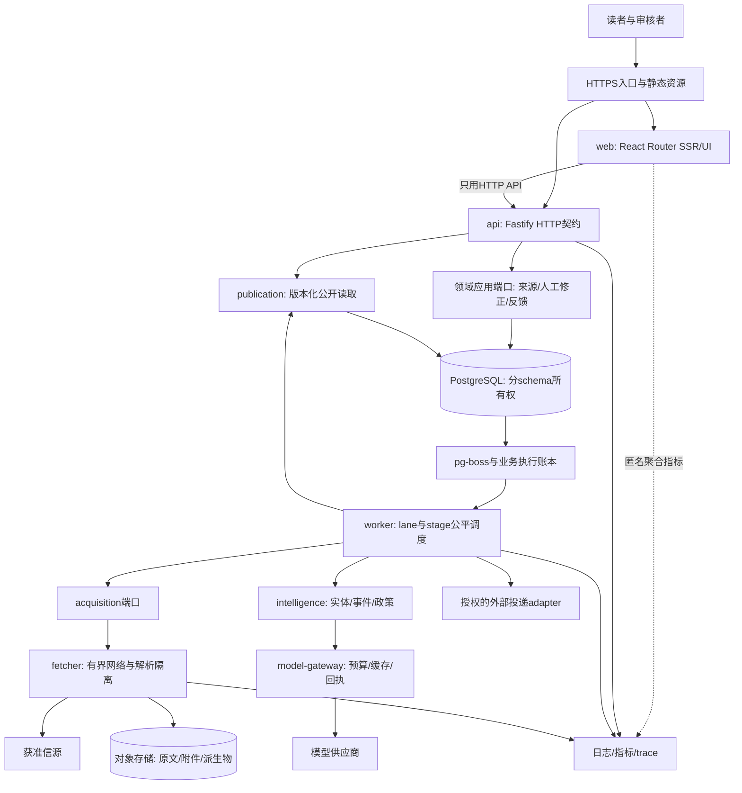

# 新 AI矿策目标架构与模块边界

状态：建议基线 v1.0；尚未创建或实现新项目。目标是保留产品认知、采用AIHOT有价值源码、重建矿业领域。本文与[数据模型](04-data-model.md)、[状态机](05-workflows-and-state-machines.md)、[AI边界](06-ai-and-agent-runtime.md)共用同一模块划分。

## 1. 架构结论

采用 TypeScript monorepo、React Router SSR前端、Fastify API、模块化后端、持久后台任务、隔离抓取进程、PostgreSQL和对象存储。单个领域模块有明确应用端口、自己的持久化与测试；前端只通过HTTP契约访问API。模块可以由不同开发Agent独立实现，部署单元按故障和资源边界划分，不按Agent数量划分。

AIHOT已经采用其中大部分基础栈，沿用它有源码复用价值。新建设的重点是数据身份、政策法域、证据、双业务任务调度、真实审核与反馈、版本一致发布和边界可执行检查。只换框架不会自动消除历史包袱；把所有旧业务塞进一个新的backend包同样会产生耦合。

“Agent时代”在这里意味着：规范可以机器校验、模块可局部理解、测试可独立运行、契约能提前mock、任务不会竞争同一文件、集成失败可定位责任。用户所举未来模型名称只是能力演进方向，不是已核实的模型可用性或实现依赖。

## 2. 新闻与法规政策：两条业务线，共享底层能力

法规政策是独立业务，不受新闻来源准入、暂停、精选评分或优先级控制。法规覆盖按33国底表并集已列目标，欧盟、联合国、OECD三组织单列；官方多部门/地方来源按法定发布职责纳入；新闻的18国历史基线不能限制法规覆盖。产品定义决定最终国家/来源集合。

| 维度 | news lane | policy lane | 共享但不混用 |
|---|---|---|---|
| 业务入口 | 新闻/官方动态/媒体/获准社交等 | 官方法规政策、必要部门/地方、修订与附件 | Source实体可共用，AcquisitionProfile和业务membership分别版本化 |
| 调度 | 近期流优先，历史回填独立 | 政策更新、版本/效力检查、附件补齐 | scheduler与transport共用，保留每lane容量，不共享一个无界FIFO |
| 停用 | 新闻profile暂停仅停止新闻任务 | 法规profile按自身状态/许可停用 | 来源级紧急许可撤销可以同时影响，但必须明确scope |
| 准入 | 矿业关联、可读性与证据；精选另判断 | 法域/机关职责/法律性质、正文完整性与附件 | 许可、URL安全、证据完整性属于共同底线；新闻价值分不拦法规 |
| 处理 | 清洗、中文整理、实体、事件、精选 | 原文及必要附件、语义理解、条款、版本/效力、影响 | content和model-gateway能力共享；业务recipe分开 |
| 产物 | 事件优先新闻、热点、专题、报告 | 法规政策库、变更/义务/期限/影响解释 | 同一公开发布系统提供稳定DTO，保持产物类型和状态区别 |
| 正常操作 | 服务端连续运行 | 服务端连续运行，无强制日常运营台审批流 | 人工修正/异常核对可用，不成为每条数据的固定人工门槛 |

曾出现的慢抓取挤占所有执行位、模型阶段长期饥饿，不可重复：`lane × stage`分别设并发上限和保留容量，抓取等待不占用模型并发，正文/OCR的CPU预算不挤占API。新闻突发流量不能无限推迟政策任务，政策回填也不能堵住新闻实时流。任何借用空闲容量都必须可被所属lane回收。

## 3. 运行视图



`model-gateway`、各领域、队列适配器首先是代码模块，可以运行在worker/API的适当进程内，不要求单独服务。Fetcher是资源与网络隔离进程；对外HTTP、浏览器抓取、PDF/OCR根据工作类型在受限子进程执行。未要求所有抓取先启动浏览器。

## 4. 部署角色和权限

| 角色 | 可以做 | 持有 | 不持有 |
|---|---|---|---|
| web | SSR、路由、表单转发、UI | API地址、必要会话cookie转发能力 | DB连接、模型密钥、抓取密钥、云管理权 |
| api/public | 契约验证、公开投影读、反馈接收 | 公开读取与feedback最小角色 | 任意私有表查询、模型调用、抓取权限 |
| api/admin | 认证、来源命令、人工修正、审计 | 经应用端口受限写权限 | 任意SQL、任意命令执行、所有者DB权限 |
| worker | 任务消费、领域处理、发布构建 | 领域角色、队列、model-gateway所需密钥引用 | 任意云控制、开发Agent会话、Web资产写权限 |
| fetcher | 获取允许目标/解析返回artifact | 有时限任务描述、出站策略、范围受限对象写凭据 | 主业务DB、发布/审核写权限、模型和飞书凭据 |
| migration | 有版本的schema变更 | 临时迁移角色 | 长期运行服务身份 |
| telemetry/backup | 收集必要指标或备份 | 专用只读/备份角色与隔离存储 | 公共响应权限、通用管理入口 |

Fetcher首期可由acquisition worker经内部有界RPC调用，worker负责持久任务、lease和业务提交；fetcher只返回结果/artifact引用，不需要自己持有pg-boss或业务DB。以后改为拉取型协议也必须保持同样权限边界，不能为了方便直接把数据库密码注入抓取浏览器。

同源反向代理可以让浏览器请求没有CORS复杂度；这不等于代码或进程合并。生产可以分独立主机或容器，容量依据压测决定，不受旧4GB主机约束。

## 5. 目标仓库结构

```text
apps/
  web/                       # React Router；HTTP-only；页面/loader/交互
  api/                       # Fastify路由、schema校验、身份与应用端口组合
  worker/                    # 队列consumer、调度、启动/停机；不放领域规则
  fetcher/                   # 有界网络/浏览器/解析隔离入口
packages/
  contracts/                 # HTTP、job、domain event、错误码与schema规范源
  api-client/                # 生成客户端；前端不手写重复DTO
  ui/                        # 无业务IO的组件与设计token
  domains/
    source-control/          # 来源、profile、逐能力许可、lane membership
    acquisition/             # 新闻/法规获取计划、游标、运行状态、fetcher端口
    content/                 # 材料修订、块、附件、清洗、翻译结果
    intelligence/
      entities/              # 实体/别名/提及
      events/                # 事实、证据、事件关联与聚簇
      policy/                # 法源、法律版本、生效状态、条款与影响解释
    editorial/               # Q/I/E/H、精选、人工修正、抑制、专题
    publication/             # 公开投影、版本、搜索、报告与公共出口读取
    feedback/                # 反馈接收/处理状态
  platform/
    model-gateway/           # provider、receipt、缓存、预算账本、schema输出
    identity/                # immutable owner身份、会话和权限
    audit/                   # 统一审计事件与落盘
    storage/                 # DB/object适配器和生命周期接口
    queue/                   # pg-boss适配器，不含业务状态机
    telemetry/               # correlation、metric与trace
  testkit/                   # 许可可用fixture、provider stub、契约mock
config/mining/               # 版本化分类/国家/矿种/词表/页面文案/recipe
migrations/                  # 单一编号分配者，按schema分组，机器校验
third-party/aihot/           # LICENSE/NOTICE、固定commit、导入映射
scripts/                     # build/test/check/release明确入口，无隐藏生产副作用
docs/modules/               # 每模块输入、输出、不变量、反例和运行命令
docs/decisions/             # 少量能改变决定的ADR
```

一个领域内部最少采用 `index.ts`（公开端口）、`application/`、`domain/`、`adapters/`、`tests/`。可按复杂度简化文件数量，不为每个函数加抽象层。`index.ts`不导出SQL、表模型、密钥或内部类；不允许 `./*`通配导出绕过模块所有权。

## 6. 每个模块的输入、产物与独立完成界限

| 模块 | 输入与依赖 | 唯一职责/输出 | 可独立验收 |
|---|---|---|---|
| source-control | 产品来源清单、来源证据、管理命令 | Source/Policy/Profile版本；各lane的可执行许可决定 | 同一来源两个lane独立启停；过期/未知权限不扩大授权；预览绑定配置版本 |
| acquisition | 许可决定、计划、旧cursor | FetchRun、候选/原始artifact引用；成功checkpoint | 条件请求/部分失败/每源限流/双lane公平；失败不前移cursor |
| content | AcquisitionResult、合法artifact | 不可变DocumentRevision/Block/Attachment/Translation | HTML/PDF/编码/表格/否定与数字保真；缺附件不标完整 |
| intelligence/entities | ContentRevision、词表、EntityPort | 提及、实体候选、确定/不确定的归一 | 重名、跨语种、中文译名、国家与项目匹配，不凭模型猜ID |
| intelligence/events | 文稿证据、实体与有界候选 | EventRevision/Membership/Relation与裁决 | 同发生/实质进展/相关/不同/不确定；人工锁优先；并发重复不双建 |
| intelligence/policy | 法规lane完整材料与法源证据 | PolicyVersion、Interpretation、ImpactAssessment | 草案/颁布/生效/废止分别；期限/例外/范围有证据；不依赖新闻精选 |
| editorial | IntelligenceResult及真实人工命令 | 精选/排序/主题/ReviewDecision/Suppression | Q/I/E/H分离；人工决策CAS；正常流程自动推进；稀缺精选不硬凑 |
| publication | 允许发布的输入、最新许可/抑制 | 版本化投影、报告、公开查询、投递请求 | 一请求一版本；全部出口撤回一致；新构建失败保留合法旧版本 |
| model-gateway | typed task、recipe、合法输入、预算请求 | typed result、invoke状态、费用账本 | 相同key不重复付费；unknown不清零；预算并发不透支；无预算不调用 |
| identity/audit | 登录凭证、授权命令/领域变更 | principal/权限决定、不可混淆审计 | 精确immutable身份；session错误与DB故障区分；变更与审计可靠提交 |
| feedback | 公共条目引用与用户提交 | 独立反馈状态与授权attachment | 大小/格式/频率限制；不开放服务器任意URL抓取或公共写入口 |

报告属于publication；外部通知作为publication产生的投递请求，由worker和adapter执行。无需创建另一个与publication争夺发布权的delivery业务域。operations是跨角色运行视图与管理用例，不是可以绕过所有域的万能模块。

## 7. 允许的依赖方向

- `web → api-client/contracts/ui`；不允许 `web → domains/platform/storage/model-gateway`。SSR loader同样遵守。
- `api routes → domain public application ports`；路由做HTTP映射，不写SQL或复制领域判断。
- `worker → domain application ports/queue adapter`；scheduler只产生有类型任务，不直接修改各域表。
- `domain application → own domain/own repository port/other domain public read port`；实现由composition root注入。
- `domain pure rules → contract value types`；禁止依赖Fastify、React、pg-boss、provider SDK和进程env。
- `adapters → own ports + platform adapters`；其他域不可直接import该域adapter。
- `contracts`不依赖应用、数据库、行业显示文案或业务包；schema是可发布契约，生成TS/client/mock，禁止手工修改生成文件。
- `intelligence`三个子域可独立分工，shared value object只保留稳定ID/EvidenceRef；不能造一个通用utils目录承载所有业务。

跨域读优先通过稳定query port或目的明确的投影；跨域写用命令/事务协调器或outbox。首期一个数据库允许适当事务一致性；协调器仍调用所属域受限操作，不把db连接交给任意模块。需要跨服务时端口可改HTTP/消息，不改变领域规则。

## 8. 可执行的边界约束

文档禁止不够，首个工程任务必须实现以下检查：

1. package exports白名单和TypeScript项目引用，非法跨目录import在CI/本地同一命令失败。
2. import边界检查：Web不得引数据库/领域实现/模型SDK；只有adapter可导入postgres/provider；跨域不得指向`internal/application/adapters`路径。
3. OpenAPI/JSON Schema变更检查、生成client diff和契约fixture回放；破坏性变更必须新major或显式迁移版本。
4. 数据库角色权限测试：公开角色不能查私有正文/模型账本，fetcher无DB角色；审稿角色不能改来源原文。
5. migration所有权映射：新表/列/索引归属一个域；两个Agent不抢同一编号，集成者分配最终编号。
6. runtime环境校验：角色禁止字段存在时失败，例如Web进程不接受DATABASE_URL或模型密钥注入。开发与生产使用同一配置schema。
7. fixture smoke：不连真实外部源、不调用付费服务，任何缺配置不能回退生产；真实来源验收独立标记。
8. 每模块有最小契约mock和本域测试入口，单域修改无需启动全系统；集成阶段再跑对应跨域不变量。

不得把“所有测试能跑”误当并行安全：上游后端测试共享一个库且串行。新testkit按Agent/测试进程创建独立临时schema或数据库，迁移/清理仅作用当前测试资源，资源所有者可追溯。

## 9. 任务和并发策略

持久队列负责投递与重试，业务JobExecution负责状态。任务只携带ID、revision、recipe、lane与trace，不携带无限正文或密钥。claim/lease/attempt状态、幂等key、超时、重试分类和dead-letter恢复由同一schema定义。

外部网络和模型请求均在短DB事务之外。提交时重查来源政策、输入revision、lease fencing token和人工锁。若结果已过期，保留回执供审计但不覆盖新revision；允许共享的合法结果复用，不能通过改随机key强行重做。

聚簇分三步：有界召回→纯关系决策/必要模型→短事务提交。对同一事件identity key或待合并集合用稳定顺序的DB锁/唯一约束；不可只靠某个进程的`localConcurrency:1`。死锁/唯一冲突在确定性提交阶段重试，不重买模型结果。审核和发布更新使用CAS和outbox。

关闭某来源或停用某模型不应杀死所有任务。全局熔断、lane预算、source限流、stage资源上限分别建模；阈值和资源大小通过压测与真实成本观察调整。

## 10. 存储、搜索和发布读取

PostgreSQL存业务事实、修订关系、审计和费用；对象存储放获准原始网页/PDF/大正文/附件和报告产物；搜索索引与向量属于可重建投影。对象采用内容hash及版本引用，不在每次publication复制全文；DB提交前staging，提交后引用，定期回收未引用对象。

首期搜索以结构过滤、稳定排序、Postgres全文/pg_trgm候选为基础。中文矿种/公司别名需要专门词表和查询扩展评测；pg_trgm不是中文语义理解的替代品。pgvector只在内部召回需要时开启，先测exact，再评ANN丢召回对聚簇误差的影响。

公开read model随publication版本生成，动态当前抑制层优先。缓存key含publication/filter/locale/policy epoch；缓存只加速允许返回的数据。不得依赖TTL自然过期实现紧急下架。搜索、详情、RSS、MCP、报告、分享图遵守同一版本和抑制规则。

## 11. 可观测性、恢复与部署

日志保持结构化、脱敏、分级；业务审计独立。trace贯穿 HTTP → command → outbox/job → fetch/model receipt → publication。记录每lane/stage的队列最老年龄、可用并发、pending/unknown费用、正文与附件完整率、有效发布新鲜度；不能只看容器心跳。

发布镜像在独立构建环境产出，绑定源码SHA/锁文件/工具链/测试结果；部署读取可信artifact，不在生产机临时构建。迁移单独执行，滚动切换的schema使用兼容增量；破坏性迁移用明确数据备份和切换程序。报告软件变更不等于内容批次更新。

首期可选托管Postgres+对象存储+容器运行平台，也可Compose/systemd独立主机；云厂商是可替换adapter。运行记录至少有release/manifest、migration版本、启用配置、健康验证与回滚版本。恢复演练证明备份能恢复业务引用和unknown账单，不只是文件能下载。

## 12. 演进条件与停下来的界限

| 变化 | 先做 | 何时才增加系统 |
|---|---|---|
| 抓取量增长 | 每源并发、条件请求、lane公平、fetcher水平扩展 | 网络/浏览器池成为独立容量瓶颈时扩大fetcher，不先拆全部领域微服务 |
| 队列压力 | job保留清理、连接池/索引、队列分区、隔离DB资源 | 观测证明Postgres争用损害公开SLO或工作流语义失控后，评专用队列/Temporal |
| 搜索质量/规模 | 词表、结构过滤、索引/查询计划与真实多语言benchmark | PG方案不能满足已定查询/召回SLO时才加专用搜索，契约不变 |
| 跨团队独立发布 | package边界、独立mock、模块验证、明确owner | 独立扩缩容/发布/故障隔离收益大于运维成本时提取服务 |
| 模型更强 | 以相同输入、holdout、费用和延迟比较新adapter | 需求出现动态工具规划且持久任务无法表达时增加受限ResearchWorker |

本轮架构不宣称“2026绝对最佳”，也不把“教科书级”当无需证明的标签。能否承载长期演进，以边界检查、故障恢复、容量成本基准、真实内容验收和不同Agent独立交付结果验证。
