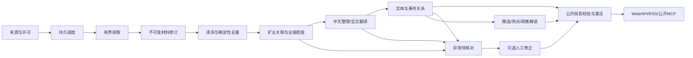

# 任务链路、状态机和失败恢复

状态：新系统建议基线。流程目标是服务器独立连续运行；开发Agent离线不影响采集、中文整理、公开和报告。工作流状态、内容可见性、任务运行状态、费用状态互相独立。

## 1. 正常链路

新闻与法规政策为两条独立业务lane。法规覆盖33国底表并集既有目标，按正式发布职责研究中央/地方/部门来源；新闻18国是历史覆盖基线。两lane有独立准入、暂停、游标、队列并发与费用分配，共享抓取、解析、模型网关和发布底层。慢抓取不能耗尽模型处理时隙；队列公平性和最大等待必须可测。法规原件、必要附件、条款定义/表格/脚注目录完整后，才允许宣称完整中文与完整解读；新闻导读模式不能冒充法规全文验收。

模型步骤可合并提取、轻分类和中文整理，但输出分字段校验，不能用一个模型“通过”状态同时授予版权、来源可信、金额结算和发布权限。正文不允许公开时输出导读+原文入口；无足够证据支持导读时仅显示可公开元数据，不补事实。

## 2. 来源状态

管理态 `draft → active ↔ paused → archived`；健康态 `healthy | no_new_content | degraded | blocked | unknown`。`no_new_content`是完成检查无更新，不能与失败混淆。来源许可过期或域名/身份不符只停止相应来源阶段，其余源继续。

新增：登记 → 规范身份与权限 → 预览 → 检查解析/时间/条目 → 激活。预览不自动公开；预览成功不是持续供给。预览结果绑定settings/profile/policy revision；任一变化、暂停或归档使旧结果失效。停用默认停止未来调度，队列执行前重新读政策，in-flight结果入私有区后重验再用。明确的紧急取消令牌才中断执行。

周期调度使用每来源并发限制、host限速、jitter、ETag/Last-Modified、失败退避和公平队列。新闻近期流优先，历史回填独立低优先级队列；每轮保存分页游标和时间窗，失败不退回第一页无限抓取。

## 3. 材料和处理状态

`discovered → fetched → parsed → normalized → processing → publishable → projected`。

可从任意适用阶段进入 `retry_wait | rights_blocked | invalid | quarantined`。`retry_wait`须带失败类别、next_retry_at、attempt上限；到期转dead-letter而非悄悄丢弃。人工下架是独立suppression，不用“处理失败”表示。

每阶段key = `(subject_revision, stage, recipe_version)`；同key只有一个成功结果，recipe含解析/规则/模型schema版本，不含随机run时间。leases用fencing token：旧worker即使恢复也不能覆盖新worker的结果。长任务定期checkpoint，续接只处理未完成片段。重试必须从真实失败阶段恢复，既有合法成功结果与原费用不重做。

## 4. 模型与费用状态

`planned → reserved → submitted → succeeded | failed_known | unknown`。

`succeeded → settled`；明确未计费失败才 `released`。`unknown → reconciled_success | reconciled_failure | manual_reconciliation`，不得按等候时长自动转失败并重复发起付费调用。供应商有幂等key/查询接口时按同一provider_request_id对账。没有此能力则保留预留、隔离该调用，让其他可付费任务在余额内继续。

用户重试未知任务前必须能看到已预留金额及重复计费可能；不把“重试”按钮作为日常生产前提。内部自动化绝不把unknown费用当零。月预算按Asia/Shanghai自然月；跨月pending归属原预留期，不因过月消失。

## 5. 事件决策

URL/文本重复先处理；相同来源重复不新增独立支持。候选召回组合实体、法域、政策编号、阶段、事件时间与语义向量；候选TopK有界。确定性明确相同可合并，确定性冲突必分离，剩余必要候选才模型判断。

决策输出 `same_event | substantive_update | related | different | uncertain` 与claim/evidence引用。相同企业、矿种或国家不足以构成同事件。草案→通过→实施为不同阶段的可关联事件，不能互相替代。没有实质更新不制造时间线。

人工合并/拆分保存版本、原关联及原因；锁定关联优先。批处理建议与人工结果冲突时形成候选差异，不能覆盖。合并后旧URL有稳定解析，拆分后记录原事件迁移关系而非404丢失追溯。

## 6. 发布、报告与撤回

`building → validated → active → superseded`。任何构建失败保留上次可确认且未被抑制的版本。没有历史版本时显示真实空态；损坏版本是错误态，不能退回示例内容。

全部动态和精选使用同一许可/真实性基础，但选择标准不同。全部动态不要求热度或高分，精选不足不硬凑。政策解释与影响评估可延迟补齐，不能阻塞已经满足公开条件的合法新闻阅读。

报告周期为北京日/周/月，默认下一周期08:00生成；同周期同edition幂等，不把重跑变成新日报。生成失败只影响当前报告，已有报告与新闻继续。迟到条目进入后续版/更正版并解释，不静默改历史。段落引用固定revision，撤下内容从任何edition输出消隐，保留“该条已撤回”。

下架事务提交后递增policy_epoch、推送失效outbox并拒绝旧epoch内容。正常旧版本分页允许继续读其稳定快照，但每次读同时适用最新suppression；历史快照不能成为下架旁路。恢复为新明确审计操作，回填/升级不能触发恢复。

## 7. 故障分类与处置矩阵

| 触发 | 可自动做 | 必须保持 | 对读者影响 |
|---|---|---|---|
| 429/503/短暂网络错误 | 有界指数退避、Retry-After、单源降速 | 游标/已获成功结果 | 已发布内容可读，源健康注明 |
| TLS/身份/跳转不符 | 隔离来源并报具体原因 | 不关闭TLS，不绕过身份 | 不伪装为已接入 |
| parser布局变化 | 保留合法元数据，解析隔离 | 原权限、旧稳定ID | 正文未取得如实说明 |
| PDF/OCR置信不足 | 保留页码、转核对 | 不声称完整/精准翻译 | 导读/原文入口或待处理 |
| 预算硬停 | 停新模型，继续规则/缓存 | 阈值/已预留/公开质量 | 更新延迟明确可见 |
| 模型schema/证据不符 | 一次有界修复仅在预算与已知失败语义内；否则隔离 | 不发布臆造字段 | 不发布不完整分析 |
| worker崩溃 | lease超时后同key恢复 | checkpoint与费用receipt | 正常旧内容继续 |
| DB不可用 | 停写、就绪失败 | 不把未知审稿提交当失败重发 | 503；不清合法会话cookie |
| 搜索投影失败 | 重建该版本索引 | 不返回跨版本结果 | 可读详情；搜索明确降级或503 |
| 审计写入失败 | 回滚高风险状态变更 | 原权限/审稿/下架状态 | 提示未完成，不给成功通知 |
| 发布CAS竞争 | 丢弃失去竞争候选/重新基线构建 | current单一一致 | 不暴露半版本 |

## 8. 观测要求

链路trace包含source_id、item_revision_id、event_id、job_id、publication_id和recipe版本；不给公开响应暴露私有链路。核心指标：来源成功检查/新内容/正文完整率/翻译完整率分别统计，queue oldest age、重试/死信/unknown数量、发现到公开延迟、模型每千项费用/命中率、重复率/误合并率、发布新鲜度、DB增长率和对象保留清理率。

页面正常、容器健康、worker心跳都不能单独证明内容持续更新。低频官方源应按计划检查成功与真实无更新评估，不能因为没有新法规就判宕机。告警含责任模块、失败类别、最近成功时间和恢复操作，不输出密钥/完整正文。
